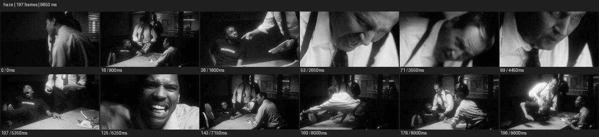

# Haze


- 출처: Eyecandy · [Haze](https://eyecannndy.com/technique/haze)
- 카탈로그 등록 표기: **Haze 헤이즈**
- 카테고리: F · Lens & Optics · 렌즈 & 옵틱
- 원본 미디어: [애니메이션 WebP](https://asset.eyecannndy.com/media/clip/2024/05/13/261715641988.webp)
- 확인 방식: 원본 애니메이션을 디코딩해 시간순 프레임을 추출한 뒤 컨택트 시트를 직접 시각 확인했다. 전체 197프레임 / 9850ms, 기본 12시점. 재생·음향 청취·전 프레임 시각 검수·생성 테스트를 했다고 주장하지 않는다.
- 기본 확인 프레임: 0, 18, 36, 53, 71, 89, 107, 125, 143, 160, 178, 196. 해당 타임스탬프(ms): 0, 900, 1800, 2650, 3550, 4450, 5350, 6250, 7150, 8000, 8900, 9800.
- 원본 길이는 관찰 정보다. 아래 새 장면의 길이를 원본에 자동 맞추지 않는다.

## 움직임 증거



## 원본에서 확인한 시작 → 변화 → 끝

흑백 실내에서 탁자 주변 여러 인물의 와이드와 얼굴 클로즈업이 빠르게 바뀐다. 흰 셔츠와 밝은 부위가 부드럽게 번지고 검은 영역과 맞닿은 경계가 흐릿한 광택을 띤다.

- 카메라·시점: 여러 거리와 각도의 컷으로 바뀐다.
- 주체: 탁자 주변 인물이 강하게 몸짓한다.
- 조명·합성·편집: 흑백·하이라이트 확산과 빠른 편집이 함께 있다.

## 작동 원리와 확인 한계

확산된 하이라이트와 낮아진 미세 대비로 장면을 감싼다. 실제 연무, 확산 필터, 후반 글로우 중 원인은 샘플만으로 구분되지 않는다.

샘플 사이의 빠른 변화는 일부 빠질 수 있다. GIF의 반복 경계가 작품의 의도된 완전 루프라는 보장은 없다. 원본 음악·대사·촬영 장비·제작 소프트웨어는 확인하지 않았다. 아래 프롬프트는 관찰한 원리를 다른 장면에 각색한 창작안이며 원본 장면이나 검증된 생성 결과가 아니다.

## 뮤직비디오 각색 · 완전한 장면 프롬프트

```text
기억처럼 흐린 재즈바의 성인 보컬을 담는 뮤직비디오. 카메라는 무대 앞 미디엄에서 천천히 접근하고 뒤의 작은 텅스텐 전구는 부드러운 원으로 번진다. 얇은 연무가 역광을 받아 공간을 채우되 눈과 입의 윤곽은 읽히게 한다. 보컬이 마이크에서 한 걸음 물러나면 빛의 층이 얼굴과 배경 사이에 드러난다. 마지막에는 접근을 멈추고 고요한 옆얼굴과 흐린 전구들을 함께 유지한다. 임의의 얼굴 변형이나 과도한 안개 덩어리는 없고 흑백 톤을 일관되게 둔다.
```

## 브랜드필름 각색 · 완전한 장면 프롬프트

```text
실크 스카프의 부드러운 감촉을 보여주는 브랜드필름. 밝은 창가의 성인 모델을 허리 위 구도로 담고 얇은 확산광으로 하이라이트 경계를 부드럽게 만든다. 모델이 스카프를 어깨 위로 천천히 펼치면 천의 끝이 공중에서 가볍게 흔들린다. 카메라는 짧게 옆으로 이동해 부드러운 빛 속에서도 실크의 결이 드러나는 각도를 찾는다. 마지막에는 모델이 스카프를 내려놓고 카메라도 멈춰 자연스러운 드레이프를 읽힌다. 몽환적 톤은 유지하되 제품의 색과 무늬를 흐려 없애지 않는다.
```

적용 시 사용자가 지정한 길이·참조·컷·음향·제품 보존 조건을 우선한다. 효과의 시작 계기와 도착 구도를 유지하며 필요한 부분을 해당 장면에 맞춰 다시 연출한다.
