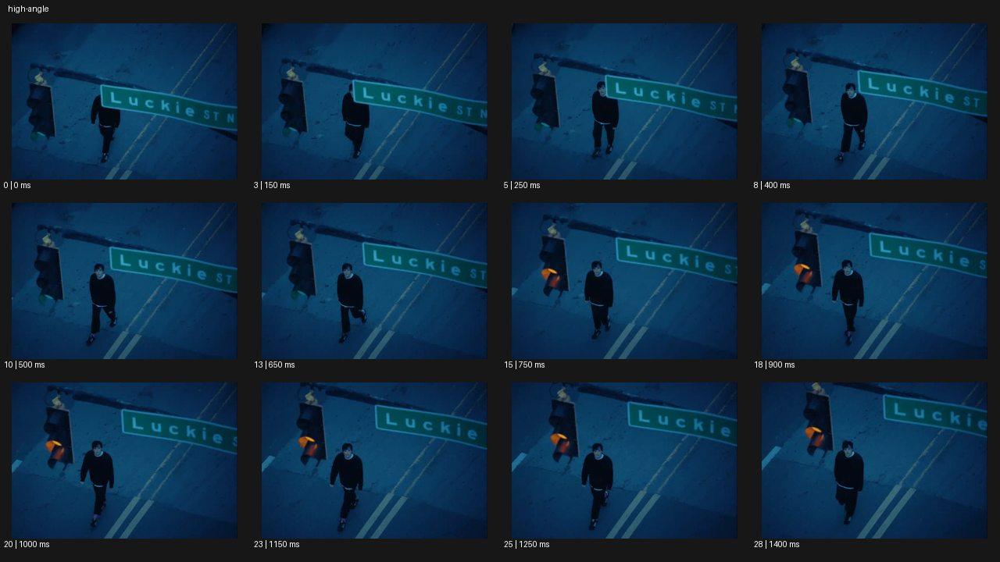

# High Angle 하이 앵글


- 원본 등록명: **High Angle 하이 앵글**
- 분류: B · 앵글 & 구도 / Angle & Framing
- 공식 기법 페이지: [High Angle 하이 앵글](https://eyecannndy.com/technique/high-angle)
- 지정 원본 미디어: [애니메이션 WebP](https://asset.eyecannndy.com/media/clip/2024/02/18/261708236813.webp)
- 확인 방식: 29프레임 중 12시점의 시간순 이미지 배열을 직접 시각 확인. 메타데이터 길이 1.45초. 전체 프레임 재생·청음 확인 또는 생성 재현 테스트로 보고하지 않는다.



## 실제 관찰

높은 사선 시점에서 푸른 도로와 신호등, 표지판 아래 걷는 인물을 본다. 0–0.65초 인물이 표지판 아래에서 앞으로 걸어나온다. 0.75초 무렵 신호등의 주황빛이 보이고 0.9–1.4초 인물은 화면 아래 쪽으로 이동한다.

## 작동 원리와 역할

카메라는 높은 고정 위치에서 사선으로 내려다보며 인물보다 도로 구조와 표지판이 크게 읽힌다. 사람의 실제 걷기가 프레임 안에서 진행된다.

## 해석의 한계

높은 시점만으로 인물이 취약하다는 감정을 사실로 단정하지 않는다. 정확한 높이와 신호 순서는 표본에 한정된다. 샘플 사이의 모든 움직임과 반복 경계의 무봉합 여부는 별도 검증하지 않았다. 아래 프롬프트는 새로운 장면 각색이며 생성 테스트는 하지 않았다.

## 뮤직비디오 적용 · 완성형 프롬프트

아래 설정과 길이는 독립 창작 예시다. 실제 요청의 길이·참조·음향 조건을 우선한다.

```text
7초 뮤직비디오. 푸른 새벽의 빈 횡단보도를 성인 보컬이 혼자 건넌다. 카메라는 맞은편 건물 2층 높이에서 사선으로 내려다보고 고정한다. 시작에는 커다란 도로 표지판이 보컬의 머리를 잠깐 가리며, 보컬이 세 걸음 앞으로 나오면 전신이 드러난다. 보컬은 횡단보도 중앙에서 멈추어 위를 올려다본다. 카메라는 내려오거나 줌하지 않고 넓은 아스팔트와 흰 선 사이에 인물을 작게 남긴다. 마지막 2초 코트 자락만 바람에 움직인다. 자동차나 군중을 갑자기 추가하지 않으며 도로의 원근을 일정하게 유지한다.
```

## 브랜드필름 적용 · 완성형 프롬프트

제품의 재질과 기능이 읽히는 순간에 효과를 배치하고 안정된 제품 상태로 끝낸다. 실제 브랜드 톤과 구조에 맞춰 각색한다.

```text
7초 고급 여행 가방 필름. 밝은 호텔 로비를 위층 난간에서 사선으로 내려다본다. 성인 여행자가 짙은 남색 캐리어를 끌고 대리석 바닥의 긴 빛 띠를 지나간다. 카메라는 높은 위치에서 짧게 옆으로 이동해 사람과 가방의 동선을 함께 담고, 바닥 무늬가 제품의 이동 방향을 또렷하게 안내한다. 여행자가 카운터 앞에 멈추면 가방을 세워 손잡이를 놓는다. 카메라도 그 위치에서 정지해 가방의 상단과 측면, 바퀴 배치를 읽힌다. 마지막 2초 로비의 여백과 제품을 함께 유지하며 캐리어 형태나 바퀴 수를 바꾸지 않는다.
```

음향은 원본에서 확인하지 않았다. 실제 음원과 무음·NO BGM 등 사용자 조건을 유지한다. 특정 모델의 자동 재현을 보장하는 프리셋이 아니다.
