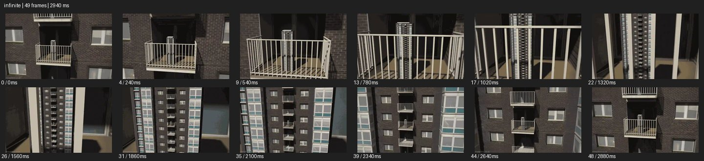

# Infinite Loop


- 출처: Eyecandy · [Infinite Loop](https://eyecannndy.com/technique/infinite)
- 카탈로그 등록 표기: **Infinite Loop 무한 루프**
- 카테고리: G · Speed & Time · 속도 & 시간
- 원본 미디어: [애니메이션 WebP](https://asset.eyecannndy.com/media/clip/2024/01/30/261706573866.webp)
- 확인 방식: 원본 애니메이션을 디코딩해 시간순 프레임을 추출한 뒤 컨택트 시트를 직접 시각 확인했다. 전체 49프레임 / 2940ms, 기본 12시점. 재생·음향 청취·전 프레임 시각 검수·생성 테스트를 했다고 주장하지 않는다.
- 기본 확인 프레임: 0, 4, 9, 13, 17, 22, 26, 31, 35, 39, 44, 48. 해당 타임스탬프(ms): 0, 240, 540, 780, 1020, 1320, 1560, 1860, 2100, 2340, 2640, 2880.
- 원본 길이는 관찰 정보다. 아래 새 장면의 길이를 원본에 자동 맞추지 않는다.

## 움직임 증거



## 원본에서 확인한 시작 → 변화 → 끝

아파트 외벽 발코니 안에 작은 동일한 건물이 보인다. 카메라가 발코니와 작은 건물 쪽으로 계속 접근해 그것이 화면을 채우면 다시 비슷한 외벽·발코니 구조가 나타난다.

- 카메라·시점: 발코니 안 작은 건물로 계속 접근한다.
- 주체: 주체는 건물의 중첩 구조다.
- 조명·합성·편집: 스케일 중첩이 반복되며 완벽한 루프 접합은 미검증.

## 작동 원리와 확인 한계

자기와 닮은 구조를 안쪽에 중첩하고 카메라 접근을 이어 규모가 끝없이 반복되는 인상을 만든다. 루프 경계의 완벽한 픽셀 일치는 검증하지 않았다.

샘플 사이의 빠른 변화는 일부 빠질 수 있다. GIF의 반복 경계가 작품의 의도된 완전 루프라는 보장은 없다. 원본 음악·대사·촬영 장비·제작 소프트웨어는 확인하지 않았다. 아래 프롬프트는 관찰한 원리를 다른 장면에 각색한 창작안이며 원본 장면이나 검증된 생성 결과가 아니다.

## 뮤직비디오 각색 · 완전한 장면 프롬프트

```text
끝나지 않는 기억을 표현하는 뮤직비디오. 벽에 걸린 액자 속에 같은 방과 성인 보컬이 보이게 시작한다. 카메라는 액자 중앙으로 천천히 접근하고 액자 안 방이 화면을 채우면 그 방 벽의 다음 액자가 같은 위치에 나타난다. 보컬은 각 공간에서 같은 자세로 창을 바라보고 반복 사이에 얼굴이나 의상이 바뀌지 않는다. 두 번의 반복 후 카메라가 다음 액자 직전에 멈춰 보컬과 액자를 함께 담는다. 무한 접근의 원리는 유지하되 마지막에는 감정을 읽을 안정 구도를 남긴다.
```

## 브랜드필름 각색 · 완전한 장면 프롬프트

```text
향수 패키지의 구조적 정교함을 보여주는 브랜드필름. 열린 상자 안에 같은 상자의 작은 형태가 정렬되어 있는 추상 세트를 만든다. 카메라는 정면에서 중앙을 향해 천천히 전진하고 안쪽 상자가 커질수록 다음 상자가 같은 비율과 조명으로 드러난다. 재귀 구조가 두 단계 이어진 뒤 마지막 안쪽에 실제 크기의 향수병이 나타난다. 카메라는 병 라벨이 읽히는 거리에서 감속해 정지한다. 상자의 재질과 색을 유지하고 최종 제품은 반복 복제 없이 하나만 남긴다.
```

적용 시 사용자가 지정한 길이·참조·컷·음향·제품 보존 조건을 우선한다. 효과의 시작 계기와 도착 구도를 유지하며 필요한 부분을 해당 장면에 맞춰 다시 연출한다.
