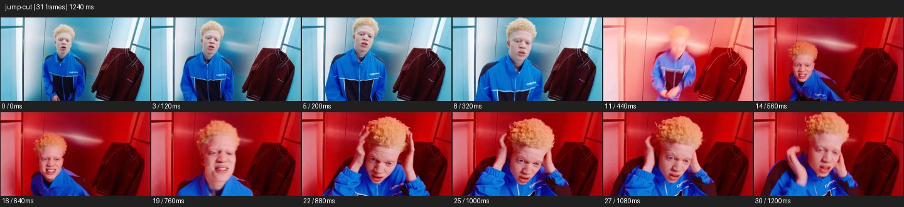

# Jump Cut


- 출처: Eyecandy · [Jump Cut](https://eyecannndy.com/technique/jump-cut)
- 카탈로그 등록 표기: **Jump Cut 점프컷**
- 카테고리: H · More Editing & Transition · 편집 & 전환 확장
- 원본 미디어: [애니메이션 WebP](https://asset.eyecannndy.com/media/clip/2023/12/24/261703389791.webp)
- 확인 방식: 원본 애니메이션을 디코딩해 시간순 프레임을 추출한 뒤 컨택트 시트를 직접 시각 확인했다. 전체 31프레임 / 1240ms, 기본 12시점. 재생·음향 청취·전 프레임 시각 검수·생성 테스트를 했다고 주장하지 않는다.
- 기본 확인 프레임: 0, 3, 5, 8, 11, 14, 16, 19, 22, 25, 27, 30. 해당 타임스탬프(ms): 0, 120, 200, 320, 440, 560, 640, 760, 880, 1000, 1080, 1200.
- 원본 길이는 관찰 정보다. 아래 새 장면의 길이를 원본에 자동 맞추지 않는다.

## 움직임 증거



## 원본에서 확인한 시작 → 변화 → 끝

푸른 옷 인물이 좁은 엘리베이터 같은 공간에서 퍼포먼스한다. 차가운 조명에서 붉은 조명으로 바뀌고 얼굴의 크기와 자세가 갑자기 가까워진다. 이후 손이 머리로 올라가며 가까운 구도가 이어진다.

- 카메라·시점: 같은 공간의 구도 크기가 갑자기 바뀐다.
- 주체: 인물 포즈와 손 위치가 건너뛴다.
- 조명·합성·편집: 푸른빛에서 붉은빛으로 변하며 불연속 컷이 보인다.

## 작동 원리와 확인 한계

같은 장소·주체의 일부 시간을 건너뛰어 자세나 크기를 불연속적으로 바꾼다. 이 예시의 조명 변화도 편집과 함께 관찰된다.

샘플 사이의 빠른 변화는 일부 빠질 수 있다. GIF의 반복 경계가 작품의 의도된 완전 루프라는 보장은 없다. 원본 음악·대사·촬영 장비·제작 소프트웨어는 확인하지 않았다. 아래 프롬프트는 관찰한 원리를 다른 장면에 각색한 창작안이며 원본 장면이나 검증된 생성 결과가 아니다.

## 뮤직비디오 각색 · 완전한 장면 프롬프트

```text
좁은 엘리베이터에서 성인 래퍼의 조급함을 표현하는 뮤직비디오. 정면 미디엄 고정 카메라로 시작하고 래퍼가 손목시계를 본다. 같은 구도를 유지한 채 다음 컷에서는 벽에 기대고, 다음 컷에서는 문 가까이 서 있는 모습으로 시간을 건너뛴다. 각 컷의 손짓은 새로운 자세로 분명히 바뀌고 디졸브나 확대 전환은 넣지 않는다. 마지막에는 문이 열리기 직전 래퍼가 움직임을 멈춰 렌즈를 바라본다. 얼굴, 의상, 엘리베이터 구조는 모든 컷에서 유지한다.
```

## 브랜드필름 각색 · 완전한 장면 프롬프트

```text
한 벌의 재킷을 입는 다양한 방식을 보여주는 패션필름. 고정된 정면 전신 구도에서 성인 모델이 지퍼를 올리기 시작한다. 점프컷 후에는 지퍼를 반만 올리고 소매를 접은 자세, 다음 컷에는 앞을 열고 손을 주머니에 넣은 자세로 바뀐다. 배경과 모델 위치는 맞추고 각 스타일이 한눈에 읽힐 만큼 유지한다. 마지막에는 가장 단정한 착장으로 두 팔을 내려 재킷의 온전한 실루엣을 남긴다. 제품 자체의 재단·색·포켓 수는 바꾸지 않고 착용 방식만 달라진다.
```

적용 시 사용자가 지정한 길이·참조·컷·음향·제품 보존 조건을 우선한다. 효과의 시작 계기와 도착 구도를 유지하며 필요한 부분을 해당 장면에 맞춰 다시 연출한다.
