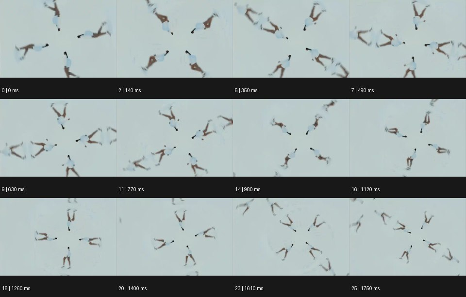

# Kaleidoscope 캘리도스코프


출처: Eyecandy · 원본 등록 카드명: **Kaleidoscope 캘리도스코프** · slug: kaleidoscope

분류: I · VFX & Style / VFX & 스타일

[원본 기법 페이지](https://eyecannndy.com/technique/kaleidoscope) · [원본 미디어](https://asset.eyecannndy.com/media/clip/2023/12/31/261703997863.webp)

## 확인 근거

원본 26프레임, 메타데이터 길이 1820ms. 고유 12개 시점 프레임을 추출하여 이미지로 직접 관찰했다. 재생 감상·음향 청취·생성 재현 테스트를 했다는 뜻이 아니다.

표본 프레임(0부터): 0, 2, 5, 7, 9, 11, 14, 16, 18, 20, 23, 25



## 실제 시간순 관찰

0–350ms: 밝은 바탕에 같은 인물 동작처럼 보이는 작은 형상들이 중심 주위에 방사형으로 배치된다. 490–1120ms: 팔·다리의 꺾임이 여러 방향에서 동시에 바뀌고 반복 패턴 전체가 회전하는 인상을 준다. 1260–1750ms: 중심 주변의 네 방향 배열이 다시 늘어나고 접히며 이어진다.

## 주체·카메라·합성·편집 구분

원형 반복 안의 인물은 몸을 움직인다. 화면 전체 회전과 복제 방향의 변화를 실제 카메라 오빗으로 보지 않는다. 주된 효과는 대칭·회전 복제 합성이다.

## 장면에 재사용할 원리

하나의 원본 동작을 중심·각도·대칭 규칙으로 반복한다. 원본 인물의 행동과 패턴 전체의 변화를 별도로 설계해야 형태가 읽힌다.

## 확인 한계

정확한 거울 면 수와 반복 경계의 매끄러운 루프 여부는 샘플에서 확정하지 않는다. 표본 사이의 모든 프레임과 반복 경계의 연속성을 검사하지 않았다. 음향은 확인하지 않았다.

## 뮤직비디오 각색 · 완성형 프롬프트

아래는 장면 목적에 맞게 새로 설계한 창작 적용안이며 원본 길이를 상속하지 않는다.

```text
6초 뮤직비디오, 흰 바닥 위 검은 옷의 성인 댄서를 천장 정수직 카메라로 담는다. 처음 1초는 한 사람이 팔을 몸 옆에 붙이고 누워 있는 구도다. 팔을 펴는 순간 그 동작을 중심 주위 네 방향으로 회전 복제해 사람 모양의 만화경을 만든다. 각 복제는 동일한 시점의 동작을 유지하고 무릎을 접는 동작이 네 개의 꽃잎처럼 함께 오므라들게 한다. 실제 카메라는 고정하고 합성 패턴만 45도 천천히 회전한다. 마지막에는 네 인물이 팔을 다시 몸에 붙인 대칭 구도에서 회전을 멈춘다. 얼굴 확대나 다른 장소로 전환하지 않는다. 무음·무자막.
```

## 브랜드필름 각색 · 완성형 프롬프트

```text
7초 실크 스카프 브랜드필름, 아이보리 바탕에 남색 무늬 스카프 한 장을 대각선으로 놓는다. 정수직 고정 카메라 아래에서 천 끝이 가벼운 바람에 들어 올려진다. 그 주름을 네 방향의 거울 대칭 영역에 복제해 꽃 같은 패턴이 천천히 펼쳐지게 한다. 무늬는 천의 주름을 따라 움직이고 임의의 문양으로 재생성되지 않는다. 4초에 바람이 잦아들면 대칭 영역이 바깥으로 물러나고 중앙의 실제 한 장만 남는다. 마지막 2초는 원래 스카프의 끝단 봉제와 색을 명확하게 읽힌다. 카메라 롤 없이 빛은 부드럽게 고정하고 천 스치는 소리만 둔다.
```

생성 테스트: 미실시. 단일 모델의 정확한 재현을 보장하지 않으며 필요한 촬영·합성·편집 층을 구분해 구현한다.
