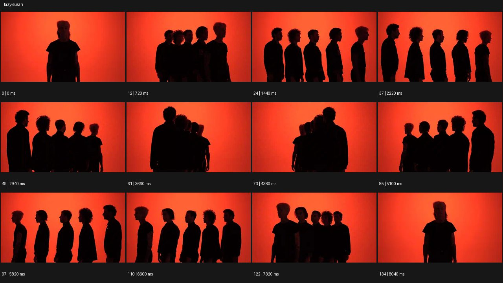

# Lazy Susan


- 원본 등록명: **Lazy Susan**
- 분류: A · 카메라 무브 / Camera Moves
- 공식 기법 페이지: [Lazy Susan](https://eyecannndy.com/technique/lazy-susan)
- 지정 원본 미디어: [애니메이션 WebP](https://asset.eyecannndy.com/media/clip/2024/01/07/261704620933.webp)
- 확인 방식: 135프레임 중 12시점의 시간순 이미지 배열을 직접 시각 확인. 메타데이터 길이 8.1초. 전체 프레임 재생·청음 확인 또는 생성 재현 테스트로 보고하지 않는다.



## 실제 관찰

붉은 배경 앞에서 첫 인물 뒤로 다른 인물들이 일렬로 겹쳐 숨는다. 0.72–2.22초 줄이 옆으로 펼쳐져 다섯 인물의 측면이 동시에 보인다. 3.66–4.38초 반대 끝에서 다시 겹치고 5.1–6.6초 다른 측면으로 펼쳐진 뒤 8.04초 첫 모습과 유사한 한 줄로 돌아온다.

## 작동 원리와 역할

인물 열과 시점의 상대 회전으로 가림의 순서가 바뀐다. 제자리 인물의 복제가 아니라 여러 사람의 깊이 정렬을 이용한다.

## 해석의 한계

붉은 무배경이라 카메라 오빗인지 인물 플랫폼 회전인지 단독 확정할 수 없다. 단순 중심 팬이라고만 설명하면 관찰된 겹침·분리를 놓친다. 샘플 사이의 모든 움직임과 반복 경계의 무봉합 여부는 별도 검증하지 않았다. 아래 프롬프트는 새로운 장면 각색이며 생성 테스트는 하지 않았다.

## 뮤직비디오 적용 · 완성형 프롬프트

아래 설정과 길이는 독립 창작 예시다. 실제 요청의 길이·참조·음향 조건을 우선한다.

```text
8초 밴드 뮤직비디오. 푸른 단색 스튜디오에 검은 의상을 입은 성인 멤버 다섯 명이 정확히 일렬로 서 있다. 시작은 첫 멤버 뒤로 나머지가 가려져 혼자처럼 보이는 전신이다. 카메라는 높이와 거리를 일정하게 유지한 채 열의 중심 주위를 반 바퀴 돈다. 회전 중 다섯 명의 옆모습이 하나씩 분리되어 보이고 멤버들은 발을 움직이지 않은 채 고개만 카메라 쪽으로 순서대로 돌린다. 반대 끝에 도착하면 다시 한 명 뒤로 겹쳐진다. 마지막 멤버가 손을 들어 다른 네 사람의 손끝이 부채처럼 나타나는 상태로 정지한다. 인물 수와 얼굴을 유지한다.
```

## 브랜드필름 적용 · 완성형 프롬프트

제품의 재질과 기능이 읽히는 순간에 효과를 배치하고 안정된 제품 상태로 끝낸다. 실제 브랜드 톤과 구조에 맞춰 각색한다.

```text
8초 향수 컬렉션 필름. 동일한 높이의 세 향수병을 크림색 회전 받침 위 앞뒤 일렬로 놓는다. 고정 카메라는 정면에서 첫 병만 보이도록 시작하며 병의 라벨을 먼저 읽힌다. 받침이 천천히 반 바퀴 회전하면 숨은 두 병이 양옆으로 드러나 유리 색과 캡 재질이 비교된다. 병 사이 간격은 일정하고 병 자체는 변형되지 않는다. 얇은 측광이 각 병의 모서리를 순서대로 밝힌다. 반대편에서 다시 겹치기 직전에 회전을 감속해 세 병이 모두 보이는 사선 배치로 멈춘다. 마지막 2초는 세 라벨과 유리 두께를 선명하게 유지한다.
```

음향은 원본에서 확인하지 않았다. 실제 음원과 무음·NO BGM 등 사용자 조건을 유지한다. 특정 모델의 자동 재현을 보장하는 프리셋이 아니다.
