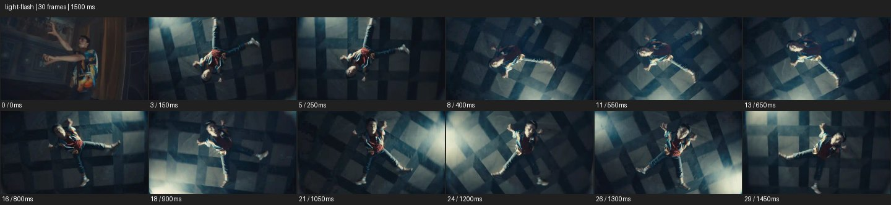
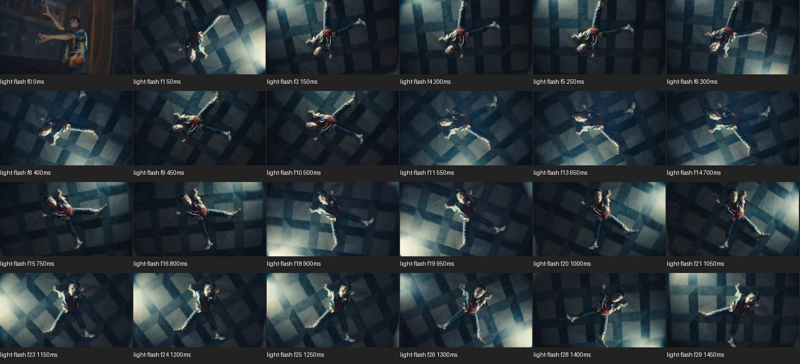

# Light Flash


- 출처: Eyecandy · [Light Flash](https://eyecannndy.com/technique/light-flash)
- 카탈로그 등록 표기: **Light Flash 라이트 플래시**
- 카테고리: F · Lens & Optics · 렌즈 & 옵틱
- 원본 미디어: [애니메이션 WebP](https://asset.eyecannndy.com/media/clip/2024/01/04/261704342082.webp)
- 확인 방식: 원본 애니메이션을 디코딩해 시간순 프레임을 추출한 뒤 컨택트 시트를 직접 시각 확인했다. 전체 30프레임 / 1500ms, 기본 12시점, 추가 24시점 고밀도 확인. 재생·음향 청취·전 프레임 시각 검수·생성 테스트를 했다고 주장하지 않는다.
- 기본 확인 프레임: 0, 3, 5, 8, 11, 13, 16, 18, 21, 24, 26, 29. 해당 타임스탬프(ms): 0, 150, 250, 400, 550, 650, 800, 900, 1050, 1200, 1300, 1450.
- 원본 길이는 관찰 정보다. 아래 새 장면의 길이를 원본에 자동 맞추지 않는다.

## 움직임 증거





## 원본에서 확인한 시작 → 변화 → 끝

초반 다른 각도의 인물 컷 뒤 체크 무늬 바닥 위 전신을 위에서 보는 회전 구도로 바뀐다. 밝은 빛의 얼룩이 화면 가장자리에서 지나가고 팔·다리 퍼포먼스와 바닥의 회전이 함께 이어진다.

- 카메라·시점: 탑뷰에서 인물·바닥 전체가 함께 회전한다.
- 주체: 팔과 다리를 펼치는 동작이 이어진다.
- 조명·합성·편집: 초반 컷과 움직이는 빛 얼룩이 있으며 전면 백색 소실은 미확인.

## 작동 원리와 확인 한계

움직이는 강한 빛과 밝기 변화로 순간을 강조한다. 샘플에서는 화면 전체가 흰색으로 소실되는 플래시는 명확하지 않다.

샘플 사이의 빠른 변화는 일부 빠질 수 있다. GIF의 반복 경계가 작품의 의도된 완전 루프라는 보장은 없다. 원본 음악·대사·촬영 장비·제작 소프트웨어는 확인하지 않았다. 아래 프롬프트는 관찰한 원리를 다른 장면에 각색한 창작안이며 원본 장면이나 검증된 생성 결과가 아니다.

## 뮤직비디오 각색 · 완전한 장면 프롬프트

```text
어두운 창고에서 성인 댄서가 팔을 크게 펼치는 뮤직비디오. 높은 사선 카메라로 전신과 바닥 선을 담고 천천히 시계 방향으로 롤한다. 댄서가 손을 위로 뻗는 한 번의 절정에서 측면 광원이 짧게 강해져 팔 윤곽과 바닥을 밝히고 바로 원래 노출로 돌아온다. 댄서는 동작을 이어가며 카메라는 롤을 감속해 수평 전신 구도로 착지한다. 플래시는 한 번만 사용하고 얼굴과 몸 형태는 유지한다. 마지막에는 조명이 안정되어 포즈를 읽히게 한다.
```

## 브랜드필름 각색 · 완전한 장면 프롬프트

```text
반사 소재 운동화를 강조하는 브랜드필름. 회색 스튜디오에서 성인 모델의 신발을 낮은 측면으로 담는다. 모델이 발을 들어 앞쪽으로 내려놓는 순간 좁은 측면 광원을 한 번 짧게 강하게 만들어 반사 패널이 또렷이 빛나게 한다. 카메라는 발과 나란히 짧게 이동하다 착지에 맞춰 멈춘다. 밝기가 정상으로 돌아오면 갑피의 질감과 밑창 구조를 선명하게 유지한다. 마지막은 두 신발의 온전한 측면 구도이며 반사광이 제품 전체를 흰 덩어리로 바꾸지 않게 한다.
```

적용 시 사용자가 지정한 길이·참조·컷·음향·제품 보존 조건을 우선한다. 효과의 시작 계기와 도착 구도를 유지하며 필요한 부분을 해당 장면에 맞춰 다시 연출한다.
