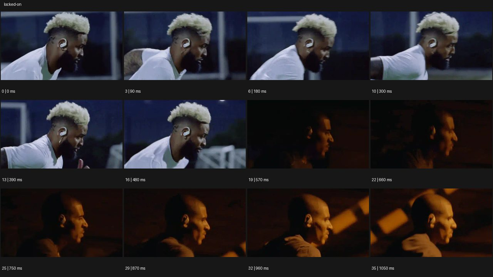

# Locked-On


- 원본 등록명: **Locked-On**
- 분류: D · 편집 & 전환 / Editing & Transition
- 공식 기법 페이지: [Locked-On](https://eyecannndy.com/technique/locked-on)
- 지정 원본 미디어: [애니메이션 WebP](https://asset.eyecannndy.com/media/clip/2024/01/10/261704860577.webp)
- 확인 방식: 36프레임 중 12시점의 시간순 이미지 배열을 직접 시각 확인. 메타데이터 길이 1.08초. 전체 프레임 재생·청음 확인 또는 생성 재현 테스트로 보고하지 않는다.



## 실제 관찰

0–0.48초 흰 옷의 달리는 인물이 측면으로 보이고 귀의 장치와 머리가 비슷한 위치에 유지된다. 0.57초 어두운 주황빛의 다른 달리는 인물로 컷이 바뀐다. 0.66–1.05초 두 번째 인물의 머리가 프레임 내 비슷한 위치에서 추적되고 배경이 흐른다.

## 작동 원리와 역할

움직이는 대상의 선택 지점을 프레임 기준으로 유지하는 추적·안정화다. 주체는 달리고 카메라/후반 정렬은 머리의 위치를 따라간다. 회전은 필수 요소가 아니다.

## 해석의 한계

실제 추적 리그와 후반 안정화의 비율은 미확인이다. 예시에 항상 중앙 회전이 있다는 기존 설명은 적용하지 않는다. 샘플 사이의 모든 움직임과 반복 경계의 무봉합 여부는 별도 검증하지 않았다. 아래 프롬프트는 새로운 장면 각색이며 생성 테스트는 하지 않았다.

## 뮤직비디오 적용 · 완성형 프롬프트

아래 설정과 길이는 독립 창작 예시다. 실제 요청의 길이·참조·음향 조건을 우선한다.

```text
7초 뮤직비디오. 성인 보컬이 긴 터널을 달리는 옆모습으로 시작한다. 카메라는 옆에서 같은 속도로 이동하고 보컬의 왼쪽 눈을 프레임의 일정한 지점에 유지한다. 팔과 어깨는 달리기에 맞춰 움직이고 벽의 빛 줄무늬는 뒤로 흐르지만 눈과 얼굴은 읽힌다. 중간에 보컬이 속도를 올리면 카메라도 함께 가속하며 배경 블러만 강해진다. 터널 끝에서 보컬이 멈추면 추적도 자연스럽게 감속해 같은 옆얼굴 구도로 안착한다. 마지막 2초 시선은 앞을 향하고 얼굴이 화면 중심 주위로 불필요하게 회전하지 않는다.
```

## 브랜드필름 적용 · 완성형 프롬프트

제품의 재질과 기능이 읽히는 순간에 효과를 배치하고 안정된 제품 상태로 끝낸다. 실제 브랜드 톤과 구조에 맞춰 각색한다.

```text
7초 프리미엄 무선 이어폰 필름. 성인 러너가 공원 길을 달리며 카메라는 귀 옆의 가까운 측면에서 나란히 이동한다. 이어폰 외곽을 프레임의 같은 위치와 크기에 유지하고 얼굴과 뒷목의 자연스러운 움직임은 남긴다. 러너가 그늘에서 햇빛으로 들어가면 제품의 무광 표면과 작은 금속 디테일이 드러난다. 손가락이 이어폰을 가볍게 한 번 터치한 뒤 다시 달리기 자세로 돌아간다. 마지막 러너가 걸음으로 바꾸면 카메라도 감속해 이어폰과 옆얼굴을 안정적으로 담는다. 제품이 귀에서 뜨거나 모양이 바뀌지 않는다.
```

음향은 원본에서 확인하지 않았다. 실제 음원과 무음·NO BGM 등 사용자 조건을 유지한다. 특정 모델의 자동 재현을 보장하는 프리셋이 아니다.
