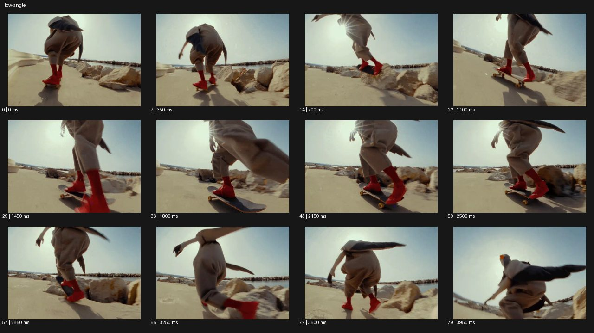

# Low Angle


- 원본 등록명: **Low Angle**
- 분류: B · 앵글 & 구도 / Angle & Framing
- 공식 기법 페이지: [Low Angle](https://eyecannndy.com/technique/low-angle)
- 지정 원본 미디어: [애니메이션 WebP](https://asset.eyecannndy.com/media/clip/2024/03/04/261709537638.webp)
- 확인 방식: 80프레임 중 12시점의 시간순 이미지 배열을 직접 시각 확인. 메타데이터 길이 4.0초. 전체 프레임 재생·청음 확인 또는 생성 재현 테스트로 보고하지 않는다.



## 실제 관찰

해변 길에서 붉은 신발의 스케이트보더를 낮은 뒤쪽 시점으로 따라간다. 0.7초 보드와 몸이 들리고 1.1초 무렵 다시 보드 위에 착지한다. 1.45–2.5초 다리와 바퀴 가까이 추적하다가 2.85–3.95초 몸을 낮추고 팔을 펼치는 동작을 담는다.

## 작동 원리와 역할

주체가 실제 주행·점프·착지를 한다. 카메라는 다리보다 낮은 높이에서 따라가며 광각 원근과 지나가는 바닥이 속도를 만든다.

## 해석의 한계

움직임 때문에 얼굴과 신체 일부가 잘린다. 정확한 지상 높이와 렌즈는 확인되지 않는다. 샘플 사이의 모든 움직임과 반복 경계의 무봉합 여부는 별도 검증하지 않았다. 아래 프롬프트는 새로운 장면 각색이며 생성 테스트는 하지 않았다.

## 뮤직비디오 적용 · 완성형 프롬프트

아래 설정과 길이는 독립 창작 예시다. 실제 요청의 길이·참조·음향 조건을 우선한다.

```text
7초 뮤직비디오. 붉은 운동화를 신은 성인 댄서가 해 질 무렵 농구장을 가로지른다. 카메라는 무릎 아래 높이에서 옆으로 이동하며 첫 발의 미끄러짐과 바닥 그림자를 크게 잡는다. 댄서가 두 번 빠르게 스텝을 밟고 낮게 점프하면 카메라는 같은 높이로 따라가 하늘을 배경으로 몸이 솟는 순간을 보여준다. 착지 때는 발과 바닥 사이 접촉을 선명하게 읽히고 이동 속도를 줄인다. 마지막에는 댄서가 멈춰 렌즈를 내려다보며 팔을 펼친다. 바닥 가까운 시점은 유지하되 신발이나 다리가 비정상적으로 늘어나지 않게 한다.
```

## 브랜드필름 적용 · 완성형 프롬프트

제품의 재질과 기능이 읽히는 순간에 효과를 배치하고 안정된 제품 상태로 끝낸다. 실제 브랜드 톤과 구조에 맞춰 각색한다.

```text
7초 프리미엄 러닝화 필름. 젖은 석재 산책로에서 회색 러닝화를 신은 성인 러너의 발 옆 25센티미터 높이로 카메라가 출발한다. 러너가 천천히 체중을 실으면 밑창이 지면을 누르는 모습을 읽힌 뒤 두 걸음 가볍게 달린다. 카메라는 발 옆에서 나란히 추적하며 낮은 햇빛이 메쉬와 뒤꿈치 곡면을 드러내게 한다. 마지막 걸음에서 러너가 멈추고 카메라는 발끝보다 조금 앞에 안착한다. 끝 2초 신발의 전체 실루엣과 소재를 선명하게 담는다. 과장된 탄성 변형이나 공중 부유 없이 실제 착지 감각을 유지한다.
```

음향은 원본에서 확인하지 않았다. 실제 음원과 무음·NO BGM 등 사용자 조건을 유지한다. 특정 모델의 자동 재현을 보장하는 프리셋이 아니다.
