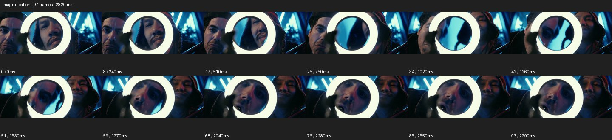

# Magnification


- 출처: Eyecandy · [Magnification](https://eyecannndy.com/technique/magnification)
- 카탈로그 등록 표기: **Magnification 매그니피케이션**
- 카테고리: F · Lens & Optics · 렌즈 & 옵틱
- 원본 미디어: [애니메이션 WebP](https://asset.eyecannndy.com/media/clip/2024/03/10/261710030897.webp)
- 확인 방식: 원본 애니메이션을 디코딩해 시간순 프레임을 추출한 뒤 컨택트 시트를 직접 시각 확인했다. 전체 94프레임 / 2820ms, 기본 12시점. 재생·음향 청취·전 프레임 시각 검수·생성 테스트를 했다고 주장하지 않는다.
- 기본 확인 프레임: 0, 8, 17, 25, 34, 42, 51, 59, 68, 76, 85, 93. 해당 타임스탬프(ms): 0, 240, 510, 750, 1020, 1260, 1530, 1770, 2040, 2280, 2550, 2790.
- 원본 길이는 관찰 정보다. 아래 새 장면의 길이를 원본에 자동 맞추지 않는다.

## 움직임 증거



## 원본에서 확인한 시작 → 변화 → 끝

밝은 원형 테두리 안에 얼굴 일부가 크게 보인다. 원형 도구가 움직이면서 안쪽의 확대된 얼굴과 뒤의 인물이 바뀌고, 원 밖에는 주변 사람과 푸른 배경이 남는다.

- 카메라·시점: 원형 확대 영역을 가까운 구도에 유지한다.
- 주체: 사람과 원형 도구가 움직인다.
- 조명·합성·편집: 원 안쪽 확대·굴절과 바깥 영상이 동시에 존재한다.

## 작동 원리와 확인 한계

화면 전체 확대 대신 특정 경계 안의 국소 확대를 이동해 디테일에 시선을 모은다. 반사·굴절이 함께 있어 실제 도구의 광학 구성은 미확인.

샘플 사이의 빠른 변화는 일부 빠질 수 있다. GIF의 반복 경계가 작품의 의도된 완전 루프라는 보장은 없다. 원본 음악·대사·촬영 장비·제작 소프트웨어는 확인하지 않았다. 아래 프롬프트는 관찰한 원리를 다른 장면에 각색한 창작안이며 원본 장면이나 검증된 생성 결과가 아니다.

## 뮤직비디오 각색 · 완전한 장면 프롬프트

```text
성인 보컬과 두 동료가 네온빛 방에 있는 뮤직비디오. 카메라는 세 사람의 미디엄을 고정하고 보컬이 둥근 돋보기를 얼굴 앞으로 들어 올린다. 원 안의 눈과 눈썹만 자연스럽게 확대되며 원 밖 얼굴은 원래 크기를 유지한다. 보컬이 돋보기를 옆으로 천천히 옮기면 확대 영역이 동료의 웃는 입으로 이동한다. 마지막에 도구를 아래로 내려 세 사람의 온전한 표정이 함께 보이게 한다. 유리 경계와 손의 접촉을 유지하고 원 안에 별도 얼굴을 생성하지 않는다.
```

## 브랜드필름 각색 · 완전한 장면 프롬프트

```text
보석 세공의 디테일을 소개하는 브랜드필름. 밝은 작업대의 반지 전체를 위에서 가까이 담고 장인이 원형 확대경을 천천히 프레임 안으로 가져온다. 확대경 안에서만 세팅의 작은 발과 보석 가장자리가 크게 보이며 바깥의 반지는 원래 비율을 유지한다. 장인이 확대경을 작은 곡선으로 옮겨 두 접합부를 차례로 읽힌다. 마지막에는 확대경을 살짝 옆으로 놓고 반지 전체와 확대된 한 디테일을 나란히 남긴다. 반지 형태와 보석 수, 금속 색을 바꾸지 않는다.
```

적용 시 사용자가 지정한 길이·참조·컷·음향·제품 보존 조건을 우선한다. 효과의 시작 계기와 도착 구도를 유지하며 필요한 부분을 해당 장면에 맞춰 다시 연출한다.
