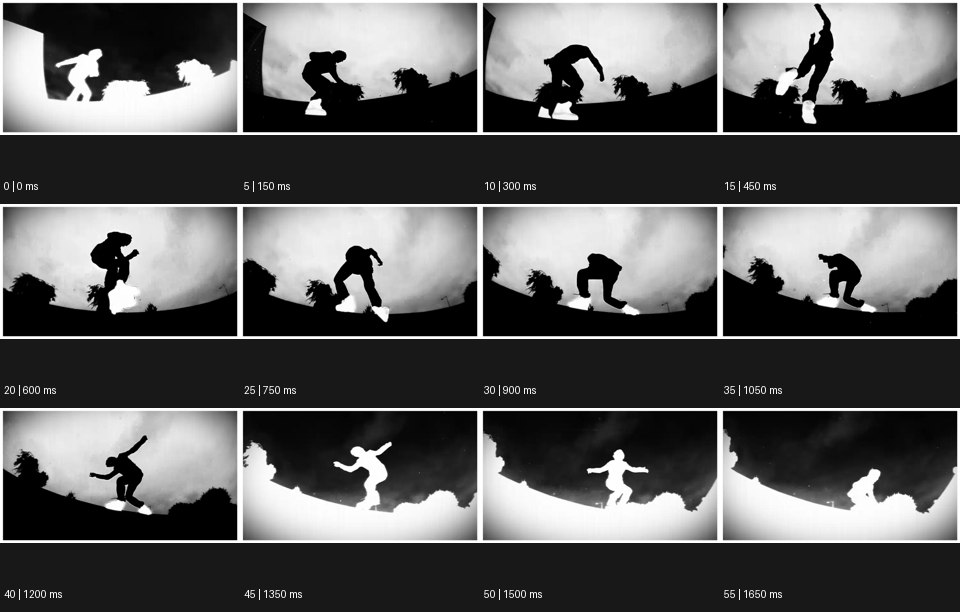

# Masking 마스킹


출처: Eyecandy · 원본 등록 카드명: **Masking 마스킹** · slug: masking

분류: I · VFX & Style / VFX & 스타일

[원본 기법 페이지](https://eyecannndy.com/technique/masking) · [원본 미디어](https://asset.eyecannndy.com/media/clip/2023/12/24/261703451266.webp)

## 확인 근거

원본 56프레임, 메타데이터 길이 1680ms. 고유 12개 시점 프레임을 추출하여 이미지로 직접 관찰했다. 재생 감상·음향 청취·생성 재현 테스트를 했다는 뜻이 아니다.

표본 프레임(0부터): 0, 5, 10, 15, 20, 25, 30, 35, 40, 45, 50, 55



## 실제 시간순 관찰

0ms: 어두운 하늘 쪽과 밝은 인물·지면의 반전된 흑백 구도. 150–450ms: 밝은 하늘 아래 검은 인물이 몸을 낮추고 도약하며 흰 신발이 분리되어 읽힌다. 600–1200ms: 인물이 공중에서 몸을 접었다가 낮게 착지하는 흐름. 1350–1650ms: 인물·지면·하늘의 명암 관계가 다시 반전된다.

## 주체·카메라·합성·편집 구분

주체는 스케이트 동작처럼 보이는 도약·착지를 한다. 카메라는 지면 가까운 넓은 화각에서 인물의 경로를 담는다. 인물 실루엣과 신발을 분리하는 영역 처리, 전체 또는 선택적 명암 반전이 보인다.

## 장면에 재사용할 원리

영역별 가시성과 처리를 분리하는 마스크 원리를 쓴다. 이 사례에서는 실루엣과 신발이 다른 명도로 읽힌다. 로토스코핑·키잉·실사 조명 중 정확한 제작 조합은 추정이다.

## 확인 한계

공식 이름은 Masking으로 유지한다. 이 미디어는 입 안으로 들어가는 사용자 예시가 아니다. 명암 반전은 이 샘플의 관찰 특징이며 새로운 공식 효과명이 아니다. 표본 사이의 모든 프레임과 반복 경계의 연속성을 검사하지 않았다. 음향은 확인하지 않았다.

## 뮤직비디오 각색 · 완성형 프롬프트

아래는 장면 목적에 맞게 새로 설계한 창작 적용안이며 원본 길이를 상속하지 않는다.

```text
6초 뮤직비디오, 흰 사이클로라마에서 성인 댄서가 검은 의상과 붉은 장갑을 착용한다. 바닥 가까운 고정 광각 카메라로 전신을 담고 첫 1초는 자연스러운 색으로 시작한다. 댄서가 두 팔을 들어 올리는 순간 몸과 배경을 각각 분리한 마스크를 적용해 몸은 짙은 실루엣, 배경은 밝은 회색으로 바꾼다. 붉은 장갑은 색과 손가락 윤곽을 보존해 팔의 궤적이 시선의 중심이 되게 한다. 댄서가 몸을 접었다가 펴며 한 걸음 전진하고, 마지막 손 내림에 맞춰 배경만 어두워져 붉은 장갑이 남는다. 정상 해부학과 전신 동작을 유지하며 무음·무자막으로 끝낸다.
```

## 브랜드필름 각색 · 완성형 프롬프트

```text
7초 러닝화 브랜드필름, 밝은 회색 곡면 벽 앞의 성인 러너가 한 걸음 도약한다. 낮은 삼사분면 카메라는 러너와 함께 1m 옆으로 이동한다. 도약 전에는 자연스러운 실사를 보여주고 발이 바닥을 떠나면 몸과 배경을 마스크로 낮은 채도의 그래픽 실루엣으로 정리한다. 신발 영역은 실제 색, 갑피 조직, 끈, 밑창 홈을 유지하고 변형하지 않는다. 착지 순간 그림자는 실제 발 아래에 이어진다. 카메라는 착지한 앞발의 측면에서 멈추고 마스크 대비를 완화해 마지막 2초에 제품 재질을 선명하게 읽힌다. 로고를 새로 만들지 않고 발소리만 둔다.
```

생성 테스트: 미실시. 단일 모델의 정확한 재현을 보장하지 않으며 필요한 촬영·합성·편집 층을 구분해 구현한다.
