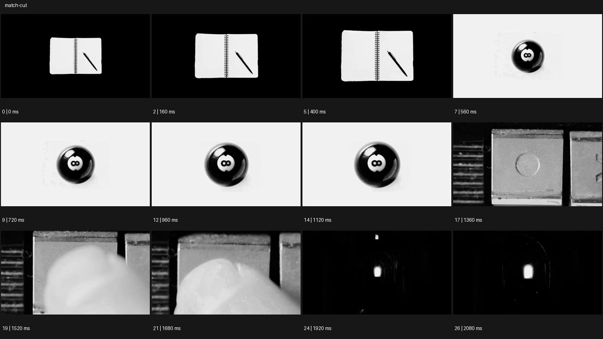

# Match Cut


- 원본 등록명: **Match Cut**
- 분류: D · 편집 & 전환 / Editing & Transition
- 공식 기법 페이지: [Match Cut](https://eyecannndy.com/technique/match-cut)
- 지정 원본 미디어: [애니메이션 WebP](https://asset.eyecannndy.com/media/clip/2024/01/06/261704512088.webp)
- 확인 방식: 27프레임 중 12시점의 시간순 이미지 배열을 직접 시각 확인. 메타데이터 길이 2.16초. 전체 프레임 재생·청음 확인 또는 생성 재현 테스트로 보고하지 않는다.



## 실제 관찰

검은 배경의 열린 노트와 펜이 커지다가 0.56초 흰 배경 중앙의 검은 8번 공으로 바뀐다. 1.36초 사각 버튼의 원형 표시로 컷되고 손가락이 들어와 누른다. 1.92–2.08초 어두운 터널의 밝은 출구가 중앙에 남는다.

## 작동 원리와 역할

색 대비·중심 위치·원형 표시처럼 장면 간 시각적 공통점을 편집으로 이어준다. 실제 물체가 변형되는 과정과 하드컷을 구별한다.

## 해석의 한계

모든 컷이 동일 형태를 완벽히 일치시키는 것은 아니다. 특정 제작 도구나 완전한 무편집을 뜻하지 않는다. 샘플 사이의 모든 움직임과 반복 경계의 무봉합 여부는 별도 검증하지 않았다. 아래 프롬프트는 새로운 장면 각색이며 생성 테스트는 하지 않았다.

## 뮤직비디오 적용 · 완성형 프롬프트

아래 설정과 길이는 독립 창작 예시다. 실제 요청의 길이·참조·음향 조건을 우선한다.

```text
7초 뮤직비디오. 성인 보컬의 손이 어두운 방에서 원형 손거울을 들어 얼굴을 비춘다. 카메라는 거울이 중앙을 채우도록 짧게 접근하고 보컬이 눈을 들면 거울의 밝은 원을 같은 크기의 무대 스포트라이트로 한 번 하드컷한다. 다음 숏은 천장을 보던 카메라가 아래로 천천히 틸트해 그 빛 아래 서 있는 같은 보컬을 드러낸다. 두 원의 중심과 흰빛 색을 맞추되 거울이 물리적으로 조명으로 변하지 않게 한다. 마지막에는 보컬 전신과 바닥 빛의 원을 함께 담고 2초 고정한다. 새로운 의상으로 바꾸지 않는다.
```

## 브랜드필름 적용 · 완성형 프롬프트

제품의 재질과 기능이 읽히는 순간에 효과를 배치하고 안정된 제품 상태로 끝낸다. 실제 브랜드 톤과 구조에 맞춰 각색한다.

```text
7초 고급 커피 필름. 흰 도자기 잔의 검은 커피 표면을 수직으로 내려다보는 근접 구도로 시작한다. 작은 파문이 잦아들어 원형 표면이 안정되면 같은 크기와 위치의 커피 그라인더 상부 다이얼로 한 번 하드컷한다. 성인 손이 다이얼을 짧게 돌리며 금속 눈금이 빛을 받는다. 카메라는 천천히 뒤로 이동해 머신과 앞의 잔을 한 프레임에 드러낸다. 마지막 2초 제품 전체와 잔을 안정적으로 보여준다. 컷 전후 원형의 중심·크기·회전 방향을 맞추고 액체가 금속으로 녹아 변하는 합성은 넣지 않는다.
```

음향은 원본에서 확인하지 않았다. 실제 음원과 무음·NO BGM 등 사용자 조건을 유지한다. 특정 모델의 자동 재현을 보장하는 프리셋이 아니다.
