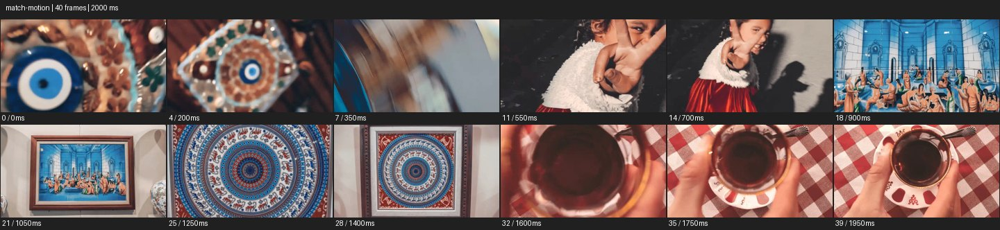

# Match Motion


- 출처: Eyecandy · [Match Motion](https://eyecannndy.com/technique/match-motion)
- 카탈로그 등록 표기: **Match Motion 매치 모션**
- 카테고리: H · More Editing & Transition · 편집 & 전환 확장
- 원본 미디어: [애니메이션 WebP](https://asset.eyecannndy.com/media/clip/2024/02/28/261709103719.webp)
- 확인 방식: 원본 애니메이션을 디코딩해 시간순 프레임을 추출한 뒤 컨택트 시트를 직접 시각 확인했다. 전체 40프레임 / 2000ms, 기본 12시점. 재생·음향 청취·전 프레임 시각 검수·생성 테스트를 했다고 주장하지 않는다.
- 기본 확인 프레임: 0, 4, 7, 11, 14, 18, 21, 25, 28, 32, 35, 39. 해당 타임스탬프(ms): 0, 200, 350, 550, 700, 900, 1050, 1250, 1400, 1600, 1750, 1950.
- 원본 길이는 관찰 정보다. 아래 새 장면의 길이를 원본에 자동 맞추지 않는다.

## 움직임 증거



## 원본에서 확인한 시작 → 변화 → 끝

원형 장식에서 빠르게 회전하며 인물의 손 제스처로 넘어간다. 이어 액자 속 그림, 원형 문양, 위에서 본 찻잔이 연속된다. 각 컷의 중심 형태와 회전·확대 방향이 비슷하게 이어진다.

- 카메라·시점: 회전·접근 방향이 컷을 건너 이어진다.
- 주체: 손 제스처와 소품 움직임이 있다.
- 조명·합성·편집: 다른 장소·대상의 중심 형태와 운동을 연결한다.

## 작동 원리와 확인 한계

앞 컷의 시선 중심과 운동 방향을 다음 컷으로 넘겨 다른 소재를 하나의 흐름으로 묶는다. 모든 컷이 무편집 이동인 것은 아니다.

샘플 사이의 빠른 변화는 일부 빠질 수 있다. GIF의 반복 경계가 작품의 의도된 완전 루프라는 보장은 없다. 원본 음악·대사·촬영 장비·제작 소프트웨어는 확인하지 않았다. 아래 프롬프트는 관찰한 원리를 다른 장면에 각색한 창작안이며 원본 장면이나 검증된 생성 결과가 아니다.

## 뮤직비디오 각색 · 완전한 장면 프롬프트

```text
성인 보컬의 일상과 무대를 연결하는 뮤직비디오. 방 안에서 보컬이 손목을 돌려 작은 레코드를 들어 올리면 카메라도 레코드 중심을 유지하며 시계 방향으로 짧게 롤한다. 회전이 가장 빠른 순간 같은 중심과 방향으로 도는 무대 조명 원에 컷한다. 카메라는 회전을 이어가며 아래로 틸트해 무대 중앙의 같은 보컬을 드러내고 감속해 수평 전신 구도로 멈춘다. 손동작이 만든 에너지가 조명으로 이어지며 얼굴과 의상을 일치시킨다. 회전 방향이 컷에서 역전되지 않는다.
```

## 브랜드필름 각색 · 완전한 장면 프롬프트

```text
커피 원두에서 한 잔까지 연결하는 브랜드필름. 위에서 본 원형 로스팅 드럼의 움직임을 가까이 담고 카메라가 같은 중심을 향해 짧게 접근한다. 원두가 회전하며 중심을 감싸는 순간 같은 크기와 회전 방향의 컵 속 커피 소용돌이에 매치컷한다. 다음 컷에서도 짧게 접근을 이어간 뒤 감속하고 잔 전체를 읽히는 안정된 탑뷰에 착지한다. 소용돌이가 자연스럽게 잦아들며 크레마가 남는다. 컵 테두리와 액체 높이를 유지하고 새로운 포털 공간은 만들지 않는다.
```

적용 시 사용자가 지정한 길이·참조·컷·음향·제품 보존 조건을 우선한다. 효과의 시작 계기와 도착 구도를 유지하며 필요한 부분을 해당 장면에 맞춰 다시 연출한다.
