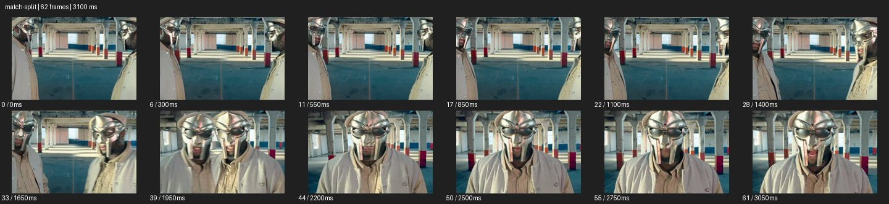

# Match Split


- 출처: Eyecandy · [Match Split](https://eyecannndy.com/technique/match-split)
- 카탈로그 등록 표기: **Match Split 매치 스플릿**
- 카테고리: H · More Editing & Transition · 편집 & 전환 확장
- 원본 미디어: [애니메이션 WebP](https://asset.eyecannndy.com/media/clip/2024/02/08/261707401477.webp)
- 확인 방식: 원본 애니메이션을 디코딩해 시간순 프레임을 추출한 뒤 컨택트 시트를 직접 시각 확인했다. 전체 62프레임 / 3100ms, 기본 12시점. 재생·음향 청취·전 프레임 시각 검수·생성 테스트를 했다고 주장하지 않는다.
- 기본 확인 프레임: 0, 6, 11, 17, 22, 28, 33, 39, 44, 50, 55, 61. 해당 타임스탬프(ms): 0, 300, 550, 850, 1100, 1400, 1650, 1950, 2200, 2500, 2750, 3050.
- 원본 길이는 관찰 정보다. 아래 새 장면의 길이를 원본에 자동 맞추지 않는다.

## 움직임 증거



## 원본에서 확인한 시작 → 변화 → 끝

빈 창고의 양쪽 가장자리에 금속 마스크를 쓴 인물이 반씩 보인다. 좌우 영상이 중앙으로 가까워지며 두 마스크가 나란히 겹친 뒤 가운데 한 인물처럼 정렬된다. 후반 중앙의 온전한 얼굴이 남는다.

- 카메라·시점: 양쪽 화면 구도가 중앙으로 정렬된다.
- 주체: 마스크 쓴 인물의 두 부분이 한 얼굴처럼 합쳐진다.
- 조명·합성·편집: 분할 경계와 정렬을 이용한 레이어 효과로 보인다.

## 작동 원리와 확인 한계

분할된 두 화면의 형태·배경 선을 맞춰 하나의 연속된 영상으로 합쳐 보이게 한다. 단순 실제 쌍둥이의 접근인지 레이어 합성인지 세부 제작 방식은 미확인.

샘플 사이의 빠른 변화는 일부 빠질 수 있다. GIF의 반복 경계가 작품의 의도된 완전 루프라는 보장은 없다. 원본 음악·대사·촬영 장비·제작 소프트웨어는 확인하지 않았다. 아래 프롬프트는 관찰한 원리를 다른 장면에 각색한 창작안이며 원본 장면이나 검증된 생성 결과가 아니다.

## 뮤직비디오 각색 · 완전한 장면 프롬프트

```text
성인 보컬의 상반된 태도를 보여주는 뮤직비디오. 좌우 세로 분할 화면에 같은 보컬을 각각 배치하고 같은 회색 복도를 배경으로 둔다. 왼쪽 보컬은 눈을 내리고 오른쪽 보컬은 렌즈를 바라본다. 두 영상의 구도를 천천히 중앙으로 옮겨 코선과 어깨선, 복도 소실점을 맞춘다. 경계가 정확히 맞는 순간 하나의 정면 얼굴로 합쳐지고 보컬이 고개를 든다. 마지막에는 분할선 없는 미디엄으로 정지한다. 인물 정체성과 눈·입의 위치가 어긋나지 않게 한다.
```

## 브랜드필름 각색 · 완전한 장면 프롬프트

```text
정교한 테일러링을 보여주는 브랜드필름. 세로로 나뉜 왼쪽 화면에는 재킷 앞면의 왼쪽 절반, 오른쪽에는 같은 재킷의 오른쪽 절반을 같은 높이로 담는다. 성인 모델은 두 화면에서 곧은 자세를 유지하고 카메라 구도만 서로 중앙 쪽으로 천천히 맞춘다. 라펠, 단추, 어깨가 이어지는 순간 분할선을 없애 하나의 완전한 상반신으로 보이게 한다. 마지막에는 모델이 작은 한 걸음을 앞으로 내딛고 카메라는 정지한다. 양쪽 원단 색과 조명, 재단선이 정확히 이어지게 한다.
```

적용 시 사용자가 지정한 길이·참조·컷·음향·제품 보존 조건을 우선한다. 효과의 시작 계기와 도착 구도를 유지하며 필요한 부분을 해당 장면에 맞춰 다시 연출한다.
