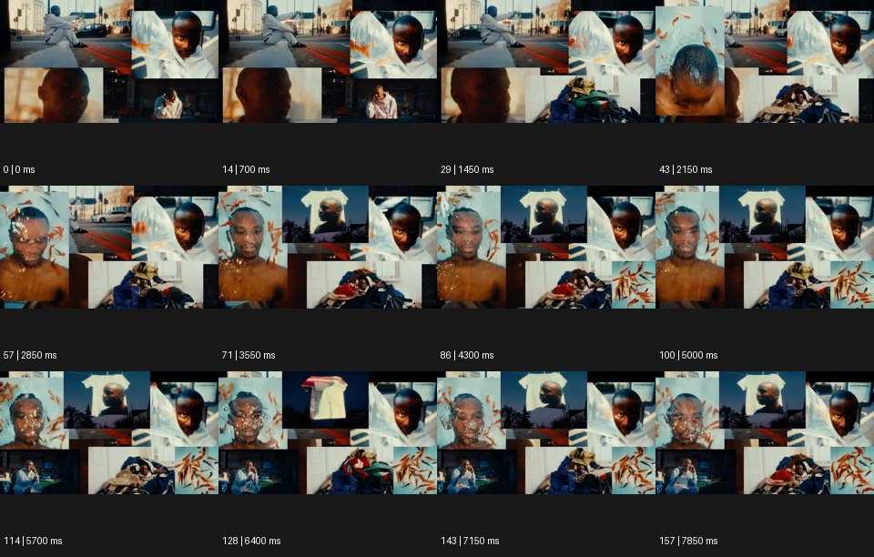

# Maximalism 맥시멀리즘


출처: Eyecandy · 원본 등록 카드명: **Maximalism 맥시멀리즘** · slug: maximalism

분류: I · VFX & Style / VFX & 스타일

[원본 기법 페이지](https://eyecannndy.com/technique/maximalism) · [원본 미디어](https://asset.eyecannndy.com/media/clip/2023/12/16/261702704033.webp)

## 확인 근거

원본 158프레임, 메타데이터 길이 7900ms. 고유 12개 시점 프레임을 추출하여 이미지로 직접 관찰했다. 재생 감상·음향 청취·생성 재현 테스트를 했다는 뜻이 아니다.

표본 프레임(0부터): 0, 14, 29, 43, 57, 71, 86, 100, 114, 128, 143, 157



## 실제 시간순 관찰

0–1450ms: 인물의 여러 크기 영상이 서로 다른 직사각 창으로 한 화면을 채운다. 2150–5000ms: 물속 같은 얼굴, 옷 무더기, 거리 인물 등 새 영상 창이 추가·교체된다. 5700–7850ms: 더 작은 창과 겹치는 구도가 이어지며 한 번에 여러 시간의 동작이 보인다.

## 주체·카메라·합성·편집 구분

각 창 안 인물이 독립적으로 움직인다. 화면 전체 카메라보다 영상 창의 편집·배치·교체가 주된 구성 원리다. 색과 크기 대비가 시선을 분산·집중시킨다.

## 장면에 재사용할 원리

많은 요소를 동시 배치하되 주요 인물이나 주제의 반복으로 화면이 완전히 흩어지지 않게 조직한다.

## 확인 한계

원본 음악을 듣지 않았으므로 창 교체가 특정 박자에 맞는다고 주장하지 않는다. 표본 사이의 모든 프레임과 반복 경계의 연속성을 검사하지 않았다. 음향은 확인하지 않았다.

## 뮤직비디오 각색 · 완성형 프롬프트

아래는 장면 목적에 맞게 새로 설계한 창작 적용안이며 원본 길이를 상속하지 않는다.

```text
8초 맥시멀리즘 뮤직비디오, 같은 성인 보컬의 녹음실 정면·손 클로즈업·옥상 전신 영상을 검은 화면의 세 창으로 시작한다. 첫 2초는 중앙 얼굴 창이 가장 크다. 보컬이 양손을 펴면 주변에 신발, 케이블, 노트의 작은 움직이는 창이 차례로 생겨 화면을 채운다. 각 창은 한 가지 동작만 반복하고 중앙 얼굴을 가리지 않는다. 5초에는 주변 창을 촘촘한 격자로 정렬해 에너지를 절정에 놓는다. 마지막 2초는 주변 창만 어두워지고 중앙 보컬의 호흡이 남는다. 창 내부 카메라는 고정하며 카메라 줌 대신 편집 크기로 리듬을 만든다. 임의 문자·대사는 없다.
```

## 브랜드필름 각색 · 완성형 프롬프트

```text
8초 패션 하우스의 공예 브랜드필름, 검은 바탕에 직물 확대·재단하는 손·단추·완성 재킷의 네 영상을 배치한다. 처음에는 완성 재킷 창을 화면 절반으로 두고 나머지는 좁게 둔다. 2초부터 장인의 손 동작을 따라 직물과 공정의 작은 창이 늘어나 최대 아홉 개의 풍부한 구성으로 펼쳐진다. 색은 아이보리·남색·금속색으로 제한해 재료가 통일되어 보이게 한다. 5초에 모든 손이 일을 멈추면 창들이 정렬되고 완성 재킷 창이 다시 중심을 차지한다. 마지막 2초는 실루엣과 봉제선 가독성을 보존한다. 새 로고·문자 없이 실제 작업 소리만 둔다.
```

생성 테스트: 미실시. 단일 모델의 정확한 재현을 보장하지 않으며 필요한 촬영·합성·편집 층을 구분해 구현한다.
