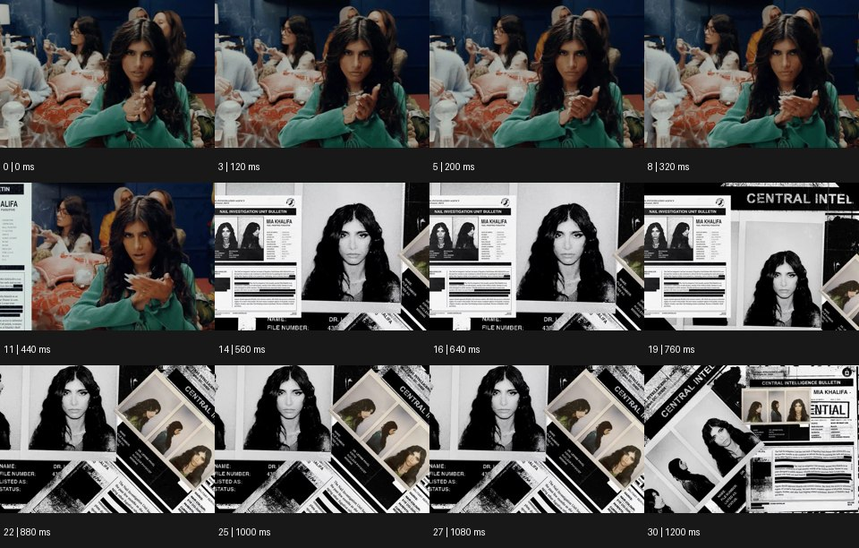

# Mixed Media 믹스드 미디어


출처: Eyecandy · 원본 등록 카드명: **Mixed Media 믹스드 미디어** · slug: mixed-media

분류: I · VFX & Style / VFX & 스타일

[원본 기법 페이지](https://eyecannndy.com/technique/mixed-media) · [원본 미디어](https://asset.eyecannndy.com/media/clip/2024/03/04/261709539206.webp)

## 확인 근거

원본 31프레임, 메타데이터 길이 1240ms. 고유 12개 시점 프레임을 추출하여 이미지로 직접 관찰했다. 재생 감상·음향 청취·생성 재현 테스트를 했다는 뜻이 아니다.

표본 프레임(0부터): 0, 3, 5, 8, 11, 14, 16, 19, 22, 25, 27, 30



## 실제 시간순 관찰

0–320ms: 식탁 같은 장소의 인물이 두 손을 모으거나 비빈다. 440–640ms: 종이 문서와 흑백 얼굴 사진이 화면 가장자리와 전면에 들어온다. 760–1200ms: 실사 장면보다 흑백 인쇄 문서·사진의 중첩과 회전 배치가 화면을 채운다.

## 주체·카메라·합성·편집 구분

초반은 실사 인물 동작, 후반은 사진·종이 그래픽 층의 이동과 편집이다. 매체가 바뀌며 얼굴 이미지가 연결점이 된다. 실제 카메라가 종이 공간으로 이동했다고 단정하지 않는다.

## 장면에 재사용할 원리

같은 대상의 행동과 형태를 실사·사진·인쇄 질감으로 이어 매체가 바뀌어도 장면 의미가 이어지게 한다.

## 확인 한계

원본에 보이는 인물 이름·문서 문구를 새 프롬프트에 복제하지 않는다. 표본 사이의 모든 프레임과 반복 경계의 연속성을 검사하지 않았다. 음향은 확인하지 않았다.

## 뮤직비디오 각색 · 완성형 프롬프트

아래는 장면 목적에 맞게 새로 설계한 창작 적용안이며 원본 길이를 상속하지 않는다.

```text
7초 믹스드 미디어 뮤직비디오, 성인 보컬이 파란 방의 책상에서 오래된 일기장을 닫는 실사로 시작한다. 카메라는 정면 미디엄숏에서 천천히 접근한다. 책 표지가 닫히는 2초 지점에 같은 손 위치를 유지한 채 화면을 거친 흑백 인쇄 사진으로 바꾼다. 사진 위로 연필선이 이어져 방의 윤곽과 창밖 풍경을 그린다. 4초에 보컬의 얼굴 부분만 사진 조각처럼 분리되어 조금 들렸다가 원래 자리에 내려앉는다. 마지막에는 전체가 다시 정돈된 한 장의 인쇄 초상으로 멈춰 기억의 물성을 남긴다. 실제 글자와 임의 문구를 생성하지 않고 종이 마찰음만 둔다.
```

## 브랜드필름 각색 · 완성형 프롬프트

```text
8초 가죽 공예 브랜드필름, 장인이 갈색 가방의 손잡이를 꿰매는 실사 손 클로즈업으로 시작한다. 카메라는 손과 바늘을 향해 짧게 접근한다. 바늘이 가죽을 통과하는 2초 지점에 봉제선의 위치를 그대로 유지하며 같은 손잡이의 연필 도면으로 매치컷한다. 도면 위에 가죽 표본 사진과 금속 부품 사진이 겹쳐지고 각 조각은 제품 구조에 맞는 자리에 정렬된다. 5초에 도면 외곽이 실제 완성 가방으로 바뀌면 삼사분면 카메라가 작은 오빗으로 두께를 보여준다. 마지막 2초는 실사 제품의 가죽 결과 스티치에 안착한다. 새 문자나 로고는 없다.
```

생성 테스트: 미실시. 단일 모델의 정확한 재현을 보장하지 않으며 필요한 촬영·합성·편집 층을 구분해 구현한다.
