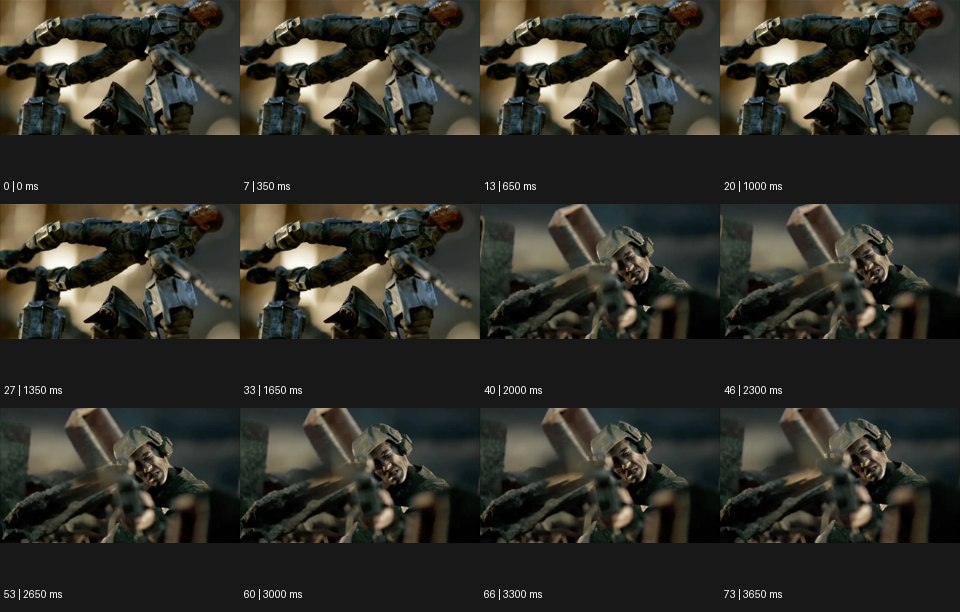

# Diorama 디오라마


출처: Eyecandy · 원본 등록 카드명: **Diorama 디오라마** · slug: model

분류: J · People, POV & Mood / 인물·시점·무드

[원본 기법 페이지](https://eyecannndy.com/technique/model) · [원본 미디어](https://asset.eyecannndy.com/media/clip/2024/03/14/261710399052.webp)

## 확인 근거

원본 74프레임, 메타데이터 길이 3700ms. 고유 12개 시점 프레임을 추출하여 이미지로 직접 관찰했다. 재생 감상·음향 청취·생성 재현 테스트를 했다는 뜻이 아니다.

표본 프레임(0부터): 0, 7, 13, 20, 27, 33, 40, 46, 53, 60, 66, 73



## 실제 시간순 관찰

0–1650ms: 파손된 장비·잔해 위에 수평으로 놓인 갑옷 같은 인물 모형이 매우 얕은 심도로 보인다. 2000ms: 다른 모형 인물의 얼굴과 앞쪽 무기·잔해가 보이는 가까운 구도로 바뀐다. 2300–3650ms: 해당 표정·자세를 거의 유지하며 작은 모형의 질감이 읽힌다.

## 주체·카메라·합성·편집 구분

주체는 대부분 정지된 조형처럼 보인다. 카메라 구도 변경과 얕은 초점이 작은 스케일을 만든다. 실제 미니어처 촬영인지 렌더링인지는 확정되지 않는다.

## 장면에 재사용할 원리

스케일을 암시하는 재질·깊이·초점과 정교한 정지 포즈로 큰 사건을 작은 전시물처럼 보여준다.

## 확인 한계

원본의 게임·영화 명칭이나 실물 모형 제작사를 추정하지 않는다. 표본 사이의 모든 프레임과 반복 경계의 연속성을 검사하지 않았다. 음향은 확인하지 않았다.

## 뮤직비디오 각색 · 완성형 프롬프트

아래는 장면 목적에 맞게 새로 설계한 창작 적용안이며 원본 길이를 상속하지 않는다.

```text
8초 디오라마 뮤직비디오, 손바닥 크기의 밤 버스 정류장 모형 안에 성인 보컬을 닮은 작은 인형 한 명을 앉힌다. 카메라는 모형 눈높이에서 유리 지붕의 물방울에 초점을 맞추며 시작한다. 2초부터 천천히 옆으로 이동해 벤치와 인형을 드러내고 초점을 인형 얼굴로 옮긴다. 인형은 큰 동작 없이 고개만 아주 조금 들어 먼 가로등을 바라본다. 페인트·미세한 먼지·모형 받침의 가장자리를 일부 남겨 작은 세계임을 읽힌다. 마지막 2초는 빈 의자와 인형의 간격을 고정 구도로 유지한다. 실사 크기로 변하는 전환·문자·대사는 없다.
```

## 브랜드필름 각색 · 완성형 프롬프트

```text
8초 건축 가구 브랜드필름, 작은 흰 방 디오라마 안에 실제 제품 비율을 정확히 줄인 목재 의자 한 개를 둔다. 카메라는 모형 문밖 낮은 위치에서 시작해 창을 통해 들어오는 빛을 따라 천천히 전진한다. 첫 3초는 방의 벽 두께와 바닥 질감으로 미니어처 스케일을 읽힌다. 의자에 가까워지면 초점을 등받이 접합부로 옮기고 모형 창은 흐리게 남긴다. 의자는 움직이거나 형태가 바뀌지 않는다. 마지막 3초는 삼사분면 정지 구도에서 실제 디자인의 다리 각도·두께·곡면을 보여준다. 새로운 로고·치수 표시 없이 조용한 환경음만 둔다.
```

생성 테스트: 미실시. 단일 모델의 정확한 재현을 보장하지 않으며 필요한 촬영·합성·편집 층을 구분해 구현한다.
