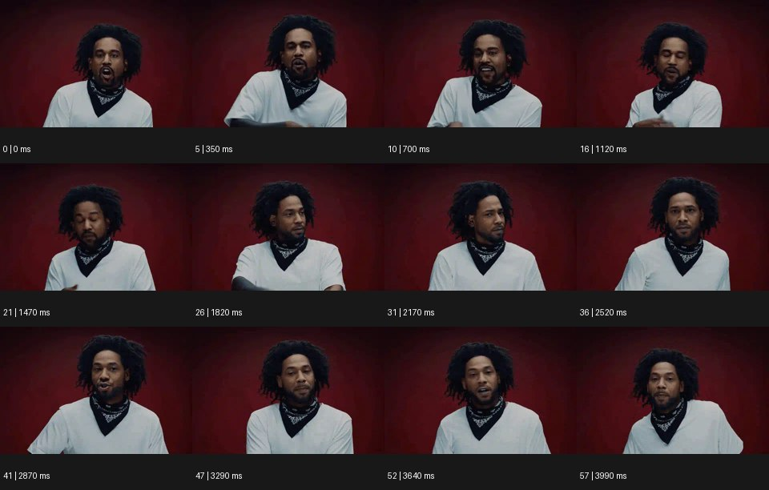

# Morphing 모핑


출처: Eyecandy · 원본 등록 카드명: **Morphing 모핑** · slug: morphing

분류: I · VFX & Style / VFX & 스타일

[원본 기법 페이지](https://eyecannndy.com/technique/morphing) · [원본 미디어](https://asset.eyecannndy.com/media/clip/2024/01/28/261706401449.webp)

## 확인 근거

원본 58프레임, 메타데이터 길이 4060ms. 고유 12개 시점 프레임을 추출하여 이미지로 직접 관찰했다. 재생 감상·음향 청취·생성 재현 테스트를 했다는 뜻이 아니다.

표본 프레임(0부터): 0, 5, 10, 16, 21, 26, 31, 36, 41, 47, 52, 57



## 실제 시간순 관찰

0–1120ms: 붉은 배경, 흰 상의와 검은 목 장식을 한 인물이 정면에서 입과 손을 움직인다. 1470–2170ms: 고개를 내렸다가 옆으로 돌린다. 2520–3990ms: 다시 정면으로 돌아와 입 모양과 표정이 달라진다.

## 주체·카메라·합성·편집 구분

주체의 입·표정·고개 움직임은 확인된다. 카메라는 비슷한 상반신 정면 구도를 유지한다. 인물 얼굴의 형태 변화가 연기인지 모핑 처리인지 샘플만으로 분리되지 않는다.

## 장면에 재사용할 원리

모핑 각색은 시작과 도착 형태의 대응점을 정하고 중간 표면을 연속 보간하는 방식이다. 아래 창작은 등록 기법의 적용안이며 원본의 세부 제작법으로 주장하지 않는다.

## 확인 한계

12개 샘플만으로 다른 사람으로 완전히 바뀌는 순간이나 모핑 알고리즘을 확정할 수 없다. 표본 사이의 모든 프레임과 반복 경계의 연속성을 검사하지 않았다. 음향은 확인하지 않았다.

## 뮤직비디오 각색 · 완성형 프롬프트

아래는 장면 목적에 맞게 새로 설계한 창작 적용안이며 원본 길이를 상속하지 않는다.

```text
7초 뮤직비디오, 코발트색 방 중앙의 성인 보컬 앞에 얇은 알루미늄 조각을 공중에 세운다. 카메라는 정면 미디엄숏에서 천천히 접근한다. 보컬이 손바닥을 펼치는 2초 지점에 각진 조각의 네 꼭짓점이 안쪽으로 이동하고 표면이 매끄럽게 팽창해 타원형 거울이 된다. 조각과 거울 사이에 컷이나 불투명 디졸브를 넣지 않고 같은 금속 하이라이트가 연속해서 흐르게 한다. 거울은 보컬의 눈높이에서 멈춰 그의 표정을 비춘다. 마지막 2초는 거울 속 눈과 실제 얼굴이 함께 보이는 구도를 유지한다. 얼굴 자체는 변형하지 않으며 대사와 자막은 없다.
```

## 브랜드필름 각색 · 완성형 프롬프트

```text
8초 주얼리 브랜드필름, 베이지 돌 받침 위에 원형 금속 조형 한 개를 올린다. 1.5초 동안 낮은 측광으로 매끈한 면을 보여준 뒤 카메라가 20도 오빗한다. 원형 조형의 바깥 윤곽이 서서히 타원으로 좁아지고 내부가 열리며 하나의 커프 팔찌 형태로 연속 변한다. 변형 중에도 금속의 질량감과 반사 방향을 유지하고 표면이 액체처럼 흘러내리지 않게 한다. 5초에 최종 팔찌의 두 끝이 정해진 간격에 도달하면 형태 변화를 끝낸다. 카메라는 멈추고 마지막 3초에 실제 제품의 두께와 마감만 읽힌다. 새 로고나 글자는 생성하지 않는다.
```

생성 테스트: 미실시. 단일 모델의 정확한 재현을 보장하지 않으며 필요한 촬영·합성·편집 층을 구분해 구현한다.
