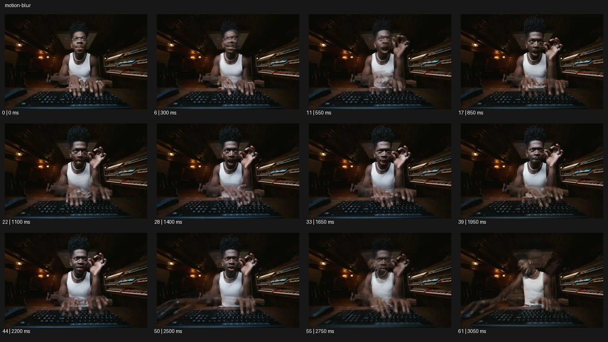

# Motion Blur


- 원본 등록명: **Motion Blur**
- 분류: C · 줌 & 임팩트 / Zoom & Impact
- 공식 기법 페이지: [Motion Blur](https://eyecannndy.com/technique/motion-blur)
- 지정 원본 미디어: [애니메이션 WebP](https://asset.eyecannndy.com/media/clip/2024/02/20/261708472556.webp)
- 확인 방식: 62프레임 중 12시점의 시간순 이미지 배열을 직접 시각 확인. 메타데이터 길이 3.1초. 전체 프레임 재생·청음 확인 또는 생성 재현 테스트로 보고하지 않는다.



## 실제 관찰

어두운 실내에서 키보드 앞 인물이 양손을 움직인다. 0.3–1.4초 손과 팔 주위에 투명하게 겹친 흐린 흔적이 보이고 일부 구간 얼굴도 흐려진다. 1.65–2.2초 얼굴과 안경이 비교적 읽히는 동안 손의 흔적은 남는다. 2.5–3.05초 상체와 머리가 움직이며 더 큰 잔상이 생긴다.

## 작동 원리와 역할

정지 배경과 움직이는 신체의 선명도 차이로 시간과 속도를 표현한다. 이 예시는 스트릭뿐 아니라 겹친 윤곽도 보이므로 단순 카메라 팬 블러로 제한하지 않는다.

## 해석의 한계

셔터 설정·프레임 블렌딩·합성 중 실제 방식은 미확인이다. 잔상의 수나 간격을 원본 수치로 주장하지 않는다. 샘플 사이의 모든 움직임과 반복 경계의 무봉합 여부는 별도 검증하지 않았다. 아래 프롬프트는 새로운 장면 각색이며 생성 테스트는 하지 않았다.

## 뮤직비디오 적용 · 완성형 프롬프트

아래 설정과 길이는 독립 창작 예시다. 실제 요청의 길이·참조·음향 조건을 우선한다.

```text
7초 뮤직비디오. 어두운 전자음악 작업실에서 성인 보컬이 테이블 위 드럼 패드를 두 손으로 연주한다. 카메라는 정면 가슴 위 구도에 고정하고 얼굴과 장비의 버튼은 선명하게 읽힌다. 손이 빠르게 왕복하는 구간에만 셔터가 길게 열린 듯 손목 뒤로 짧은 흐린 궤적을 남긴다. 보컬이 잠깐 손을 멈추면 잔상은 바로 사라져 본래 손이 분명해진다. 마지막에는 보컬이 두 손을 패드에 놓고 렌즈를 바라보며 2초 정지한다. 배경 전체를 흔들거나 손을 여러 개의 독립된 신체로 복제하지 않는다.
```

## 브랜드필름 적용 · 완성형 프롬프트

제품의 재질과 기능이 읽히는 순간에 효과를 배치하고 안정된 제품 상태로 끝낸다. 실제 브랜드 톤과 구조에 맞춰 각색한다.

```text
7초 고급 필기구 필름. 짙은 녹색 가죽 책상 위에서 성인 손이 검은 만년필로 흰 종이에 긴 곡선을 긋는다. 카메라는 사선 매크로에 고정해 펜촉과 잉크 선을 선명하게 잡는다. 손이 빠르게 방향을 바꿀 때 손목과 펜 끝 뒤로 짧은 자연스러운 모션블러가 생기고 이미 그어진 선은 고정된다. 마지막 획이 끝나면 손의 속도가 줄어 블러가 사라진다. 펜을 종이 옆에 내려놓고 카메라가 아주 조금 접근해 펜촉 각인과 검은 배럴을 읽힌다. 마지막 2초 완전히 선명한 제품 구도를 유지한다.
```

음향은 원본에서 확인하지 않았다. 실제 음원과 무음·NO BGM 등 사용자 조건을 유지한다. 특정 모델의 자동 재현을 보장하는 프리셋이 아니다.
