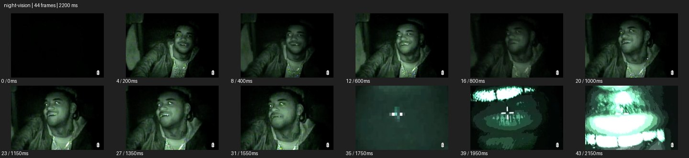

# Night Vision


- 출처: Eyecandy · [Night Vision](https://eyecannndy.com/technique/night-vision)
- 카탈로그 등록 표기: **Night Vision 나이트 비전**
- 카테고리: F · Lens & Optics · 렌즈 & 옵틱
- 원본 미디어: [애니메이션 WebP](https://asset.eyecannndy.com/media/clip/2024/03/16/261710576125.webp)
- 확인 방식: 원본 애니메이션을 디코딩해 시간순 프레임을 추출한 뒤 컨택트 시트를 직접 시각 확인했다. 전체 44프레임 / 2200ms, 기본 12시점. 재생·음향 청취·전 프레임 시각 검수·생성 테스트를 했다고 주장하지 않는다.
- 기본 확인 프레임: 0, 4, 8, 12, 16, 20, 23, 27, 31, 35, 39, 43. 해당 타임스탬프(ms): 0, 200, 400, 600, 800, 1000, 1150, 1350, 1550, 1750, 1950, 2150.
- 원본 길이는 관찰 정보다. 아래 새 장면의 길이를 원본에 자동 맞추지 않는다.

## 움직임 증거



## 원본에서 확인한 시작 → 변화 → 끝

검은 화면 뒤 녹색조 인물 클로즈업이 나타난다. 인물이 웃으며 시선을 옆으로 옮기고 눈과 액세서리가 밝게 보인다. 끝부분은 조준선이 있는 저해상도 야외 장면으로 바뀐다.

- 카메라·시점: 가까운 인물 구도 뒤 다른 야외 구도로 컷한다.
- 주체: 인물이 웃고 시선을 돌린다.
- 조명·합성·편집: 녹색조·노이즈·밝은 반사와 후반 조준선이 보인다.

## 작동 원리와 확인 한계

저조도 증폭 영상처럼 제한된 녹색 톤, 밝은 반사와 노이즈를 사용한다. 실제 야간 장비와 색 보정 재현은 구분되지 않는다.

샘플 사이의 빠른 변화는 일부 빠질 수 있다. GIF의 반복 경계가 작품의 의도된 완전 루프라는 보장은 없다. 원본 음악·대사·촬영 장비·제작 소프트웨어는 확인하지 않았다. 아래 프롬프트는 관찰한 원리를 다른 장면에 각색한 창작안이며 원본 장면이나 검증된 생성 결과가 아니다.

## 뮤직비디오 각색 · 완전한 장면 프롬프트

```text
밤 숲길을 탐색하는 성인 보컬의 뮤직비디오. 카메라는 동행자의 눈높이에서 보컬 얼굴을 가까이 따라가며 녹색 단색의 야간 관찰 톤과 미세한 입자를 유지한다. 보컬이 작은 소리를 찾듯 고개를 옆으로 돌리면 카메라도 잠깐 같은 방향으로 팬해 어두운 나무를 보여준다. 다시 보컬에게 돌아오면 웃는 얼굴과 밝은 눈 반사가 보인다. 마지막에는 움직임을 줄여 얼굴 미디엄에 머문다. 군사용 조준선은 추가하지 않고 피부 형태와 인물 정체성을 유지한다.
```

## 브랜드필름 각색 · 완전한 장면 프롬프트

```text
야간 산책용 아웃도어 재킷의 활용 장면을 보여주는 브랜드필름. 넓은 숲길의 성인 모델을 녹색 저조도 관찰 영상처럼 담고 카메라는 측후면에서 천천히 따라간다. 모델이 멈춰 후드를 정리하면 반사 탭과 얼굴의 밝은 부분이 먼저 읽힌다. 카메라는 짧게 옆으로 이동해 재킷의 전면과 손 동작을 보여준 뒤 멈춘다. 마지막에는 야간 톤을 유지하며 후드 형태와 전면 포켓을 선명하게 남긴다. 실제 야간 성능 수치나 검증되지 않은 기능 문구를 만들지 않는다.
```

적용 시 사용자가 지정한 길이·참조·컷·음향·제품 보존 조건을 우선한다. 효과의 시작 계기와 도착 구도를 유지하며 필요한 부분을 해당 장면에 맞춰 다시 연출한다.
