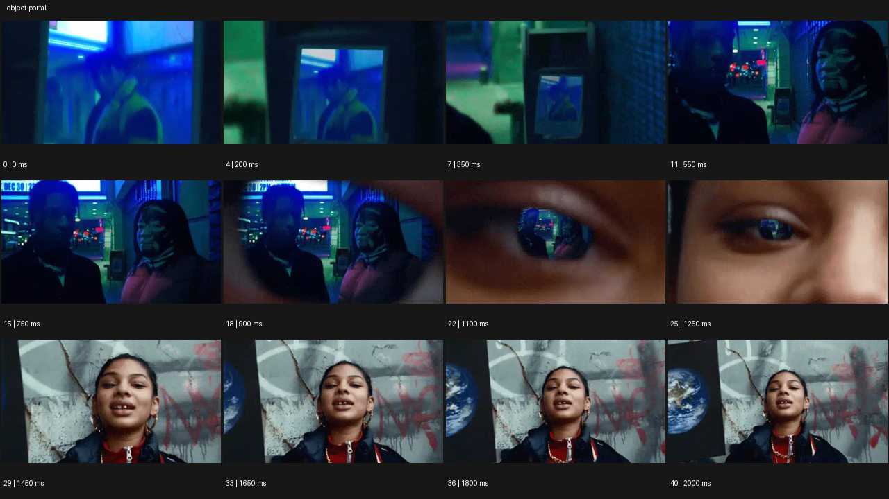

# Object Portal


- 원본 등록명: **Object Portal**
- 분류: D · 편집 & 전환 / Editing & Transition
- 공식 기법 페이지: [Object Portal](https://eyecannndy.com/technique/object-portal)
- 지정 원본 미디어: [애니메이션 WebP](https://asset.eyecannndy.com/media/clip/2024/01/12/261705099775.webp)
- 확인 방식: 41프레임 중 12시점의 시간순 이미지 배열을 직접 시각 확인. 메타데이터 길이 2.05초. 전체 프레임 재생·청음 확인 또는 생성 재현 테스트로 보고하지 않는다.



## 실제 관찰

푸른 실내 장면이 먼저 보이다가 0.2–0.35초 그 장면이 작은 직사각 프레임 안에 들어 있는 모습으로 멀어진다. 0.55–0.9초 두 인물이 있는 밤거리로 나오고 1.1초 그 거리 영상이 눈 안의 작은 반사처럼 축소된다. 1.25–2.0초 얼굴 전체와 다른 거리 배경이 드러난다.

## 작동 원리와 역할

한 장면을 다음 장면 속 표면·반사에 담아 뒤로 빠지는 확대 반대 방향의 연속 경로로 연결한다. 카메라 후퇴처럼 보이는 프레이밍과 합성의 경계를 구별한다.

## 해석의 한계

눈을 실제로 관통한 촬영이 아니다. 원본의 실제 합성 공정이나 숨은 컷 위치는 확정하지 않는다. 샘플 사이의 모든 움직임과 반복 경계의 무봉합 여부는 별도 검증하지 않았다. 아래 프롬프트는 새로운 장면 각색이며 생성 테스트는 하지 않았다.

## 뮤직비디오 적용 · 완성형 프롬프트

아래 설정과 길이는 독립 창작 예시다. 실제 요청의 길이·참조·음향 조건을 우선한다.

```text
8초 뮤직비디오. 네온빛 지하 공연장에서 성인 보컬이 노래하는 중간 구도로 시작한다. 카메라가 천천히 뒤로 빠지면 공연장 장면이 오래된 휴대용 화면 안에 들어 있는 영상임이 드러난다. 화면을 들고 있던 같은 보컬이 낮의 옥상에 서 있고, 손을 내리면 카메라는 옥상 보컬의 얼굴과 전신을 차례로 보여준다. 두 공간의 화면 중심과 푸른빛을 이어주고 화면 테두리가 등장하는 순간 해상도와 반사를 자연스럽게 바꾼다. 마지막에는 기기를 허리 아래로 내린 보컬과 밝은 하늘을 2초 유지한다. 한 번의 표면 통과만 사용한다.
```

## 브랜드필름 적용 · 완성형 프롬프트

제품의 재질과 기능이 읽히는 순간에 효과를 배치하고 안정된 제품 상태로 끝낸다. 실제 브랜드 톤과 구조에 맞춰 각색한다.

```text
8초 고급 여행 가방 필름. 파도 치는 해변 풍경이 화면을 가득 채운 채 시작한다. 카메라가 뒤로 부드럽게 빠지면 그 풍경이 호텔 방에 놓인 가방의 광택 금속 잠금장치에 비친 반사임이 드러난다. 반사 속 바다는 금속 곡률에 맞춰 작아지고 실물 잠금장치의 가장자리가 선명해진다. 계속 후퇴해 짙은 가죽 가방 전체와 창 밖 바다를 같은 구도에 담는다. 성인 투숙객의 손이 잠금장치를 닫고 화면 밖으로 나간다. 끝 2초 제품의 봉제선과 금속 마감을 읽히며 가방이 문처럼 열리거나 바다로 녹지 않는다.
```

음향은 원본에서 확인하지 않았다. 실제 음원과 무음·NO BGM 등 사용자 조건을 유지한다. 특정 모델의 자동 재현을 보장하는 프리셋이 아니다.
