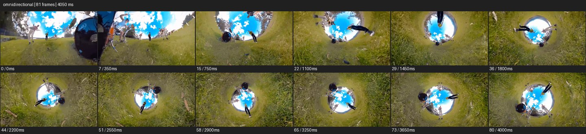

# Omnidirectional 360


- 출처: Eyecandy · [Omnidirectional 360](https://eyecannndy.com/technique/omnidirectional)
- 카탈로그 등록 표기: **Omnidirectional 360 촬영**
- 카테고리: E · More Camera Moves · 카메라 무브 확장
- 원본 미디어: [애니메이션 WebP](https://asset.eyecannndy.com/media/clip/2024/01/07/261704613976.webp)
- 확인 방식: 원본 애니메이션을 디코딩해 시간순 프레임을 추출한 뒤 컨택트 시트를 직접 시각 확인했다. 전체 81프레임 / 4050ms, 기본 12시점. 재생·음향 청취·전 프레임 시각 검수·생성 테스트를 했다고 주장하지 않는다.
- 기본 확인 프레임: 0, 7, 15, 22, 29, 36, 44, 51, 58, 65, 73, 80. 해당 타임스탬프(ms): 0, 350, 750, 1100, 1450, 1800, 2200, 2550, 2900, 3250, 3650, 4000.
- 원본 길이는 관찰 정보다. 아래 새 장면의 길이를 원본에 자동 맞추지 않는다.

## 움직임 증거



## 원본에서 확인한 시작 → 변화 → 끝

잔디 위 공연자와 드럼이 넓게 보이다 지평선이 원형으로 말린다. 하늘이 중앙의 작은 원이 되고 인물과 풀밭이 그 둘레를 감싸는 터널형 구도로 바뀌며 회전한다.

- 카메라·시점: 구면 투영의 중심·회전이 변한다.
- 주체: 잔디 위 공연자들이 움직인다.
- 조명·합성·편집: 투영 변환과 촬영 카메라 이동을 분리해 해석한다.

## 작동 원리와 확인 한계

광범위한 시야를 구면 투영으로 재배치해 공간의 위아래·안팎 관계를 바꾼다. 단순 어안과 달리 투영 변화가 강하지만 카메라 시스템은 미확인.

샘플 사이의 빠른 변화는 일부 빠질 수 있다. GIF의 반복 경계가 작품의 의도된 완전 루프라는 보장은 없다. 원본 음악·대사·촬영 장비·제작 소프트웨어는 확인하지 않았다. 아래 프롬프트는 관찰한 원리를 다른 장면에 각색한 창작안이며 원본 장면이나 검증된 생성 결과가 아니다.

## 뮤직비디오 각색 · 완전한 장면 프롬프트

```text
잔디 언덕에서 원을 이루어 연주하는 밴드의 뮤직비디오. 처음에는 드럼 가까운 낮은 광각 시점에서 각 연주자를 읽힌다. 밴드가 동시에 몸을 앞으로 기울이면 구면 투영을 서서히 바꾸어 풀밭이 화면 바깥을 감싸고 하늘이 중심의 원이 되게 한다. 가상 시점이 그 원을 따라 천천히 회전하지만 연주자 사이의 실제 순서는 유지한다. 마지막에는 회전을 멈추고 투영을 다시 넓은 수평 풍경으로 풀어 밴드 전원이 보이는 구도에 착지한다. 얼굴을 임의로 복제하지 않는다.
```

## 브랜드필름 각색 · 완전한 장면 프롬프트

```text
원형 정원에 배치된 아웃도어 체어 컬렉션을 보여주는 브랜드필름. 중앙의 낮은 시점에서 서로 다른 색의 의자와 뒤의 나무를 한 번에 담는다. 시점이 천천히 상승하는 동안 구면 투영을 변화시켜 의자들이 둥근 정원의 테두리를 따라 배치된 작은 세계로 보이게 한다. 의자는 정지하고 가상 시점만 아주 느리게 돈다. 후반에는 한 개의 차콜 의자 쪽으로 투영을 풀어 정상 원근의 측면에 도착한다. 마지막에는 재질과 프레임 구조를 선명하게 유지해 형태를 읽힌다.
```

적용 시 사용자가 지정한 길이·참조·컷·음향·제품 보존 조건을 우선한다. 효과의 시작 계기와 도착 구도를 유지하며 필요한 부분을 해당 장면에 맞춰 다시 연출한다.
