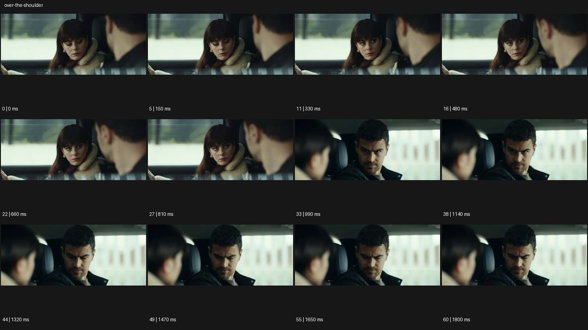

# Over the Shoulder 오버 더 숄더


- 원본 등록명: **Over the Shoulder 오버 더 숄더**
- 분류: B · 앵글 & 구도 / Angle & Framing
- 공식 기법 페이지: [Over the Shoulder 오버 더 숄더](https://eyecannndy.com/technique/over-the-shoulder)
- 지정 원본 미디어: [애니메이션 WebP](https://asset.eyecannndy.com/media/clip/2024/03/10/261710032234.webp)
- 확인 방식: 61프레임 중 12시점의 시간순 이미지 배열을 직접 시각 확인. 메타데이터 길이 1.83초. 전체 프레임 재생·청음 확인 또는 생성 재현 테스트로 보고하지 않는다.



## 실제 관찰

차 안에서 오른쪽 전경 남성의 뒷머리·어깨 너머 왼쪽 여성이 보인다. 0–0.81초 여성은 아래를 보다가 상대에게 눈을 올린다. 0.99초 반대 역숏으로 바뀌어 여성의 흐린 머리 너머 남성 얼굴이 보이고, 후반 남성은 눈을 아래로 내린다.

## 작동 원리와 역할

전경 상대의 신체 일부가 공간 관계를 유지한다. 카메라는 각 위치에 머물고 두 인물의 시선 변화 뒤에 역숏 편집이 사용된다.

## 해석의 한계

차량 움직임이나 대화 내용은 이 예시로 확인하지 않는다. 흐린 전경 인물을 새로운 얼굴로 바꾸지 않는 것이 재현상 중요하다. 샘플 사이의 모든 움직임과 반복 경계의 무봉합 여부는 별도 검증하지 않았다. 아래 프롬프트는 새로운 장면 각색이며 생성 테스트는 하지 않았다.

## 뮤직비디오 적용 · 완성형 프롬프트

아래 설정과 길이는 독립 창작 예시다. 실제 요청의 길이·참조·음향 조건을 우선한다.

```text
7초 뮤직비디오. 불 꺼진 공연장 무대에서 성인 보컬이 오래된 동료와 마주 선다. 카메라는 동료의 오른쪽 어깨 너머 보컬의 얼굴을 선명히 담고, 어깨는 부드럽게 흐린 전경으로 남긴다. 보컬이 마이크를 동료에게 건네려다 멈추고 눈을 올리면 한 번 역숏으로 전환해 보컬의 어깨 너머 동료의 반응을 보여준다. 시선 높이와 두 사람 사이 축은 유지한다. 마지막에는 동료가 마이크를 받으며 가볍게 고개를 끄덕인다. 카메라는 접근하지 않고 반응에 2초 머문다. 앞뒤 인물의 얼굴과 의상을 일관되게 유지한다.
```

## 브랜드필름 적용 · 완성형 프롬프트

제품의 재질과 기능이 읽히는 순간에 효과를 배치하고 안정된 제품 상태로 끝낸다. 실제 브랜드 톤과 구조에 맞춰 각색한다.

```text
7초 고급 맞춤 수트 필름. 따뜻한 재단실에서 성인 재단사의 어깨 너머 거울 앞 고객을 바라본다. 전경의 재단사 어깨는 흐리고 고객의 옷깃과 표정은 선명하다. 재단사가 손을 뻗어 어깨선을 한 번 정리하면 고객은 거울에서 손끝으로 시선을 옮긴다. 카메라는 어깨 너머 위치를 유지하며 아주 짧게 오른쪽으로 이동해 수트의 허리선을 드러낸다. 손이 빠져나가면 고객이 정면으로 서고 옷이 자연스럽게 내려앉는다. 끝 2초 봉제선과 라펠 형태를 읽히며 거울에 중복된 얼굴이나 카메라가 나타나지 않게 한다.
```

음향은 원본에서 확인하지 않았다. 실제 음원과 무음·NO BGM 등 사용자 조건을 유지한다. 특정 모델의 자동 재현을 보장하는 프리셋이 아니다.
