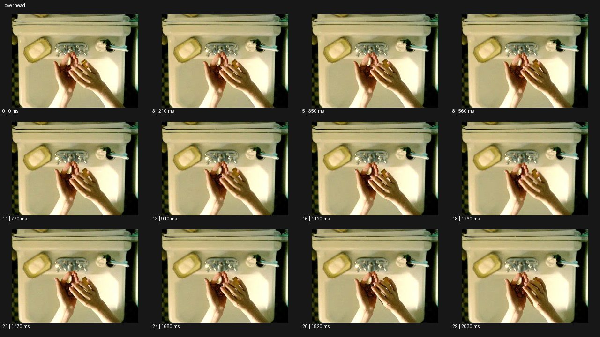

# Overhead 오버헤드


- 원본 등록명: **Overhead 오버헤드**
- 분류: B · 앵글 & 구도 / Angle & Framing
- 공식 기법 페이지: [Overhead 오버헤드](https://eyecannndy.com/technique/overhead)
- 지정 원본 미디어: [애니메이션 WebP](https://asset.eyecannndy.com/media/clip/2024/03/04/261709532127.webp)
- 확인 방식: 30프레임 중 12시점의 시간순 이미지 배열을 직접 시각 확인. 메타데이터 길이 2.1초. 전체 프레임 재생·청음 확인 또는 생성 재현 테스트로 보고하지 않는다.



## 실제 관찰

세면대와 비누·칫솔이 위에서 보이고 가운데 두 손이 작은 물체를 다룬다. 0–0.91초 손바닥 가까이에 손가락이 모이며 1.12–2.03초 오른손이 조금 움직인다. 세면대 테두리와 소품 위치는 거의 고정되어 있다.

## 작동 원리와 역할

카메라는 수직에 가까운 위쪽 고정 시점이다. 손의 미세 동작이 평면적인 물체 배치 안에서 읽힌다.

## 해석의 한계

손 안의 작은 물체를 명확히 식별하지 못했으므로 약이나 보석 등으로 특정하지 않는다. 초점거리와 실제 카메라 높이는 미확인이다. 샘플 사이의 모든 움직임과 반복 경계의 무봉합 여부는 별도 검증하지 않았다. 아래 프롬프트는 새로운 장면 각색이며 생성 테스트는 하지 않았다.

## 뮤직비디오 적용 · 완성형 프롬프트

아래 설정과 길이는 독립 창작 예시다. 실제 요청의 길이·참조·음향 조건을 우선한다.

```text
6초 뮤직비디오. 낡은 피아노 건반 바로 위에서 수직으로 내려다보는 고정 카메라다. 성인 보컬의 두 손이 건반 위에 놓여 있고 접힌 편지 한 장이 오른쪽에 있다. 왼손이 짧은 구절을 누르는 동안 오른손은 편지를 펼쳐 건반 두 개 위에 걸친다. 모든 행동은 프레임 안에서 이루어지며 카메라는 롤이나 줌 없이 손과 흑백 건반의 배열을 유지한다. 마지막 음을 누른 뒤 양손이 천천히 화면 아래로 빠져나가고 펼쳐진 편지만 남는다. 편지의 글자는 읽을 수 없는 자연스러운 필기 흔적으로 처리하며 생성 자막을 넣지 않는다.
```

## 브랜드필름 적용 · 완성형 프롬프트

제품의 재질과 기능이 읽히는 순간에 효과를 배치하고 안정된 제품 상태로 끝낸다. 실제 브랜드 톤과 구조에 맞춰 각색한다.

```text
7초 고급 차 도구 필름. 밝은 석회색 테이블을 수직으로 내려다보며 흰 찻잔, 황동 계량스푼, 짙은 차잎 통을 정돈된 삼각형으로 배치한다. 성인 장인의 손이 통을 열고 차잎을 한 스푼 옮겨 빈 작은 접시에 놓는다. 카메라는 정확한 오버헤드를 고정해 손의 동선과 재료의 양이 명확하게 보이게 한다. 찻잔에는 다른 손이 화면 위에서 천천히 차를 따르고 호박색 원형 수면이 생긴다. 손들이 빠져나가면 세 오브제와 접시가 균형을 이룬다. 마지막 2초 패키지 이름과 금속 표면을 읽히며 소품의 위치가 튀지 않게 한다.
```

음향은 원본에서 확인하지 않았다. 실제 음원과 무음·NO BGM 등 사용자 조건을 유지한다. 특정 모델의 자동 재현을 보장하는 프리셋이 아니다.
