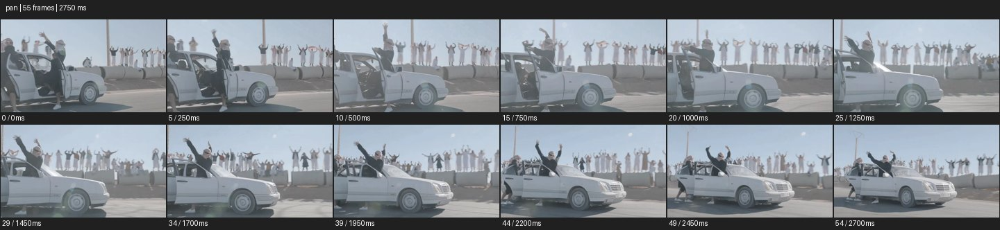

# Pan


- 출처: Eyecandy · [Pan](https://eyecannndy.com/technique/pan)
- 카탈로그 등록 표기: **Pan 팬**
- 카테고리: E · More Camera Moves · 카메라 무브 확장
- 원본 미디어: [애니메이션 WebP](https://asset.eyecannndy.com/media/clip/2024/09/12/261726175733.webp)
- 확인 방식: 원본 애니메이션을 디코딩해 시간순 프레임을 추출한 뒤 컨택트 시트를 직접 시각 확인했다. 전체 55프레임 / 2750ms, 기본 12시점. 재생·음향 청취·전 프레임 시각 검수·생성 테스트를 했다고 주장하지 않는다.
- 기본 확인 프레임: 0, 5, 10, 15, 20, 25, 29, 34, 39, 44, 49, 54. 해당 타임스탬프(ms): 0, 250, 500, 750, 1000, 1250, 1450, 1700, 1950, 2200, 2450, 2700.
- 원본 길이는 관찰 정보다. 아래 새 장면의 길이를 원본에 자동 맞추지 않는다.

## 움직임 증거



## 원본에서 확인한 시작 → 변화 → 끝

흰 자동차 문 밖에 걸터앉은 인물이 팔을 올린다. 차와 인물을 따라 구도가 수평으로 움직이며 뒤 담 위 사람들과 기둥이 옆으로 지나간다. 마지막에는 자동차 앞부분이 더 드러난다.

- 카메라·시점: 차를 따라 수평 방향으로 시선을 바꾼다.
- 주체: 차량과 인물의 팔 동작이 진행된다.
- 조명·합성·편집: 팬과 물리 이동 혼합 가능성을 남긴다.

## 작동 원리와 확인 한계

수평 방향으로 시선을 돌려 움직이는 대상을 프레임에 유지한다. 배경 시차 때문에 이 예시의 물리 이동과 순수 팬의 비율은 샘플만으로 확정할 수 없다.

샘플 사이의 빠른 변화는 일부 빠질 수 있다. GIF의 반복 경계가 작품의 의도된 완전 루프라는 보장은 없다. 원본 음악·대사·촬영 장비·제작 소프트웨어는 확인하지 않았다. 아래 프롬프트는 관찰한 원리를 다른 장면에 각색한 창작안이며 원본 장면이나 검증된 생성 결과가 아니다.

## 뮤직비디오 각색 · 완전한 장면 프롬프트

```text
옥상 난간을 따라 걷는 성인 보컬을 담는 뮤직비디오. 카메라는 옥상 한 지점에 서서 보컬의 허리 위 구도로 시작한다. 보컬이 난간을 따라 왼쪽에서 오른쪽으로 걸으며 가사를 표현하면 카메라가 같은 방향으로 부드럽게 팬한다. 몸체의 위치는 유지하고 보컬의 앞쪽 여백을 일정하게 남긴다. 이동하는 배경 사이로 해 지는 도시가 차례로 드러난다. 보컬이 난간 끝에서 멈춰 도시를 바라보면 팬도 감속해 정지하고, 옆얼굴과 노을을 함께 담은 구도로 끝낸다.
```

## 브랜드필름 각색 · 완전한 장면 프롬프트

```text
도자기 공방의 제작 과정을 연결하는 브랜드필름. 고정된 카메라 위치에서 왼쪽 작업대의 젖은 흙과 장인의 손을 먼저 담는다. 장인이 완성한 컵을 오른쪽 선반으로 옮기면 카메라는 그 손을 따라 천천히 수평 팬해 건조 중인 기물과 완성품을 차례로 보여준다. 컵을 선반에 내려놓는 순간 팬을 멈추고 창빛이 유약의 굴곡을 스치게 한다. 마지막에는 컵 전체와 손잡이를 온전히 읽히는 구도를 유지한다. 수평 회전 중 카메라를 옆으로 옮기거나 디지털 확대하지 않는다.
```

적용 시 사용자가 지정한 길이·참조·컷·음향·제품 보존 조건을 우선한다. 효과의 시작 계기와 도착 구도를 유지하며 필요한 부분을 해당 장면에 맞춰 다시 연출한다.
