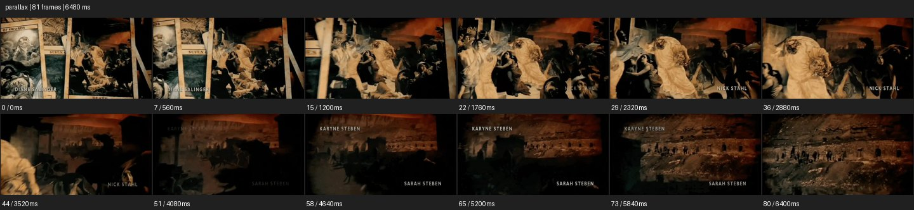

# Parallax


- 출처: Eyecandy · [Parallax](https://eyecannndy.com/technique/parallax)
- 카탈로그 등록 표기: **Parallax 패럴랙스**
- 카테고리: F · Lens & Optics · 렌즈 & 옵틱
- 원본 미디어: [애니메이션 WebP](https://asset.eyecannndy.com/media/clip/2024/01/12/261705035243.webp)
- 확인 방식: 원본 애니메이션을 디코딩해 시간순 프레임을 추출한 뒤 컨택트 시트를 직접 시각 확인했다. 전체 81프레임 / 6480ms, 기본 12시점. 재생·음향 청취·전 프레임 시각 검수·생성 테스트를 했다고 주장하지 않는다.
- 기본 확인 프레임: 0, 7, 15, 22, 29, 36, 44, 51, 58, 65, 73, 80. 해당 타임스탬프(ms): 0, 560, 1200, 1760, 2320, 2880, 3520, 4080, 4640, 5200, 5840, 6400.
- 원본 길이는 관찰 정보다. 아래 새 장면의 길이를 원본에 자동 맞추지 않는다.

## 움직임 증거



## 원본에서 확인한 시작 → 변화 → 끝

고전 회화와 카드 같은 평면 이미지가 겹쳐 있다. 가까운 기둥·그림 레이어가 크게 옆으로 지나가며 뒤의 인물과 풍경은 다른 속도로 움직인다. 후반에는 더 넓은 황갈색 풍경이 드러난다.

- 카메라·시점: 가상 시점처럼 여러 평면을 옆으로 통과한다.
- 주체: 그림 속 인물의 자체 동작은 두드러지지 않는다.
- 조명·합성·편집: 전후 레이어 속도차와 글자 층이 보인다.

## 작동 원리와 확인 한계

평면 소재를 서로 다른 깊이의 레이어로 나누고 가상 카메라를 이동해 깊이차를 만든다. 원화 밖 가려진 영역의 복원 방식은 미확인.

샘플 사이의 빠른 변화는 일부 빠질 수 있다. GIF의 반복 경계가 작품의 의도된 완전 루프라는 보장은 없다. 원본 음악·대사·촬영 장비·제작 소프트웨어는 확인하지 않았다. 아래 프롬프트는 관찰한 원리를 다른 장면에 각색한 창작안이며 원본 장면이나 검증된 생성 결과가 아니다.

## 뮤직비디오 각색 · 완전한 장면 프롬프트

```text
기억 속 방을 보여주는 뮤직비디오. 성인 보컬의 오래된 사진을 중심으로 창틀, 책상, 커튼을 서로 다른 깊이의 사진 레이어로 분리한다. 가상 카메라가 천천히 오른쪽으로 이동해 가까운 커튼은 빠르게, 먼 보컬 사진과 창밖 풍경은 느리게 움직이게 한다. 사진 속 보컬의 얼굴과 손은 그대로 유지하고 별도 입 움직임은 만들지 않는다. 후반에는 가상 이동을 멈춰 창빛을 향한 보컬의 옆얼굴이 온전히 보이는 구도에 착지한다. 빈 경계가 드러나지 않게 겹침을 유지한다.
```

## 브랜드필름 각색 · 완전한 장면 프롬프트

```text
아카이브 사진으로 가구의 역사를 소개하는 브랜드필름. 오래된 공방 사진의 전경 목재, 중앙 의자, 뒤 창문을 세 깊이로 분리한다. 가상 카메라는 아주 느리게 왼쪽으로 이동해 전경 목재가 먼저 지나가고 의자의 온전한 곡선이 드러나게 한다. 사진의 인물과 제품은 정지하며 레이어 간 시차만으로 공간을 만든다. 마지막에는 의자 중심의 구도에서 이동을 멈추고 원래 사진의 종이 질감과 목재의 결을 읽힌다. 역사적 사진에 없던 부품이나 인물 행동을 추가하지 않는다.
```

적용 시 사용자가 지정한 길이·참조·컷·음향·제품 보존 조건을 우선한다. 효과의 시작 계기와 도착 구도를 유지하며 필요한 부분을 해당 장면에 맞춰 다시 연출한다.
