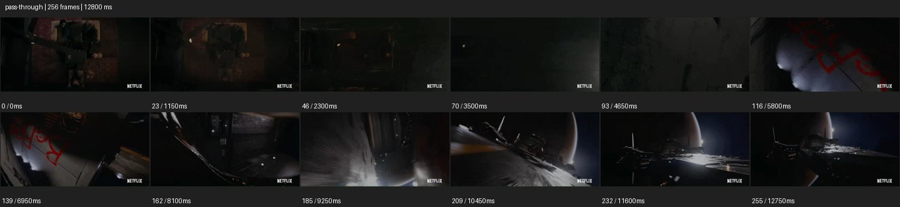

# Pass Through


- 출처: Eyecandy · [Pass Through](https://eyecannndy.com/technique/pass-through)
- 카탈로그 등록 표기: **Pass Through 패스 스루**
- 카테고리: E · More Camera Moves · 카메라 무브 확장
- 원본 미디어: [애니메이션 WebP](https://asset.eyecannndy.com/media/clip/2024/03/05/261709635545.webp)
- 확인 방식: 원본 애니메이션을 디코딩해 시간순 프레임을 추출한 뒤 컨택트 시트를 직접 시각 확인했다. 전체 256프레임 / 12800ms, 기본 12시점. 재생·음향 청취·전 프레임 시각 검수·생성 테스트를 했다고 주장하지 않는다.
- 기본 확인 프레임: 0, 23, 46, 70, 93, 116, 139, 162, 185, 209, 232, 255. 해당 타임스탬프(ms): 0, 1150, 2300, 3500, 4650, 5800, 6950, 8100, 9250, 10450, 11600, 12750.
- 원본 길이는 관찰 정보다. 아래 새 장면의 길이를 원본에 자동 맞추지 않는다.

## 움직임 증거



## 원본에서 확인한 시작 → 변화 → 끝

어두운 구조물 내부의 높은 시점에서 출발해 암부와 벽 같은 표면이 가까이 지나간다. 붉은 문양이 있는 곡면과 긴 구조를 거쳐 외부의 거대한 우주선·행성이 드러난다.

- 카메라·시점: 내부 암부와 표면을 지나 외부 넓은 시점으로 이어진다.
- 주체: 주로 공간 구조의 공개가 중심이다.
- 조명·합성·편집: 통과 구간의 CG·숨은 컷 여부는 확인되지 않는다.

## 작동 원리와 확인 한계

막힌 구조를 통과하는 듯한 연속 경로로 내부에서 외부로 규모를 확장한다. 어두운 구간에 숨은 컷이나 CG 연결이 있는지는 샘플만으로 확정하지 않는다.

샘플 사이의 빠른 변화는 일부 빠질 수 있다. GIF의 반복 경계가 작품의 의도된 완전 루프라는 보장은 없다. 원본 음악·대사·촬영 장비·제작 소프트웨어는 확인하지 않았다. 아래 프롬프트는 관찰한 원리를 다른 장면에 각색한 창작안이며 원본 장면이나 검증된 생성 결과가 아니다.

## 뮤직비디오 각색 · 완전한 장면 프롬프트

```text
성인 보컬이 텅 빈 아파트 방에서 창밖을 바라보는 뮤직비디오. 카메라는 등 뒤 미디엄에서 시작해 보컬 옆을 지나 창 쪽으로 전진한다. 창문 프레임 가까이에서 유리 반사가 잠깐 화면을 채우고, 연속된 환상 경로로 유리를 통과한 듯 외부로 나간다. 카메라가 천천히 후진 상승하며 건물 전체 속 작은 창의 보컬을 드러낸다. 마지막에는 창 하나의 빛과 도시의 큰 어둠을 함께 담아 멈춘다. 통과 지점의 반사와 운동 방향을 유지하고 신체를 관통하지 않는다.
```

## 브랜드필름 각색 · 완전한 장면 프롬프트

```text
오디오 기기의 내부 설계를 상상적으로 보여주는 브랜드필름. 스피커 전면의 메시를 가까이 담고 카메라가 중앙의 작은 구멍으로 접근한다. 메시 표면이 화면을 채울 때 매끄러운 CG 연결로 내부 공간에 들어가 진동판과 하우징의 배치를 따라 천천히 이동한다. 제품의 실제 구조 참조가 있는 부분만 정확하게 보이고 미확인 부품을 사실처럼 만들지 않는다. 후반에는 같은 전면 구멍을 통해 밖으로 빠져나와 온전한 스피커 정면에서 멈춘다. 끝의 제품 비율과 마감은 선명하게 유지한다.
```

적용 시 사용자가 지정한 길이·참조·컷·음향·제품 보존 조건을 우선한다. 효과의 시작 계기와 도착 구도를 유지하며 필요한 부분을 해당 장면에 맞춰 다시 연출한다.
