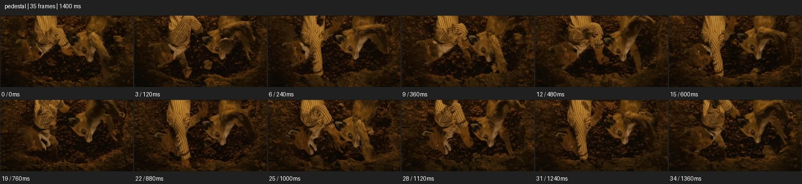

# Pedestal


- 출처: Eyecandy · [Pedestal](https://eyecannndy.com/technique/pedestal)
- 카탈로그 등록 표기: **Pedestal 페데스탈**
- 카테고리: E · More Camera Moves · 카메라 무브 확장
- 원본 미디어: [애니메이션 WebP](https://asset.eyecannndy.com/media/clip/2024/03/25/261711343806.webp)
- 확인 방식: 원본 애니메이션을 디코딩해 시간순 프레임을 추출한 뒤 컨택트 시트를 직접 시각 확인했다. 전체 35프레임 / 1400ms, 기본 12시점. 재생·음향 청취·전 프레임 시각 검수·생성 테스트를 했다고 주장하지 않는다.
- 기본 확인 프레임: 0, 3, 6, 9, 12, 15, 19, 22, 25, 28, 31, 34. 해당 타임스탬프(ms): 0, 120, 240, 360, 480, 600, 760, 880, 1000, 1120, 1240, 1360.
- 원본 길이는 관찰 정보다. 아래 새 장면의 길이를 원본에 자동 맞추지 않는다.

## 움직임 증거



## 원본에서 확인한 시작 → 변화 → 끝

어두운 갈색 숲 또는 흙 공간에서 줄무늬 옷의 인물이 동물 머리처럼 보이는 조형물 사이에 있다. 시점이 아래로 내려가며 상체보다 팔·다리와 아래 구조가 더 드러난다.

- 카메라·시점: 프레임에 아래쪽 신체와 구조가 더 드러난다.
- 주체: 인물의 팔과 다리가 조형물 사이에서 움직인다.
- 조명·합성·편집: 어두워 리그나 합성 여부는 확인 불가.

## 작동 원리와 확인 한계

시선의 높이를 바꾸며 수직 방향 정보를 공개한다. 조형물의 정체와 정확한 리그, 일부 인물 움직임은 어두운 샘플로 확정하기 어렵다.

샘플 사이의 빠른 변화는 일부 빠질 수 있다. GIF의 반복 경계가 작품의 의도된 완전 루프라는 보장은 없다. 원본 음악·대사·촬영 장비·제작 소프트웨어는 확인하지 않았다. 아래 프롬프트는 관찰한 원리를 다른 장면에 각색한 창작안이며 원본 장면이나 검증된 생성 결과가 아니다.

## 뮤직비디오 각색 · 완전한 장면 프롬프트

```text
어두운 연습실에서 성인 무용수가 발끝으로 균형을 잡는 뮤직비디오. 카메라는 발목 높이에서 바닥과 신발을 정면으로 담는다. 무용수가 두 팔을 천천히 들어 올리는 동안 카메라 몸체도 수직으로 상승해 다리, 허리, 어깨를 차례로 드러낸다. 렌즈 방향은 수평을 유지하고 인물과의 거리는 일정하게 둔다. 얼굴 높이에 도달하면 상승을 멈추고 땀과 고른 호흡을 읽히는 미디엄에 착지한다. 주체는 같은 위치에서 균형을 유지하고 상승을 틸트로 대체하지 않는다.
```

## 브랜드필름 각색 · 완전한 장면 프롬프트

```text
수직으로 이어지는 코트의 재단을 소개하는 패션 브랜드필름. 성인 모델이 회색 배경 앞에서 곧게 서 있고 카메라는 코트 밑단 높이에서 시작한다. 모델이 손을 주머니에 넣는 작은 동작에 맞춰 카메라가 수직으로 부드럽게 올라가 밑단의 주름, 허리선, 어깨 구조를 순서대로 보여준다. 모델과 카메라 사이 거리를 유지해 신체 비율이 바뀌지 않게 한다. 어깨와 얼굴이 함께 들어오는 높이에서 이동을 멈추고 라펠의 질감에 충분한 여운을 준다. 과장된 롤이나 화면 전환은 없다.
```

적용 시 사용자가 지정한 길이·참조·컷·음향·제품 보존 조건을 우선한다. 효과의 시작 계기와 도착 구도를 유지하며 필요한 부분을 해당 장면에 맞춰 다시 연출한다.
