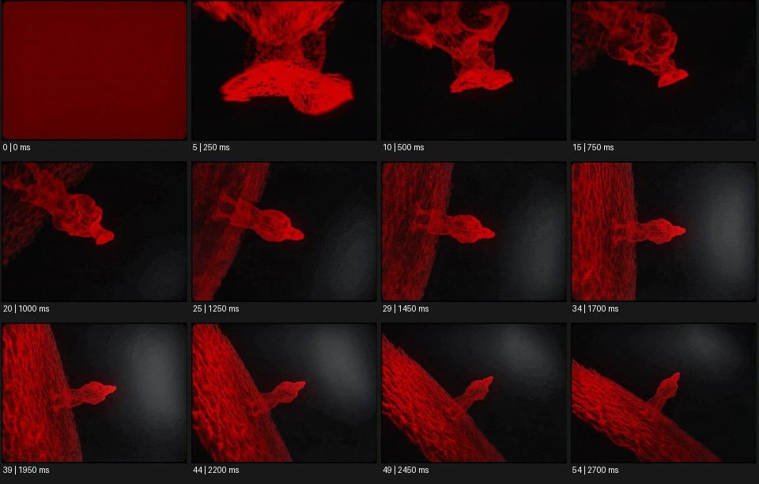

# Photogrammetry 포토그래메트리


출처: Eyecandy · 원본 등록 카드명: **Photogrammetry 포토그래메트리** · slug: photogrammetry

분류: I · VFX & Style / VFX & 스타일

[원본 기법 페이지](https://eyecannndy.com/technique/photogrammetry) · [원본 미디어](https://asset.eyecannndy.com/media/clip/2024/03/24/261711257139.webp)

## 확인 근거

원본 55프레임, 메타데이터 길이 2750ms. 고유 12개 시점 프레임을 추출하여 이미지로 직접 관찰했다. 재생 감상·음향 청취·생성 재현 테스트를 했다는 뜻이 아니다.

표본 프레임(0부터): 0, 5, 10, 15, 20, 25, 29, 34, 39, 44, 49, 54



## 실제 시간순 관찰

0ms: 거의 붉은 면으로 화면이 채워져 있다. 250–1000ms: 검은 공간 속 붉은 선·점으로 된 입체 형상이 드러나고 화면 안에서 크기와 방향이 달라진다. 1250–2700ms: 커다란 붉은 망 형태의 면과 튀어나온 작은 형상 사이의 시점이 바뀌며 기울어진 공간이 보인다.

## 주체·카메라·합성·편집 구분

표면은 실사 질감보다 붉은 와이어·점 형태로 표시된다. 시점 변화는 가상 카메라 이동 또는 물체 회전일 수 있다. 실제 사진 스캔 작업이나 현장 촬영 장면은 보이지 않는다.

## 장면에 재사용할 원리

사진 기반 공간 재구성의 결과를 점·망·질감 표면으로 시각화하고 카메라가 그 깊이를 탐색하게 한다. 원본에서는 스캔 같은 표면 표현이 관찰되며 사진측량 공정 자체는 확인되지 않는다.

## 확인 한계

형상의 정확한 대상과 복원 도구를 단정하지 않는다. 붉은 와이어 모양을 사진측량에 필수인 스타일로 취급하지 않는다. 표본 사이의 모든 프레임과 반복 경계의 연속성을 검사하지 않았다. 음향은 확인하지 않았다.

## 뮤직비디오 각색 · 완성형 프롬프트

아래는 장면 목적에 맞게 새로 설계한 창작 적용안이며 원본 길이를 상속하지 않는다.

```text
8초 뮤직비디오, 폐극장의 빈 객석과 중앙 통로를 사진 스캔한 듯한 입체 공간을 만든다. 카메라는 의자 등받이의 거친 점군 클로즈업에서 시작해 뒤로 이동한다. 2초에 성인 보컬의 발자국을 따라 통로 바닥의 흩어진 점들이 정확한 표면으로 정렬되고, 좌우 좌석은 여전히 불완전한 점군으로 남는다. 카메라는 보컬 뒤에서 함께 전진하며 빈 극장의 기억을 드러낸다. 보컬의 몸과 얼굴은 처음부터 끝까지 실사 형태로 유지한다. 마지막에는 무대 앞에서 카메라와 보컬이 동시에 멈추고 반쯤 복원된 객석을 돌아본다. 자막 없이 발소리와 빈 공간 잔향만 둔다.
```

## 브랜드필름 각색 · 완성형 프롬프트

```text
8초 공예 가구 브랜드필름, 어두운 중성 스튜디오 한가운데 수작업 목재 의자를 놓는다. 카메라는 다리 접합부를 비스듬히 바라보며 30도 천천히 오빗한다. 의자 반대편에는 같은 형태의 성긴 스캔 점군이 보이고, 카메라가 측면을 지날 때 점군이 촘촘해져 목재 결을 가진 표면으로 정합된다. 실물 의자 윤곽과 스캔 위치가 어긋나지 않게 고정한다. 5초에 모든 표면이 완성되면 점군 표현을 끝내고 은은한 측광으로 손으로 다듬은 모서리를 보여준다. 마지막 3초는 온전한 의자의 삼사분면 정지 구도다. 기술 UI와 임의의 수치·로고는 넣지 않는다.
```

생성 테스트: 미실시. 단일 모델의 정확한 재현을 보장하지 않으며 필요한 촬영·합성·편집 층을 구분해 구현한다.
