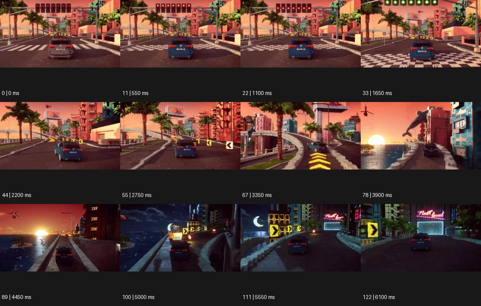

# Pixel Art 픽셀 아트


출처: Eyecandy · 원본 등록 카드명: **Pixel Art 픽셀 아트** · slug: pixel-art

분류: I · VFX & Style / VFX & 스타일

[원본 기법 페이지](https://eyecannndy.com/technique/pixel-art) · [원본 미디어](https://asset.eyecannndy.com/media/clip/2024/01/01/261704076080.webp)

## 확인 근거

원본 123프레임, 메타데이터 길이 6150ms. 고유 12개 시점 프레임을 추출하여 이미지로 직접 관찰했다. 재생 감상·음향 청취·생성 재현 테스트를 했다는 뜻이 아니다.

표본 프레임(0부터): 0, 11, 22, 33, 44, 55, 67, 78, 89, 100, 111, 122



## 실제 시간순 관찰

0–1650ms: 블록형 도심 도로에서 파란 자동차를 뒤에서 보며 출발 신호가 붉은색에서 녹색으로 바뀐다. 2200–3900ms: 자동차가 커브·경사로를 달리고 카메라가 뒤를 따라간다. 4450–6100ms: 해질녘 해안 도로가 밤 장면으로 바뀌고 같은 차가 표지 방향을 따라 달린다.

## 주체·카메라·합성·편집 구분

자동차가 도로를 이동하고 가상 추적 카메라가 뒤에서 따른다. 픽셀·복셀처럼 각진 환경이 전 구간에 지속된다. 낮과 밤의 공간 상태가 편집 또는 장면 변경으로 이어진다.

## 장면에 재사용할 원리

낮은 해상도의 격자·블록을 시각 언어로 삼되 운동 경로와 공간 깊이를 명확하게 유지한다.

## 확인 한계

이 사례는 평면 2D 픽셀 그림만이 아니라 블록형 3D 공간을 포함한다. 사용 엔진과 실제 게임 여부는 알 수 없다. 표본 사이의 모든 프레임과 반복 경계의 연속성을 검사하지 않았다. 음향은 확인하지 않았다.

## 뮤직비디오 각색 · 완성형 프롬프트

아래는 장면 목적에 맞게 새로 설계한 창작 적용안이며 원본 길이를 상속하지 않는다.

```text
7초 픽셀 아트 뮤직비디오, 보라색 재킷의 성인 보컬을 작은 격자 캐릭터로 표현하고 블록으로 된 야간 지하철 플랫폼에 세운다. 가상 카메라는 측면에서 일정한 속도로 이동한다. 보컬이 세 걸음을 옮길 때 신발이 닿는 바닥 픽셀이 한 칸씩 청록색으로 켜지고, 그 빛이 뒤쪽으로만 길게 이어진다. 얼굴의 픽셀 배치와 재킷 색은 고정하고 움직임에 부드러운 실사 피부를 섞지 않는다. 5초에 보컬이 멈추면 카메라도 멈추고 켜진 바닥선이 빈 플랫폼의 깊이를 드러낸다. 마지막에는 작은 고개 들기로 감정을 남긴다. 무음, 화면 문자 없음.
```

## 브랜드필름 각색 · 완성형 프롬프트

```text
8초 디자인 토이 브랜드필름, 크림색 블록 도시의 광장에 코발트색 미니 자동차 한 대를 둔다. 시작은 장난감 눈높이의 뒤쪽 삼사분면이며 바퀴·차체가 정확한 격자 덩어리로 읽힌다. 자동차가 움직이면 가상 카메라가 뒤를 따라 낮게 전진하고, 광장을 둘러싼 블록 건물이 한 단씩 조립된다. 조립은 차체와 부딪히지 않고 제품의 윤곽을 가리지 않는다. 5초에 차가 작은 받침 위로 올라 정지하면 카메라는 측면으로 20도 이동해 완성된 형태를 보여준다. 마지막 2초는 브랜드 지정 색과 바퀴 수를 보존한 제품 구도다. UI·점수·임의 로고는 없다.
```

생성 테스트: 미실시. 단일 모델의 정확한 재현을 보장하지 않으며 필요한 촬영·합성·편집 층을 구분해 구현한다.
