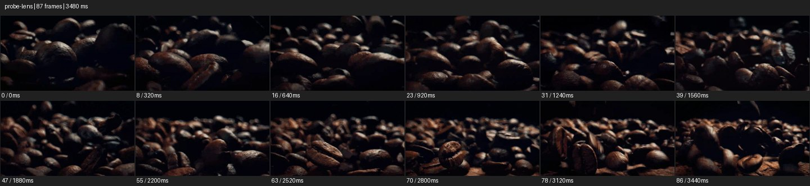

# Probe


- 출처: Eyecandy · [Probe](https://eyecannndy.com/technique/probe-lens)
- 카탈로그 등록 표기: **Probe 프로브 렌즈**
- 카테고리: F · Lens & Optics · 렌즈 & 옵틱
- 원본 미디어: [애니메이션 WebP](https://asset.eyecannndy.com/media/clip/2023/12/23/261703306920.webp)
- 확인 방식: 원본 애니메이션을 디코딩해 시간순 프레임을 추출한 뒤 컨택트 시트를 직접 시각 확인했다. 전체 87프레임 / 3480ms, 기본 12시점. 재생·음향 청취·전 프레임 시각 검수·생성 테스트를 했다고 주장하지 않는다.
- 기본 확인 프레임: 0, 8, 16, 23, 31, 39, 47, 55, 63, 70, 78, 86. 해당 타임스탬프(ms): 0, 320, 640, 920, 1240, 1560, 1880, 2200, 2520, 2800, 3120, 3440.
- 원본 길이는 관찰 정보다. 아래 새 장면의 길이를 원본에 자동 맞추지 않는다.

## 움직임 증거



## 원본에서 확인한 시작 → 변화 → 끝

어두운 커피 원두 더미를 표면 가까운 낮은 시점에서 본다. 카메라가 원두 사이를 이동하며 가까운 원두가 프레임 옆으로 지나가고 뒤의 원두 질감이 새로 나타난다.

- 카메라·시점: 원두 표면 가까이 낮게 이동한다.
- 주체: 원두 자체의 큰 움직임은 확인되지 않는다.
- 조명·합성·편집: 초점과 근접 원근이 질감을 강조한다.

## 작동 원리와 확인 한계

작은 피사체 표면을 낮은 근접 시점으로 탐색해 미세한 질감을 거대한 지형처럼 느끼게 한다. 실제 프로브 렌즈 장착 여부는 미확인.

샘플 사이의 빠른 변화는 일부 빠질 수 있다. GIF의 반복 경계가 작품의 의도된 완전 루프라는 보장은 없다. 원본 음악·대사·촬영 장비·제작 소프트웨어는 확인하지 않았다. 아래 프롬프트는 관찰한 원리를 다른 장면에 각색한 창작안이며 원본 장면이나 검증된 생성 결과가 아니다.

## 뮤직비디오 각색 · 완전한 장면 프롬프트

```text
성인 피아니스트의 연주를 새로운 시점으로 보여주는 뮤직비디오. 카메라는 피아노 건반 바로 위의 낮은 근접 위치에서 시작해 흰 건반의 표면과 틈을 따라 천천히 전진한다. 연주자의 손가락이 앞쪽 건반을 누르면 눌림과 반사를 읽히고 카메라는 손에 닿기 전 옆으로 짧게 빠진다. 이후 건반 줄을 따라 이동하며 검은 건반의 높이가 작은 건축물처럼 드러난다. 마지막에는 누르고 있는 한 손과 여러 건반을 함께 담아 정지한다. 손가락과 건반의 접촉을 자연스럽게 유지한다.
```

## 브랜드필름 각색 · 완전한 장면 프롬프트

```text
볶은 커피의 질감을 소개하는 브랜드필름. 따뜻한 측광 아래 원두 더미를 표면 높이의 극근접 시점에서 담는다. 카메라는 원두 사이의 넓은 틈을 따라 천천히 전진해 주름, 갈라진 홈, 은은한 유분 반사를 차례로 드러낸다. 원두는 정지하고 전경의 원두만 화면 양옆으로 지나가 공간 깊이를 만든다. 마지막에는 홈이 선명한 한 알의 삼분의 사 측면 앞에서 감속해 멈춘다. 과도한 액체 광택이나 원두 형태 변형 없이 건조한 로스팅 질감을 유지한다.
```

적용 시 사용자가 지정한 길이·참조·컷·음향·제품 보존 조건을 우선한다. 효과의 시작 계기와 도착 구도를 유지하며 필요한 부분을 해당 장면에 맞춰 다시 연출한다.
