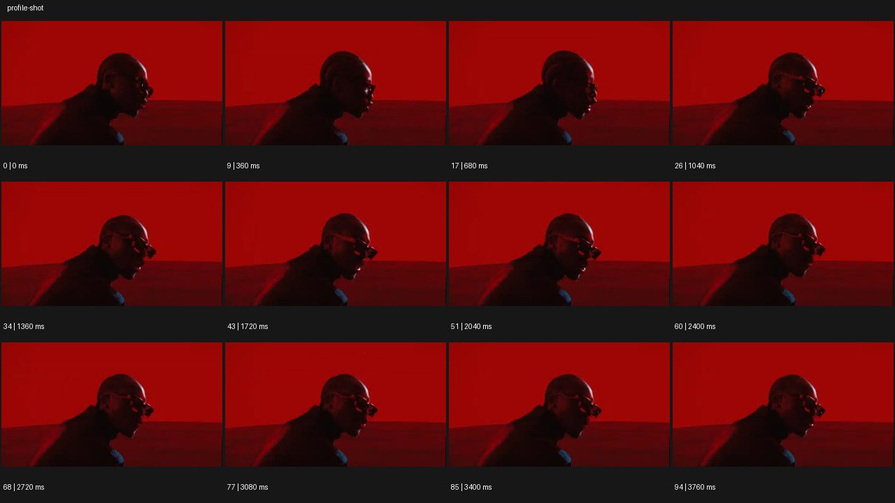

# Profile 프로필 샷


- 원본 등록명: **Profile 프로필 샷**
- 분류: B · 앵글 & 구도 / Angle & Framing
- 공식 기법 페이지: [Profile 프로필 샷](https://eyecannndy.com/technique/profile-shot)
- 지정 원본 미디어: [애니메이션 WebP](https://asset.eyecannndy.com/media/clip/2024/01/12/261705031055.webp)
- 확인 방식: 95프레임 중 12시점의 시간순 이미지 배열을 직접 시각 확인. 메타데이터 길이 3.8초. 전체 프레임 재생·청음 확인 또는 생성 재현 테스트로 보고하지 않는다.



## 실제 관찰

붉은 배경 앞 안경을 쓴 인물이 오른쪽을 향한 옆모습으로 시작한다. 0.36–1.72초 입과 턱, 목이 움직이고 몸이 조금 앞뒤로 흔들린다. 2.04–3.76초에도 옆얼굴 방향을 유지하며 입모양 퍼포먼스가 이어진다.

## 작동 원리와 역할

옆얼굴의 코·입·턱 윤곽을 지속적으로 읽히는 측면 구도다. 주체의 작은 상체 움직임이 있고 카메라의 큰 시점 변화나 전환은 보이지 않는다.

## 해석의 한계

완벽한 90도 측면이나 특정 음악 장르로 단정하지 않는다. 소리는 확인하지 않았다. 샘플 사이의 모든 움직임과 반복 경계의 무봉합 여부는 별도 검증하지 않았다. 아래 프롬프트는 새로운 장면 각색이며 생성 테스트는 하지 않았다.

## 뮤직비디오 적용 · 완성형 프롬프트

아래 설정과 길이는 독립 창작 예시다. 실제 요청의 길이·참조·음향 조건을 우선한다.

```text
6초 뮤직비디오. 짙은 청색 벽 앞에 성인 보컬이 오른쪽을 향해 서 있다. 카메라는 얼굴 높이에서 옆모습을 가슴 위로 담아 코끝과 입술, 턱선을 하나의 윤곽으로 읽힌다. 보컬이 작은 목소리로 노래하는 입모양을 유지하며 손을 가슴에 올렸다가 천천히 내린다. 뒤쪽의 가는 흰 빛이 목선과 머리카락 가장자리를 비추고 얼굴 앞쪽은 부드럽게 어둡다. 카메라는 인물과 평행하게 짧게 이동해도 측면 각도를 유지한다. 마지막에는 보컬이 입을 다물고 시선을 수평으로 고정한다. 정면으로 돌거나 다른 인물로 바뀌지 않는다.
```

## 브랜드필름 적용 · 완성형 프롬프트

제품의 재질과 기능이 읽히는 순간에 효과를 배치하고 안정된 제품 상태로 끝낸다. 실제 브랜드 톤과 구조에 맞춰 각색한다.

```text
6초 고급 귀걸이 필름. 귀에 작은 황금색 조형 귀걸이를 한 성인 모델이 회색 배경 앞에서 정확한 옆모습으로 서 있다. 카메라는 귀와 턱선이 함께 보이는 근접 구도로 시작한다. 모델이 숨을 고르며 턱을 아주 조금 들면 귀걸이가 작게 흔들리고 긴 소프트박스 반사가 표면을 따라 이동한다. 카메라는 같은 측면을 유지한 채 천천히 접근해 잠금 구조와 금속의 두께를 읽힌다. 흔들림이 자연스럽게 잦아들면 카메라도 멈춘다. 마지막 2초 귀걸이와 피부 경계가 선명하며 귀나 장신구의 형태를 늘리지 않는다.
```

음향은 원본에서 확인하지 않았다. 실제 음원과 무음·NO BGM 등 사용자 조건을 유지한다. 특정 모델의 자동 재현을 보장하는 프리셋이 아니다.
