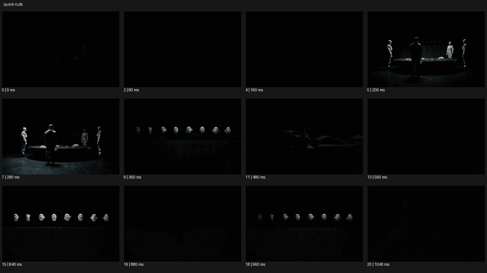
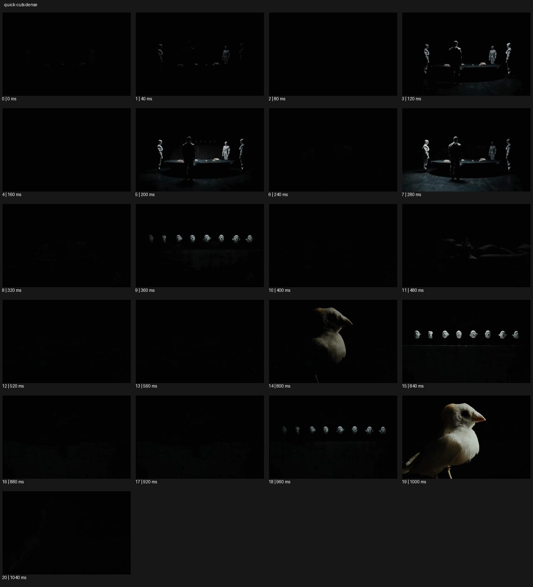

# Quick Cuts


- 원본 등록명: **Quick Cuts**
- 분류: D · 편집 & 전환 / Editing & Transition
- 공식 기법 페이지: [Quick Cuts](https://eyecannndy.com/technique/quick-cuts)
- 지정 원본 미디어: [애니메이션 WebP](https://asset.eyecannndy.com/media/clip/2024/05/20/261716236020.webp)
- 확인 방식: 21프레임 중 12시점의 시간순 이미지 배열을 직접 시각 확인. 메타데이터 길이 1.08초. 추가 21시점 배열도 직접 확인. 전체 프레임 재생·청음 확인 또는 생성 재현 테스트로 보고하지 않는다.





## 실제 관찰

어두운 공간에서 여러 인물이 둘러선 탁자 장면이 밝았다 어두워지며 반복된다. 이후 작은 머리 형태들이 일렬로 놓인 장면과 새의 근접 장면이 삽입된다. 21프레임 전체를 배열해 확인했으며 마지막에도 어둠과 짧은 형상의 출현이 교차한다.

## 작동 원리와 역할

서로 다른 숏의 짧은 지속과 암부 프레임이 리듬을 만든다. 주체가 급히 움직여 생긴 모션블러와 다른 편집 현상이다.

## 해석의 한계

어두운 프레임의 세부는 판독이 제한된다. 원본의 의미나 음향 리듬은 확인하지 않았다. 전체 프레임 배열 확인도 실제 재생 감상과 같지는 않다. 샘플 사이의 모든 움직임과 반복 경계의 무봉합 여부는 별도 검증하지 않았다. 아래 프롬프트는 새로운 장면 각색이며 생성 테스트는 하지 않았다.

## 뮤직비디오 적용 · 완성형 프롬프트

아래 설정과 길이는 독립 창작 예시다. 실제 요청의 길이·참조·음향 조건을 우선한다.

```text
7초 뮤직비디오. 성인 밴드가 공연 직전 준비하는 작은 대기실을 짧은 디테일 컷으로 보여준다. 0–2초에는 손이 케이블을 꽂고, 신발끈을 당기고, 마이크 스위치를 올리는 세 행동을 각 동작의 완료점에서 하드컷한다. 2–4초에는 같은 순서의 더 가까운 디테일을 조금 짧게 이어 긴장을 높인다. 각 컷의 카메라는 고정하고 인물이나 물체가 순간적으로 변형되지 않는다. 마지막에는 문이 열리는 넓은 숏으로 넘어가 밴드가 함께 나가는 모습을 3초 유지한다. 실제 음원이 있으면 지정 타격점에 컷을 맞추고 불필요한 백색 점멸은 넣지 않는다.
```

## 브랜드필름 적용 · 완성형 프롬프트

제품의 재질과 기능이 읽히는 순간에 효과를 배치하고 안정된 제품 상태로 끝낸다. 실제 브랜드 톤과 구조에 맞춰 각색한다.

```text
7초 고급 에스프레소 도구 필름. 성인 바리스타가 포터필터를 준비하는 과정을 가까운 고정 숏으로 편집한다. 원두가 떨어지는 장면, 가루를 평평하게 누르는 장면, 손잡이를 머신에 잠그는 장면을 각각 행동이 끝나는 순간 빠르게 하드컷한다. 금속·가루·손의 진행 방향은 일관되게 유지한다. 마지막 컷은 잔에 첫 커피가 흐르는 조금 넓은 구도로 전환하고 3초 머물러 크레마와 손잡이 디자인을 읽힌다. 빠른 구간에도 각 도구가 무엇을 하는지 알아볼 수 있고 제품 로고는 마지막 안정된 숏에서 선명하게 남긴다.
```

음향은 원본에서 확인하지 않았다. 실제 음원과 무음·NO BGM 등 사용자 조건을 유지한다. 특정 모델의 자동 재현을 보장하는 프리셋이 아니다.
