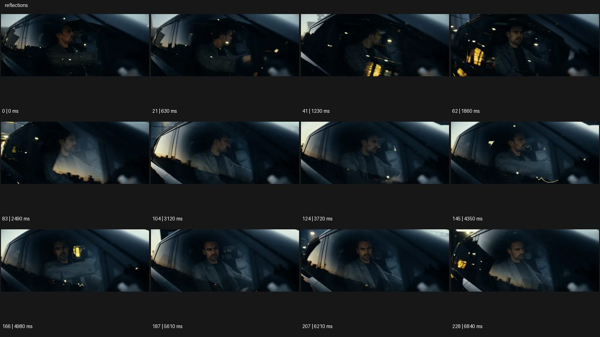

# Reflections 리플렉션


- 원본 등록명: **Reflections 리플렉션**
- 분류: B · 앵글 & 구도 / Angle & Framing
- 공식 기법 페이지: [Reflections 리플렉션](https://eyecannndy.com/technique/reflections)
- 지정 원본 미디어: [애니메이션 WebP](https://asset.eyecannndy.com/media/clip/2024/03/13/261710316254.webp)
- 확인 방식: 229프레임 중 12시점의 시간순 이미지 배열을 직접 시각 확인. 메타데이터 길이 6.87초. 전체 프레임 재생·청음 확인 또는 생성 재현 테스트로 보고하지 않는다.



## 실제 관찰

차량 창 너머 운전자의 옆모습과 얼굴이 보이고 유리 위에 하늘·건물·불빛 반사가 겹친다. 0.63–1.86초 밝은 노란 반사가 지나가 얼굴이 부분적으로 드러난다. 2.49–6.84초 차 주변 풍경과 빛이 계속 흐르고 운전자는 앞·옆으로 시선을 조금 바꾼다.

## 작동 원리와 역할

창의 투과상과 외부 반사상을 동시에 읽힌다. 카메라는 차량 가까이서 상대 위치를 유지하며 이동하는 외부 빛이 반사층을 바꾼다.

## 해석의 한계

촬영용 편광필터나 합성 여부는 확인되지 않는다. 반사 때문에 얼굴이 어두워지는 구간을 인물 소멸로 해석하지 않는다. 샘플 사이의 모든 움직임과 반복 경계의 무봉합 여부는 별도 검증하지 않았다. 아래 프롬프트는 새로운 장면 각색이며 생성 테스트는 하지 않았다.

## 뮤직비디오 적용 · 완성형 프롬프트

아래 설정과 길이는 독립 창작 예시다. 실제 요청의 길이·참조·음향 조건을 우선한다.

```text
8초 뮤직비디오. 밤 기차 창가에 성인 보컬이 앉아 바깥을 바라본다. 카메라는 기차 밖에서 창과 나란히 이동하는 시점으로 얼굴을 유리 너머 담는다. 시작에는 어두운 얼굴 위로 역의 흰 조명 반사가 천천히 흐르고, 보컬이 시선을 렌즈 가까이 돌릴 때 조명이 지나가 얼굴이 또렷하게 드러난다. 이어 도시의 작은 불빛이 다시 겹치지만 얼굴 정체성은 유지한다. 카메라는 줌하지 않고 창 프레임을 같은 위치에 둔다. 마지막에는 터널 입구의 어둠으로 반사만 줄어들고 창 안의 보컬이 조용히 남는다. 소리를 들은 듯한 설정은 추가하지 않는다.
```

## 브랜드필름 적용 · 완성형 프롬프트

제품의 재질과 기능이 읽히는 순간에 효과를 배치하고 안정된 제품 상태로 끝낸다. 실제 브랜드 톤과 구조에 맞춰 각색한다.

```text
8초 고급 전기차 필름. 새벽 도심을 천천히 지나는 차량의 측면 창 가까이에서 카메라가 나란히 움직인다. 창 너머 성인 운전자의 편안한 자세와 밝은 가죽 시트를 보여주고 유리에는 건물의 수직선이 길게 비친다. 차가 가로수 구간에 들어서면 건물 반사가 부드러운 잎 그림자로 바뀌며 차체의 곡률을 드러낸다. 카메라는 조금 뒤로 이동해 창과 도어 손잡이를 함께 담는다. 마지막 차가 멈추면 반사도 안정되고 운전자가 앞을 바라본다. 끝 2초 차량의 표면과 실내를 동시에 읽히며 유리 속 인물을 복제하지 않는다.
```

음향은 원본에서 확인하지 않았다. 실제 음원과 무음·NO BGM 등 사용자 조건을 유지한다. 특정 모델의 자동 재현을 보장하는 프리셋이 아니다.
