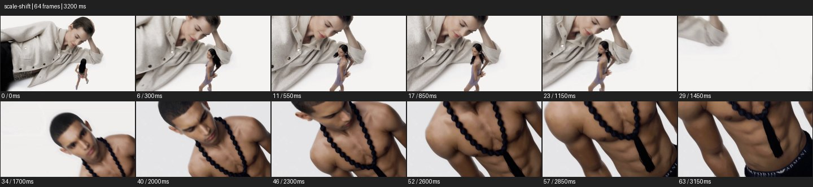

# Scale Shift


- 출처: Eyecandy · [Scale Shift](https://eyecannndy.com/technique/scale-shift)
- 카탈로그 등록 표기: **Scale Shift 스케일 시프트**
- 카테고리: F · Lens & Optics · 렌즈 & 옵틱
- 원본 미디어: [애니메이션 WebP](https://asset.eyecannndy.com/media/clip/2024/03/09/261709970169.webp)
- 확인 방식: 원본 애니메이션을 디코딩해 시간순 프레임을 추출한 뒤 컨택트 시트를 직접 시각 확인했다. 전체 64프레임 / 3200ms, 기본 12시점. 재생·음향 청취·전 프레임 시각 검수·생성 테스트를 했다고 주장하지 않는다.
- 기본 확인 프레임: 0, 6, 11, 17, 23, 29, 34, 40, 46, 52, 57, 63. 해당 타임스탬프(ms): 0, 300, 550, 850, 1150, 1450, 1700, 2000, 2300, 2600, 2850, 3150.
- 원본 길이는 관찰 정보다. 아래 새 장면의 길이를 원본에 자동 맞추지 않는다.

## 움직임 증거



## 원본에서 확인한 시작 → 변화 → 끝

흰 배경에서 매우 큰 누운 인물과 작은 전신 인물이 한 화면에 함께 있다. 큰 인물이 옆으로 빠지며 작은 인물이 상대적으로 커 보이고, 이후 다른 인물의 큰 상체 구도로 바뀐다.

- 카메라·시점: 화면 내 크기 관계와 가까운 상체 구도가 바뀐다.
- 주체: 크기가 다른 인물 레이어가 이동한다.
- 조명·합성·편집: 크기 조절·합성·컷 가능성이 있어 순수 강제원근으로 단정하지 않는다.

## 작동 원리와 확인 한계

서로 다른 크기·거리의 레이어를 함께 배치해 인물 사이 규모 관계를 바꾼다. 강제원근만으로 촬영됐다고 단정할 수 없고 합성 가능성이 있다.

샘플 사이의 빠른 변화는 일부 빠질 수 있다. GIF의 반복 경계가 작품의 의도된 완전 루프라는 보장은 없다. 원본 음악·대사·촬영 장비·제작 소프트웨어는 확인하지 않았다. 아래 프롬프트는 관찰한 원리를 다른 장면에 각색한 창작안이며 원본 장면이나 검증된 생성 결과가 아니다.

## 뮤직비디오 각색 · 완전한 장면 프롬프트

```text
흰 연습실에서 성인 보컬의 내적 자아를 표현하는 뮤직비디오. 바닥 가까운 고정 카메라에 보컬의 큰 옆얼굴을 왼쪽 전경으로 두고, 같은 의상의 작은 전신 분신을 먼 오른쪽에 배치한다. 작은 분신이 두 걸음 걸어와 큰 인물의 시선을 올려다보면 큰 인물은 천천히 고개를 든다. 카메라는 오른쪽으로 짧게 이동해 큰 얼굴이 프레임 밖으로 빠지고 작은 분신이 정상 크기의 단독 인물처럼 남게 한다. 마지막에는 전신과 흰 여백을 유지한다. 두 인물의 얼굴 정체성을 일치시킨다.
```

## 브랜드필름 각색 · 완전한 장면 프롬프트

```text
여행가방의 공간감을 상상적으로 표현하는 브랜드필름. 흰 스튜디오에서 거대한 가방을 왼쪽에 세우고 오른쪽에 정상 크기의 성인 모델을 둔다. 카메라는 낮은 와이드로 시작하며 모델이 가방 옆을 걷는 동안 가방과 모델의 크기 대비를 읽힌다. 모델이 손을 뻗는 순간 정렬된 위치에서 한 번 매치컷해 정상 크기의 가방 손잡이를 잡은 가까운 구도로 연결한다. 마지막에는 모델이 가방을 끌고 한 걸음 이동하고 카메라는 정지한다. 확대된 가방과 실제 제품의 구조·재질·손잡이 형태는 동일하게 유지한다.
```

적용 시 사용자가 지정한 길이·참조·컷·음향·제품 보존 조건을 우선한다. 효과의 시작 계기와 도착 구도를 유지하며 필요한 부분을 해당 장면에 맞춰 다시 연출한다.
