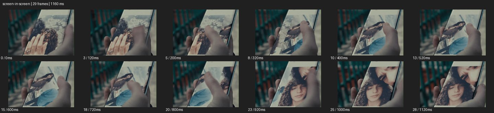

# Screen in Screen


- 출처: Eyecandy · [Screen in Screen](https://eyecannndy.com/technique/screen-in-screen)
- 카탈로그 등록 표기: **Screen in Screen 스크린 인 스크린**
- 카테고리: H · More Editing & Transition · 편집 & 전환 확장
- 원본 미디어: [애니메이션 WebP](https://asset.eyecannndy.com/media/clip/2024/03/19/261710832128.webp)
- 확인 방식: 원본 애니메이션을 디코딩해 시간순 프레임을 추출한 뒤 컨택트 시트를 직접 시각 확인했다. 전체 29프레임 / 1160ms, 기본 12시점. 재생·음향 청취·전 프레임 시각 검수·생성 테스트를 했다고 주장하지 않는다.
- 기본 확인 프레임: 0, 3, 5, 8, 10, 13, 15, 18, 20, 23, 25, 28. 해당 타임스탬프(ms): 0, 120, 200, 320, 400, 520, 600, 720, 800, 920, 1000, 1120.
- 원본 길이는 관찰 정보다. 아래 새 장면의 길이를 원본에 자동 맞추지 않는다.

## 움직임 증거



## 원본에서 확인한 시작 → 변화 → 끝

손에 든 스마트폰 화면 안에 인물 사진이 보인다. 엄지가 화면을 위로 넘기면서 전신 사진과 얼굴 사진이 차례로 나타난다. 실제 손과 휴대폰 프레임은 바깥 장면에 계속 남는다.

- 카메라·시점: 손에 든 휴대폰 가까운 구도를 유지한다.
- 주체: 엄지가 화면을 넘긴다.
- 조명·합성·편집: 기기 안 사진만 바뀌며 바깥 현실 층은 이어진다.

## 작동 원리와 확인 한계

현실 프레임 안에 기기 화면을 두고 내부 콘텐츠만 바꿔 기억·관찰·정보의 층을 만든다. 화면 속 사진을 실제 주변 인물로 혼동하지 않는다.

샘플 사이의 빠른 변화는 일부 빠질 수 있다. GIF의 반복 경계가 작품의 의도된 완전 루프라는 보장은 없다. 원본 음악·대사·촬영 장비·제작 소프트웨어는 확인하지 않았다. 아래 프롬프트는 관찰한 원리를 다른 장면에 각색한 창작안이며 원본 장면이나 검증된 생성 결과가 아니다.

## 뮤직비디오 각색 · 완전한 장면 프롬프트

```text
투어 중 추억을 보는 성인 보컬의 뮤직비디오. 카메라는 보컬 어깨 너머 휴대폰을 가까이 담고 화면 안에는 낮의 연습실에서 웃는 밴드 사진이 보인다. 보컬의 엄지가 천천히 위로 스와이프하면 다음 공연 사진으로 바뀌지만 손과 휴대폰 테두리는 계속 같은 현실 공간에 남는다. 마지막에는 카메라가 조금 뒤로 물러나 화면을 바라보며 웃는 보컬의 옆얼굴까지 드러낸다. 스와이프 방향과 콘텐츠 이동을 맞추고 읽지 못할 자동 텍스트는 생성하지 않는다.
```

## 브랜드필름 각색 · 완전한 장면 프롬프트

```text
여행용 카메라와 결과 이미지를 연결하는 브랜드필름. 성인 여행자가 손에 든 카메라의 후면 화면을 가까이 보여주고 그 안에 방금 촬영한 해안 풍경이 담겨 있다. 여행자가 재생 버튼을 눌러 두 장의 사진을 차례로 확인하는 동안 바깥의 실제 해안은 부드럽게 흐려 남는다. 카메라는 짧게 뒤로 이동해 제품 전체와 손, 실제 배경을 함께 읽히게 한다. 마지막에는 화면 속 수평선과 배경 수평선을 비슷한 높이로 정렬해 멈춘다. 제품 버튼과 화면 테두리의 구조를 유지한다.
```

적용 시 사용자가 지정한 길이·참조·컷·음향·제품 보존 조건을 우선한다. 효과의 시작 계기와 도착 구도를 유지하며 필요한 부분을 해당 장면에 맞춰 다시 연출한다.
