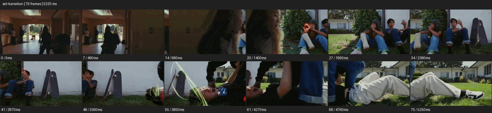

# Set Transition


- 출처: Eyecandy · [Set Transition](https://eyecannndy.com/technique/set-transition)
- 카탈로그 등록 표기: **Set Transition 세트 전환**
- 카테고리: H · More Editing & Transition · 편집 & 전환 확장
- 원본 미디어: [애니메이션 WebP](https://asset.eyecannndy.com/media/clip/2023/12/24/261703387296.webp)
- 확인 방식: 원본 애니메이션을 디코딩해 시간순 프레임을 추출한 뒤 컨택트 시트를 직접 시각 확인했다. 전체 76프레임 / 5320ms, 기본 12시점. 재생·음향 청취·전 프레임 시각 검수·생성 테스트를 했다고 주장하지 않는다.
- 기본 확인 프레임: 0, 7, 14, 20, 27, 34, 41, 48, 55, 61, 68, 75. 해당 타임스탬프(ms): 0, 490, 980, 1400, 1890, 2380, 2870, 3360, 3850, 4270, 4760, 5250.
- 원본 길이는 관찰 정보다. 아래 새 장면의 길이를 원본에 자동 맞추지 않는다.

## 움직임 증거



## 원본에서 확인한 시작 → 변화 → 끝

학교 복도 같은 실내에서 전진하던 시점이 인물 가까운 가림을 거쳐 바깥 잔디의 앉은 사람들로 넘어간다. 이어 카메라가 옆으로 움직이며 벽·스케이트보드를 지나 누운 인물을 드러낸다.

- 카메라·시점: 실내 전진에서 실외 옆 이동으로 이어진다.
- 주체: 가까운 인물 가림과 앉거나 누운 사람들이 보인다.
- 조명·합성·편집: 가림·공간 연결을 확인했으며 벽의 실제 변신은 미확인.

## 작동 원리와 확인 한계

세트와 인물 가림, 연속된 카메라 경로로 다른 공간을 이어 보이게 한다. 이 샘플에서 벽이 실제 접히거나 물리적으로 변신하는 장면은 확인되지 않는다.

샘플 사이의 빠른 변화는 일부 빠질 수 있다. GIF의 반복 경계가 작품의 의도된 완전 루프라는 보장은 없다. 원본 음악·대사·촬영 장비·제작 소프트웨어는 확인하지 않았다. 아래 프롬프트는 관찰한 원리를 다른 장면에 각색한 창작안이며 원본 장면이나 검증된 생성 결과가 아니다.

## 뮤직비디오 각색 · 완전한 장면 프롬프트

```text
연습실에서 공연장으로 나아가는 성인 보컬의 뮤직비디오. 카메라는 보컬 옆을 천천히 따라가고 보컬이 커다란 검은 커튼을 손으로 당기면 천이 화면을 완전히 가린다. 가림 안에서 한 번 숨은 컷으로 공간을 바꾸고 같은 방향으로 걷는 보컬이 공연장 무대 옆에 나타난다. 카메라는 옆 이동을 계속하며 커튼 뒤 밝은 무대를 드러낸 뒤 보컬의 어깨 뒤에서 멈춘다. 걸음 방향과 손의 높이를 이어주고 커튼이 걷힌 뒤 새 공간의 구조를 충분히 읽힌다.
```

## 브랜드필름 각색 · 완전한 장면 프롬프트

```text
가정용 조명의 활용 공간을 보여주는 브랜드필름. 카메라가 책상 위 램프를 담으며 천천히 오른쪽으로 이동한다. 성인 모델이 큰 이동식 패널을 밀어 전경을 가리면 패널 뒤에서 세트가 서재에서 침실로 바뀐 상태를 드러낸다. 같은 램프가 같은 화면 위치에 놓이고 카메라는 이동을 짧게 이어 정지한다. 모델이 밝기를 낮추면 침실의 따뜻한 분위기가 안정된다. 마지막에는 램프 전체와 침대 옆 용도를 읽힌다. 제품 디자인과 패널의 이동 방향, 광원 색을 일관되게 유지한다.
```

적용 시 사용자가 지정한 길이·참조·컷·음향·제품 보존 조건을 우선한다. 효과의 시작 계기와 도착 구도를 유지하며 필요한 부분을 해당 장면에 맞춰 다시 연출한다.
