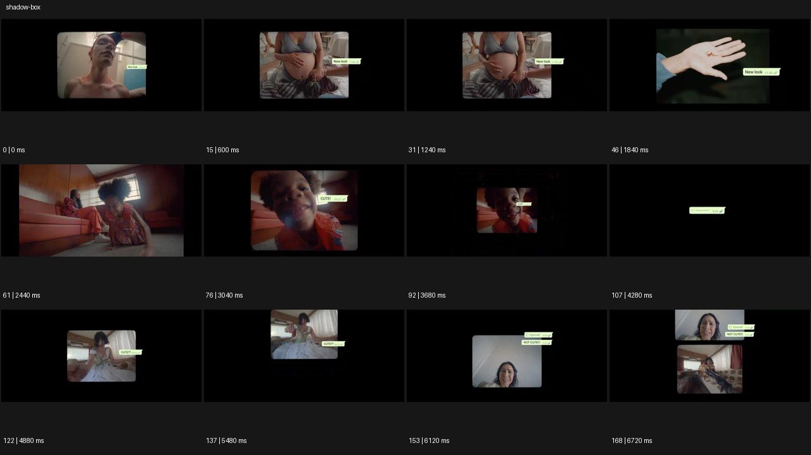

# Shadow Box


- 원본 등록명: **Shadow Box**
- 분류: B · 앵글 & 구도 / Angle & Framing
- 공식 기법 페이지: [Shadow Box](https://eyecannndy.com/technique/shadow-box)
- 지정 원본 미디어: [애니메이션 WebP](https://asset.eyecannndy.com/media/clip/2024/01/26/261706251823.webp)
- 확인 방식: 169프레임 중 12시점의 시간순 이미지 배열을 직접 시각 확인. 메타데이터 길이 6.76초. 전체 프레임 재생·청음 확인 또는 생성 재현 테스트로 보고하지 않는다.



## 실제 관찰

검은 큰 화면 속 작은 영상창에 얼굴·임신한 배·손이 차례로 나오고 옆에 작은 말풍선이 붙는다. 2.44초 아이가 있는 장면이 커졌다가 3.68초 작아지고 4.28초 영상은 사라져 말풍선만 남는다. 4.88–6.72초 다른 작은 영상창들이 등장하고 마지막에는 두 창이 위아래로 놓인다.

## 작동 원리와 역할

각 작은 영상 안에서 사람은 움직인다. 편집·합성이 영상창 크기·위치·개수를 바꾸며 검은 여백을 배치한다. 단순 저조도 촬영과 구별된다.

## 해석의 한계

말풍선의 일부 작은 글자는 정확히 판독하지 않았다. 실제 메시지 앱 UI 구현이나 화면 녹화라고 단정하지 않는다. 샘플 사이의 모든 움직임과 반복 경계의 무봉합 여부는 별도 검증하지 않았다. 아래 프롬프트는 새로운 장면 각색이며 생성 테스트는 하지 않았다.

## 뮤직비디오 적용 · 완성형 프롬프트

아래 설정과 길이는 독립 창작 예시다. 실제 요청의 길이·참조·음향 조건을 우선한다.

```text
8초 뮤직비디오. 넓은 검정 화면 가운데 작은 가로 영상창 하나로 성인 보컬이 새벽 버스 창에 이마를 기대는 모습을 보여준다. 영상창 안 카메라는 고정되고 버스 밖 불빛만 흘러간다. 보컬이 눈을 감으면 영상창을 서서히 작게 줄여 검은 여백이 넓어지게 한다. 오른쪽 아래에는 같은 인물이 빈 방에서 마이크를 내려놓는 두 번째 창이 조용히 나타난다. 두 창은 서로 겹치지 않고 서로 다른 시간의 행동을 이어간다. 마지막에는 버스 창만 사라지고 방 안의 작은 인물 하나를 남긴다. 글자와 메시지 UI 없이 여백으로 거리감을 만든다.
```

## 브랜드필름 적용 · 완성형 프롬프트

제품의 재질과 기능이 읽히는 순간에 효과를 배치하고 안정된 제품 상태로 끝낸다. 실제 브랜드 톤과 구조에 맞춰 각색한다.

```text
8초 고급 가죽 공예 필름. 검정 캔버스 중앙의 작은 가로 창에서 성인 장인의 손이 갈색 가죽 가장자리를 정리한다. 창 안 카메라는 손과 도구의 매크로 구도에 고정한다. 절단이 끝나면 창이 왼쪽으로 작게 이동하고 오른쪽에 완성 지갑의 정면 영상창이 나타난다. 두 창의 높이와 여백을 단정하게 맞추고 장인의 손동작과 완제품을 함께 비교하게 한다. 마지막에는 작업창이 천천히 사라지고 제품창만 조금 커져 중앙에 안착한다. 끝 2초 로고 각인과 스티치가 읽히며 창 밖은 순수한 검정으로 유지한다.
```

음향은 원본에서 확인하지 않았다. 실제 음원과 무음·NO BGM 등 사용자 조건을 유지한다. 특정 모델의 자동 재현을 보장하는 프리셋이 아니다.
