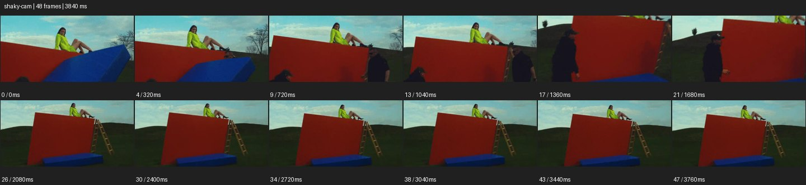

# Handheld


- 출처: Eyecandy · [Handheld](https://eyecannndy.com/technique/shaky-cam)
- 카탈로그 등록 표기: **Handheld 핸드헬드**
- 카테고리: E · More Camera Moves · 카메라 무브 확장
- 원본 미디어: [애니메이션 WebP](https://asset.eyecannndy.com/media/clip/2024/01/27/261706399330.webp)
- 확인 방식: 원본 애니메이션을 디코딩해 시간순 프레임을 추출한 뒤 컨택트 시트를 직접 시각 확인했다. 전체 48프레임 / 3840ms, 기본 12시점. 재생·음향 청취·전 프레임 시각 검수·생성 테스트를 했다고 주장하지 않는다.
- 기본 확인 프레임: 0, 4, 9, 13, 17, 21, 26, 30, 34, 38, 43, 47. 해당 타임스탬프(ms): 0, 320, 720, 1040, 1360, 1680, 2080, 2400, 2720, 3040, 3440, 3760.
- 원본 길이는 관찰 정보다. 아래 새 장면의 길이를 원본에 자동 맞추지 않는다.

## 움직임 증거



## 원본에서 확인한 시작 → 변화 → 끝

빨간 세트 벽 위의 형광색 옷 인물을 가까이 보다가 구도가 흔들리고 멀어진다. 앞을 지나가는 스태프와 사다리, 파란 바닥 구조가 드러나며 언덕 위 세트 전체가 보인다.

- 카메라·시점: 뒤로 물러나며 불규칙하게 기울고 흔들린다.
- 주체: 세트 위 모델과 앞을 지나는 스태프가 움직인다.
- 조명·합성·편집: 물리 세트와 촬영 현장 공개가 보이며 안정화 방식 미확인.

## 작동 원리와 확인 한계

불규칙한 작은 위치·회전 흔들림과 뒤로 물러나는 이동이 현장감을 만든다. 흔들림은 주체 떨림이나 화면 합성 왜곡과 구별한다.

샘플 사이의 빠른 변화는 일부 빠질 수 있다. GIF의 반복 경계가 작품의 의도된 완전 루프라는 보장은 없다. 원본 음악·대사·촬영 장비·제작 소프트웨어는 확인하지 않았다. 아래 프롬프트는 관찰한 원리를 다른 장면에 각색한 창작안이며 원본 장면이나 검증된 생성 결과가 아니다.

## 뮤직비디오 각색 · 완전한 장면 프롬프트

```text
공연을 마친 성인 보컬을 무대 뒤에서 따라가는 뮤직비디오. 카메라는 어깨 높이 미디엄으로 보컬 옆에서 걸으며 작은 보폭의 상하 움직임과 가벼운 손목 흔들림을 남긴다. 보컬이 웃으며 동료와 손을 맞잡으면 가까이 다가가 손과 얼굴을 함께 담는다. 사람이 전경을 잠깐 가린 뒤 보컬이 벽에 기대 숨을 고르는 모습을 찾는다. 마지막에는 카메라 움직임을 줄여 피곤하지만 편안한 표정에 머문다. 흔들림의 크기를 제한해 얼굴과 손을 계속 읽게 한다.
```

## 브랜드필름 각색 · 완전한 장면 프롬프트

```text
여행용 재킷을 입은 성인 모델이 바람 부는 해안에 도착하는 브랜드필름. 동행자가 직접 따라가는 듯한 어깨 높이 카메라로 모델의 측후면을 담고 걸음에 따른 작고 자연스러운 흔들림을 유지한다. 모델이 모자를 벗고 바다를 바라보면 카메라가 옆으로 짧게 이동해 바람을 견디는 원단과 옆얼굴을 포착한다. 마지막에는 모델이 멈추는 만큼 카메라도 안정되어 재킷 실루엣을 읽힌다. 큰 충격 흔들림과 과도한 모션블러는 피하고 제품 색과 지퍼 구조를 보존한다.
```

적용 시 사용자가 지정한 길이·참조·컷·음향·제품 보존 조건을 우선한다. 효과의 시작 계기와 도착 구도를 유지하며 필요한 부분을 해당 장면에 맞춰 다시 연출한다.
