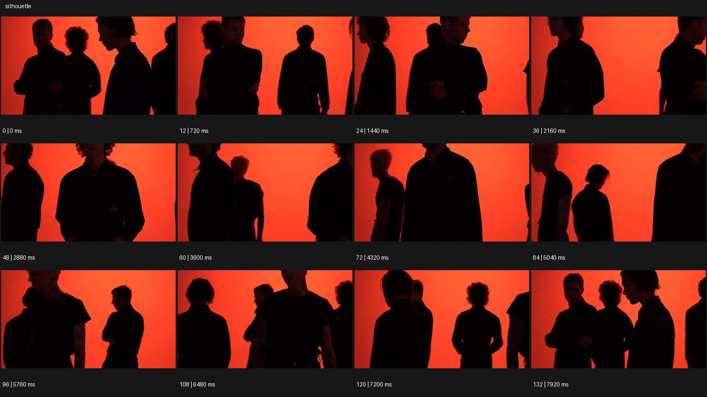

# Silhouette


- 원본 등록명: **Silhouette**
- 분류: B · 앵글 & 구도 / Angle & Framing
- 공식 기법 페이지: [Silhouette](https://eyecannndy.com/technique/silhouette)
- 지정 원본 미디어: [애니메이션 WebP](https://asset.eyecannndy.com/media/clip/2024/01/07/261704620909.webp)
- 확인 방식: 133프레임 중 12시점의 시간순 이미지 배열을 직접 시각 확인. 메타데이터 길이 7.98초. 전체 프레임 재생·청음 확인 또는 생성 재현 테스트로 보고하지 않는다.



## 실제 관찰

붉은 단색 배경 앞 어두운 인물들이 전경과 후경에서 서로 지나가고 겹친다. 초반에는 여러 측면이 보이고 중간에는 앞 인물의 상반신이 화면을 크게 가린다. 후반에는 인물 간 간격이 다시 열리며 일부는 정면, 일부는 측면으로 남는다.

## 작동 원리와 역할

인물 이동과 가림이 구도를 바꾸고 밝은 배경 대비가 어두운 윤곽을 유지한다. 얼굴의 일부 희미한 세부는 남아 있으나 형태가 주로 읽힌다.

## 해석의 한계

완전한 검정 마스크나 얼굴 디테일 0으로 단정하지 않는다. 광원의 실제 설치 및 카메라 이동은 단색 배경만으로 확인하기 어렵다. 샘플 사이의 모든 움직임과 반복 경계의 무봉합 여부는 별도 검증하지 않았다. 아래 프롬프트는 새로운 장면 각색이며 생성 테스트는 하지 않았다.

## 뮤직비디오 적용 · 완성형 프롬프트

아래 설정과 길이는 독립 창작 예시다. 실제 요청의 길이·참조·음향 조건을 우선한다.

```text
7초 뮤직비디오. 밝은 호박색 반투명 스크린 앞에 검은 옷의 성인 댄서 세 명을 서로 다른 깊이에 둔다. 고정된 허리 위 카메라로 첫 댄서의 옆얼굴 윤곽만 읽히게 하고 얼굴 정면 조명은 약하게 둔다. 뒤의 두 댄서가 서로 반대 방향으로 걸어오면 세 실루엣이 하나로 겹쳤다가 다시 분리된다. 가운데 보컬은 움직이지 않고 고개만 숙여 무리 속 고립감을 만든다. 마지막에는 양쪽 인물이 빠져나가 한 사람의 어깨와 턱선만 남는다. 배경 밝기는 일정하고 인물들이 검은 액체로 합쳐지지 않게 한다.
```

## 브랜드필름 적용 · 완성형 프롬프트

제품의 재질과 기능이 읽히는 순간에 효과를 배치하고 안정된 제품 상태로 끝낸다. 실제 브랜드 톤과 구조에 맞춰 각색한다.

```text
7초 고급 코트 필름. 우윳빛 창을 배경으로 짙은 갈색 울 코트를 입은 성인 모델이 측면으로 서 있다. 카메라는 전신 정면 위치에 고정하고 역광으로 코트의 어깨, 허리, 넓은 밑단 윤곽을 분명히 만든다. 모델이 한 걸음 옮겨 몸을 4분의 1만 돌리면 밑단이 천천히 펼쳐지고 다시 내려앉는다. 중간부터 아주 약한 측면 보조광을 켜 봉제선과 울 표면이 어둠 속에서 드러나게 한다. 마지막에는 3/4 자세로 정지해 외곽 실루엣과 재질을 함께 읽힌다. 얼굴 노출을 강하게 올리거나 배경을 장소 전환으로 사용하지 않는다.
```

음향은 원본에서 확인하지 않았다. 실제 음원과 무음·NO BGM 등 사용자 조건을 유지한다. 특정 모델의 자동 재현을 보장하는 프리셋이 아니다.
