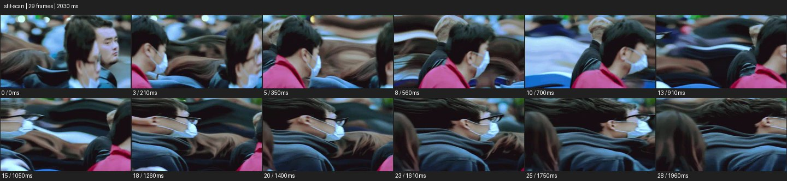

# Slit-Scan


- 출처: Eyecandy · [Slit-Scan](https://eyecannndy.com/technique/slit-scan)
- 카탈로그 등록 표기: **Slit-Scan 슬릿스캔**
- 카테고리: F · Lens & Optics · 렌즈 & 옵틱
- 원본 미디어: [애니메이션 WebP](https://asset.eyecannndy.com/media/clip/2024/02/21/261708509108.webp)
- 확인 방식: 원본 애니메이션을 디코딩해 시간순 프레임을 추출한 뒤 컨택트 시트를 직접 시각 확인했다. 전체 29프레임 / 2030ms, 기본 12시점. 재생·음향 청취·전 프레임 시각 검수·생성 테스트를 했다고 주장하지 않는다.
- 기본 확인 프레임: 0, 3, 5, 8, 10, 13, 15, 18, 20, 23, 25, 28. 해당 타임스탬프(ms): 0, 210, 350, 560, 700, 910, 1050, 1260, 1400, 1610, 1750, 1960.
- 원본 길이는 관찰 정보다. 아래 새 장면의 길이를 원본에 자동 맞추지 않는다.

## 움직임 증거



## 원본에서 확인한 시작 → 변화 → 끝

거리의 여러 인물이 옆으로 지나가면서 머리·어깨·배경 일부가 수평으로 길게 늘어나고 물결처럼 휜다. 앞의 마스크 쓴 인물은 비교적 읽히지만 주변 형상이 서로 다른 폭으로 지연된다.

- 카메라·시점: 거리의 옆 방향 흐름을 담는다.
- 주체: 사람들이 지나가며 위치를 바꾼다.
- 조명·합성·편집: 주체·배경 일부가 시간차 띠처럼 길게 왜곡된다.

## 작동 원리와 확인 한계

화면의 띠마다 서로 다른 순간을 배치한 듯한 시간차가 움직이는 형태를 늘인다. 물리적 얼굴 변형과 구별하며 정확한 스캔 축·알고리즘은 미확인.

샘플 사이의 빠른 변화는 일부 빠질 수 있다. GIF의 반복 경계가 작품의 의도된 완전 루프라는 보장은 없다. 원본 음악·대사·촬영 장비·제작 소프트웨어는 확인하지 않았다. 아래 프롬프트는 관찰한 원리를 다른 장면에 각색한 창작안이며 원본 장면이나 검증된 생성 결과가 아니다.

## 뮤직비디오 각색 · 완전한 장면 프롬프트

```text
복잡한 통근 흐름 속 성인 보컬을 보여주는 뮤직비디오. 고정 카메라 앞 중앙 보컬은 천천히 정면으로 걸으며 얼굴 형태를 유지한다. 양옆의 빠른 보행자와 뒤의 광고판에만 수평 시간차 스캔을 적용해 어깨와 색 띠가 길게 밀리게 한다. 보컬이 걸음을 멈추고 눈을 들면 주변의 시간차가 차례로 줄어 정상 형태로 돌아온다. 마지막에는 군중이 빠져나간 뒤 온전한 보컬의 미디엄을 남긴다. 효과가 누구에게 적용되는지 분명히 하고 얼굴을 녹이거나 다른 사람으로 바꾸지 않는다.
```

## 브랜드필름 각색 · 완전한 장면 프롬프트

```text
기능성 러닝웨어의 유연함을 표현하는 브랜드필름. 측면 고정 카메라 앞에서 성인 러너가 한 번 크게 팔을 뻗는다. 몸통과 로고는 정상 형태로 유지하되 팔 뒤 공간에만 움직임의 시간을 얇은 수평 띠로 지연시켜 원단 색이 층층이 길게 이어지게 한다. 팔이 정지하면 늘어난 띠가 순서대로 현재 위치에 합쳐진다. 마지막에는 정상 실루엣의 모델이 측면으로 서서 옷의 여유와 재단선을 읽힌다. 팔을 실제로 늘린 신체처럼 보이게 하지 않고 배경은 단순한 회색으로 유지한다.
```

적용 시 사용자가 지정한 길이·참조·컷·음향·제품 보존 조건을 우선한다. 효과의 시작 계기와 도착 구도를 유지하며 필요한 부분을 해당 장면에 맞춰 다시 연출한다.
