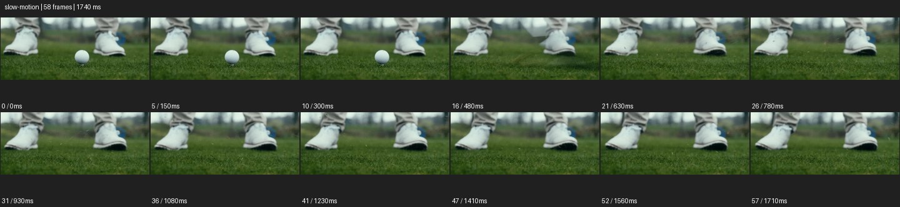
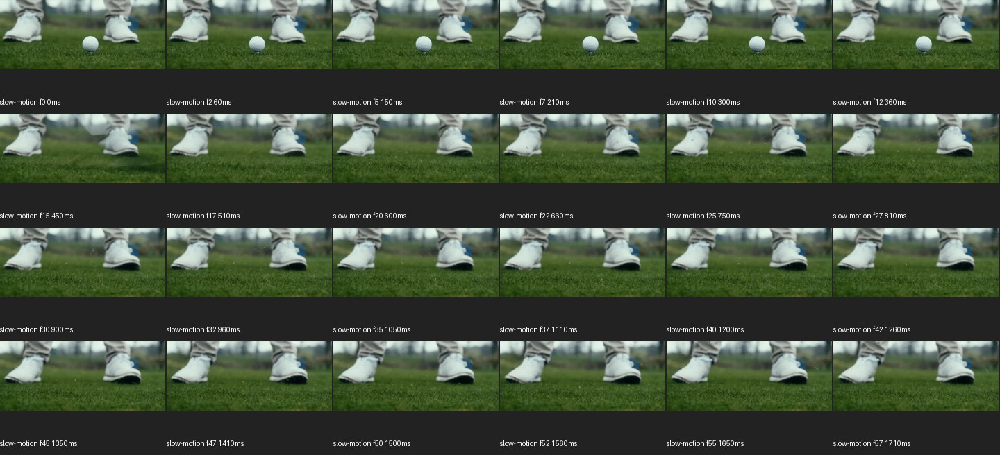

# Slow Motion


- 출처: Eyecandy · [Slow Motion](https://eyecannndy.com/technique/slow-motion)
- 카탈로그 등록 표기: **Slow Motion 슬로우모션**
- 카테고리: G · Speed & Time · 속도 & 시간
- 원본 미디어: [애니메이션 WebP](https://asset.eyecannndy.com/media/clip/2024/03/12/261710225532.webp)
- 확인 방식: 원본 애니메이션을 디코딩해 시간순 프레임을 추출한 뒤 컨택트 시트를 직접 시각 확인했다. 전체 58프레임 / 1740ms, 기본 12시점, 추가 24시점 고밀도 확인. 재생·음향 청취·전 프레임 시각 검수·생성 테스트를 했다고 주장하지 않는다.
- 기본 확인 프레임: 0, 5, 10, 16, 21, 26, 31, 36, 41, 47, 52, 57. 해당 타임스탬프(ms): 0, 150, 300, 480, 630, 780, 930, 1080, 1230, 1410, 1560, 1710.
- 원본 길이는 관찰 정보다. 아래 새 장면의 길이를 원본에 자동 맞추지 않는다.

## 움직임 증거





## 원본에서 확인한 시작 → 변화 → 끝

초반 잔디 위 골프공과 뒤의 신발이 보인다. 약 0.36–0.45초 사이 공이 사라진 뒤 잔디 조각이 낮게 흩날리고 신발은 거의 같은 위치에 남는다. 후반에는 빈 잔디 구도가 유지된다.

- 카메라·시점: 잔디와 발을 담는 낮은 구도를 유지한다.
- 주체: 공이 사라지고 잔디 조각이 흩날린다.
- 조명·합성·편집: 충돌 후 동작을 읽는 느린 시간감, 배율 미확인.

## 작동 원리와 확인 한계

짧은 충돌 뒤 잔디와 작은 움직임을 늘여 읽는 시간 연출. 원본 촬영 프레임레이트나 정확한 감속 배율은 샘플로 검증하지 않았다.

샘플 사이의 빠른 변화는 일부 빠질 수 있다. GIF의 반복 경계가 작품의 의도된 완전 루프라는 보장은 없다. 원본 음악·대사·촬영 장비·제작 소프트웨어는 확인하지 않았다. 아래 프롬프트는 관찰한 원리를 다른 장면에 각색한 창작안이며 원본 장면이나 검증된 생성 결과가 아니다.

## 뮤직비디오 각색 · 완전한 장면 프롬프트

```text
성인 댄서가 비 젖은 무대에서 한 번 발을 구르는 뮤직비디오. 카메라는 낮은 측면에서 발과 무릎을 담고 발바닥이 바닥에 닿기 직전부터 동작을 부드러운 슬로모션으로 보여준다. 충돌로 튄 물방울이 발 주변에 퍼지고 바짓단이 늦게 흔들리는 과정을 읽힌다. 카메라는 아주 짧게 옆으로 이동해 물방울과 신발의 겹침을 피한다. 물방울이 내려앉으면 정상 속도로 돌아가 댄서의 다음 한 걸음을 보여주고 멈춘다. 발 접촉과 물의 중력을 유지한다.
```

## 브랜드필름 각색 · 완전한 장면 프롬프트

```text
탄산수의 질감을 보여주는 브랜드필름. 투명한 유리잔 가장자리를 가까이 담고 얼음 한 조각이 물에 닿는 순간을 느리게 보여준다. 작은 물결과 기포가 얼음 주변으로 퍼지며 유리의 두께와 액체 높이는 일관되게 유지된다. 카메라는 잔 높이에서 아주 조금 전진하고 기포의 상승이 읽히는 거리에서 멈춘다. 후반에는 물결이 잦아들며 얼음과 기포가 남은 온전한 잔 구도로 착지한다. 제품을 과장되게 폭발시키지 않고 배경은 밝고 단순하게 유지한다.
```

적용 시 사용자가 지정한 길이·참조·컷·음향·제품 보존 조건을 우선한다. 효과의 시작 계기와 도착 구도를 유지하며 필요한 부분을 해당 장면에 맞춰 다시 연출한다.
