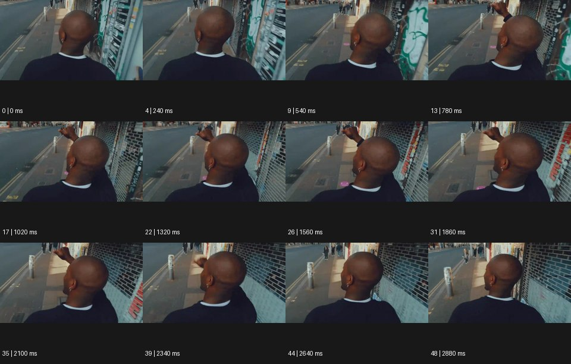

# Snorricam 스노리캠


출처: Eyecandy · 원본 등록 카드명: **Snorricam 스노리캠** · slug: snorricam

분류: J · People, POV & Mood / 인물·시점·무드

[원본 기법 페이지](https://eyecannndy.com/technique/snorricam) · [원본 미디어](https://asset.eyecannndy.com/media/clip/2024/02/20/261708425185.webp)

## 확인 근거

원본 49프레임, 메타데이터 길이 2940ms. 고유 12개 시점 프레임을 추출하여 이미지로 직접 관찰했다. 재생 감상·음향 청취·생성 재현 테스트를 했다는 뜻이 아니다.

표본 프레임(0부터): 0, 4, 9, 13, 17, 22, 26, 31, 35, 39, 44, 48



## 실제 시간순 관찰

0–540ms: 인물의 뒤통수와 어깨가 화면 가운데 크게 놓이고 길과 벽이 뒤로 흐른다. 780–1860ms: 인물이 팔을 들어 앞으로 뻗고 배경 수평선이 기울어도 몸의 화면 위치는 비교적 유지된다. 2100–2880ms: 고개가 조금 돌아가고 계속 걸으며 벽면이 옆으로 지나간다.

## 주체·카메라·합성·편집 구분

카메라는 얼굴 앞이 아닌 몸 뒤쪽에 고정된 것처럼 가까운 관계를 유지한다. 주체 이동에 따라 거리와 벽이 흔들리고 기울어진다. 실제 장착 장비는 미확인이다.

## 장면에 재사용할 원리

인물과 카메라 사이의 거리·방향을 묶어 몸은 안정적으로 남기고 배경 움직임으로 속도와 심리를 표현한다.

## 확인 한계

이 원본을 얼굴 정면 스노리캠이라고 설명하지 않는다. 카메라 리그가 실제로 몸에 고정됐는지는 화면으로만 추정한다. 표본 사이의 모든 프레임과 반복 경계의 연속성을 검사하지 않았다. 음향은 확인하지 않았다.

## 뮤직비디오 각색 · 완성형 프롬프트

아래는 장면 목적에 맞게 새로 설계한 창작 적용안이며 원본 길이를 상속하지 않는다.

```text
7초 뮤직비디오, 성인 보컬이 밤의 좁은 육교를 걸어간다. 카메라는 보컬의 몸 뒤 70cm, 어깨보다 약간 높은 위치에 붙어 뒤통수와 어깨가 화면 중앙을 계속 유지하게 한다. 첫 2초는 느린 걸음, 다음 3초는 조금 빨라진 걸음으로 배경 난간과 멀리 있는 불빛의 흔들림만 커진다. 보컬이 오른손을 들어 앞으로 뻗어도 카메라는 별도로 오빗하지 않는다. 5초에 걸음을 멈추면 배경 흔들림이 가라앉고 손도 내려간다. 마지막 2초에는 보컬이 고개를 약간 돌려 옆얼굴 일부만 보이며 길 끝을 바라본다. 무자막, 발소리와 밤바람만 둔다.
```

## 브랜드필름 각색 · 완성형 프롬프트

```text
8초 기능성 백팩 브랜드필름, 성인 모델이 밝은 도시 골목에서 완만한 계단을 오른다. 카메라는 몸 뒤의 고정된 상대 위치를 유지해 백팩이 같은 크기로 중앙에 남게 한다. 첫 2초는 걷는 상태에서 등판 밀착과 스트랩을 읽힌다. 계단을 오르는 3초 동안 배경은 아래로 흘러가고 몸에는 자연스러운 상하 리듬이 있지만 백팩 형태와 지퍼 수는 변하지 않는다. 모델이 정상에서 멈추면 카메라도 함께 멈춰 가방에 남는 작은 관성만 보여준다. 마지막 3초는 창빛이 가방 표면을 스치며 직물과 스트랩 고정부를 읽힌다. 별도 카메라 회전·새 로고·문구는 없다.
```

생성 테스트: 미실시. 단일 모델의 정확한 재현을 보장하지 않으며 필요한 촬영·합성·편집 층을 구분해 구현한다.
