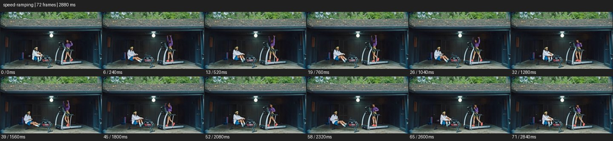
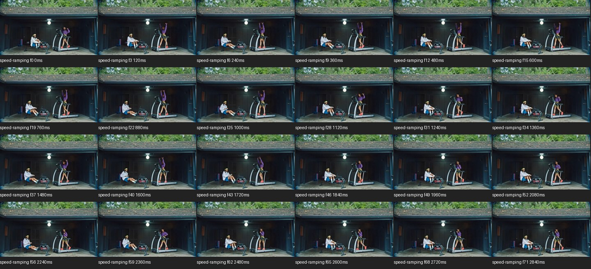

# Speed Ramp


- 출처: Eyecandy · [Speed Ramp](https://eyecannndy.com/technique/speed-ramping)
- 카탈로그 등록 표기: **Speed Ramp 스피드 램프**
- 카테고리: G · Speed & Time · 속도 & 시간
- 원본 미디어: [애니메이션 WebP](https://asset.eyecannndy.com/media/clip/2024/03/21/261711006010.webp)
- 확인 방식: 원본 애니메이션을 디코딩해 시간순 프레임을 추출한 뒤 컨택트 시트를 직접 시각 확인했다. 전체 72프레임 / 2880ms, 기본 12시점, 추가 24시점 고밀도 확인. 재생·음향 청취·전 프레임 시각 검수·생성 테스트를 했다고 주장하지 않는다.
- 기본 확인 프레임: 0, 6, 13, 19, 26, 32, 39, 45, 52, 58, 65, 71. 해당 타임스탬프(ms): 0, 240, 520, 760, 1040, 1280, 1560, 1800, 2080, 2320, 2600, 2840.
- 원본 길이는 관찰 정보다. 아래 새 장면의 길이를 원본에 자동 맞추지 않는다.

## 움직임 증거





## 원본에서 확인한 시작 → 변화 → 끝

차고의 고정 와이드에서 두 사람이 운동 기구를 사용한다. 오른쪽 인물이 팔을 위로 뻗었다 내리고 왼쪽 인물은 앞뒤로 몸을 움직인다. 연속 동작의 변화량이 구간마다 다르지만 샘플만으로 정확한 속도 곡선은 정량화하지 못했다.

- 카메라·시점: 차고의 와이드 구도는 고정된다.
- 주체: 두 사람이 다른 운동 기구를 사용한다.
- 조명·합성·편집: 움직임 간격이 달라지는 시간 처리, 정확한 곡선 미확인.

## 작동 원리와 확인 한계

한 동작 안에서 시간 밀도를 바꿔 준비·절정·복귀의 중요도를 나눈다. 소리나 원본 프레임레이트를 확인하지 않아 특정 박자 동기화는 주장하지 않는다.

샘플 사이의 빠른 변화는 일부 빠질 수 있다. GIF의 반복 경계가 작품의 의도된 완전 루프라는 보장은 없다. 원본 음악·대사·촬영 장비·제작 소프트웨어는 확인하지 않았다. 아래 프롬프트는 관찰한 원리를 다른 장면에 각색한 창작안이며 원본 장면이나 검증된 생성 결과가 아니다.

## 뮤직비디오 각색 · 완전한 장면 프롬프트

```text
성인 댄서의 한 번의 도약을 중심으로 한 뮤직비디오. 카메라는 측면 전신으로 댄서와 나란히 짧게 이동한다. 두 걸음의 준비 동작은 약간 빠르게 보여주고 발이 지면을 떠나는 순간 속도를 부드럽게 낮춰 공중에서 펼쳐진 팔과 옷자락을 읽힌다. 착지를 향할 때 다시 정상 속도로 돌아오고 발이 닿은 뒤 몸이 안정되는 동작을 생략하지 않는다. 마지막에는 카메라도 멈춰 댄서의 전신 포즈를 남긴다. 신체 동작과 카메라 경로는 연속으로 유지한다.
```

## 브랜드필름 각색 · 완전한 장면 프롬프트

```text
러닝화의 착지 구조를 보여주는 브랜드필름. 낮은 측면 카메라가 성인 러너의 발을 따라가며 준비 보폭은 빠르게 압축한다. 신발이 지면을 누르는 순간만 부드러운 슬로모션으로 전환해 밑창의 눌림과 복원을 읽힌다. 발이 지면을 떠나면 정상 속도로 돌아와 다음 보폭을 한 번 보여준다. 카메라는 마지막 걸음과 함께 감속해 정지한 신발의 측면에 착지한다. 밑창 변형을 과장하거나 제품 구조를 바꾸지 않으며 속도 변화는 같은 연속 동작 안에서 일어난다.
```

적용 시 사용자가 지정한 길이·참조·컷·음향·제품 보존 조건을 우선한다. 효과의 시작 계기와 도착 구도를 유지하며 필요한 부분을 해당 장면에 맞춰 다시 연출한다.
