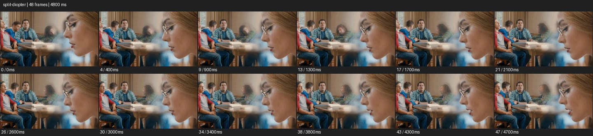

# Split Diopter


- 출처: Eyecandy · [Split Diopter](https://eyecannndy.com/technique/split-diopter)
- 카탈로그 등록 표기: **Split Diopter 스플릿 디옵터**
- 카테고리: F · Lens & Optics · 렌즈 & 옵틱
- 원본 미디어: [애니메이션 WebP](https://asset.eyecannndy.com/media/clip/2023/12/25/261703502401.webp)
- 확인 방식: 원본 애니메이션을 디코딩해 시간순 프레임을 추출한 뒤 컨택트 시트를 직접 시각 확인했다. 전체 48프레임 / 4800ms, 기본 12시점. 재생·음향 청취·전 프레임 시각 검수·생성 테스트를 했다고 주장하지 않는다.
- 기본 확인 프레임: 0, 4, 9, 13, 17, 21, 26, 30, 34, 38, 43, 47. 해당 타임스탬프(ms): 0, 400, 900, 1300, 1700, 2100, 2600, 3000, 3400, 3800, 4300, 4700.
- 원본 길이는 관찰 정보다. 아래 새 장면의 길이를 원본에 자동 맞추지 않는다.

## 움직임 증거



## 원본에서 확인한 시작 → 변화 → 끝

오른쪽 전경 안경 쓴 인물의 옆얼굴과 왼쪽 먼 테이블의 인물이 함께 선명하다. 중간 연결 영역은 흐리며 뒤 사람들이 움직여도 두 주요 거리의 선명함은 유지된다.

- 카메라·시점: 거의 고정된 두 깊이 구도를 유지한다.
- 주체: 앞 인물과 뒤 테이블 사람들이 작게 움직인다.
- 조명·합성·편집: 두 선명 영역 사이가 흐리며 광학·합성 방식 미확인.

## 작동 원리와 확인 한계

서로 다른 두 거리의 주체를 한 프레임에서 동시에 읽게 한다. 광학 디옵터인지 합성인지 확인할 수 없고 경계의 흐림을 기록한다.

샘플 사이의 빠른 변화는 일부 빠질 수 있다. GIF의 반복 경계가 작품의 의도된 완전 루프라는 보장은 없다. 원본 음악·대사·촬영 장비·제작 소프트웨어는 확인하지 않았다. 아래 프롬프트는 관찰한 원리를 다른 장면에 각색한 창작안이며 원본 장면이나 검증된 생성 결과가 아니다.

## 뮤직비디오 각색 · 완전한 장면 프롬프트

```text
헤어진 두 사람의 거리를 보여주는 뮤직비디오. 카메라는 카페 한 지점에 고정하고 오른쪽 전경에 성인 보컬의 옆얼굴, 왼쪽 먼 테이블에 다른 성인의 정면을 둔다. 두 얼굴은 동시에 선명하며 중간 빈 공간은 부드럽게 흐리게 한다. 보컬이 시선을 내리는 동안 먼 인물이 컵을 놓고 자리에서 일어난다. 카메라는 따라가지 않고 두 거리의 관계를 유지한다. 마지막에는 전경의 고요한 얼굴과 비어 있는 먼 의자를 함께 남긴다. 초점을 앞뒤로 이동시키지 않는다.
```

## 브랜드필름 각색 · 완전한 장면 프롬프트

```text
향수병과 조향사의 집중을 한 화면에 담는 브랜드필름. 왼쪽 가까운 전경의 향수병 라벨과 오른쪽 먼 작업대의 성인 조향사 얼굴을 동시에 선명하게 유지한다. 카메라는 고정하고 조향사가 시향지를 코에 가져갔다 내리는 작은 행동만 보여준다. 중간 공간은 자연스럽게 흐리게 두어 두 선명한 대상을 분리한다. 마지막에 조향사가 병을 바라보면 창빛이 유리 모서리를 스치고 정지 구도를 유지한다. 병의 형태와 라벨을 보존하며 두 초점 영역 사이 경계가 제품을 자르지 않게 한다.
```

적용 시 사용자가 지정한 길이·참조·컷·음향·제품 보존 조건을 우선한다. 효과의 시작 계기와 도착 구도를 유지하며 필요한 부분을 해당 장면에 맞춰 다시 연출한다.
