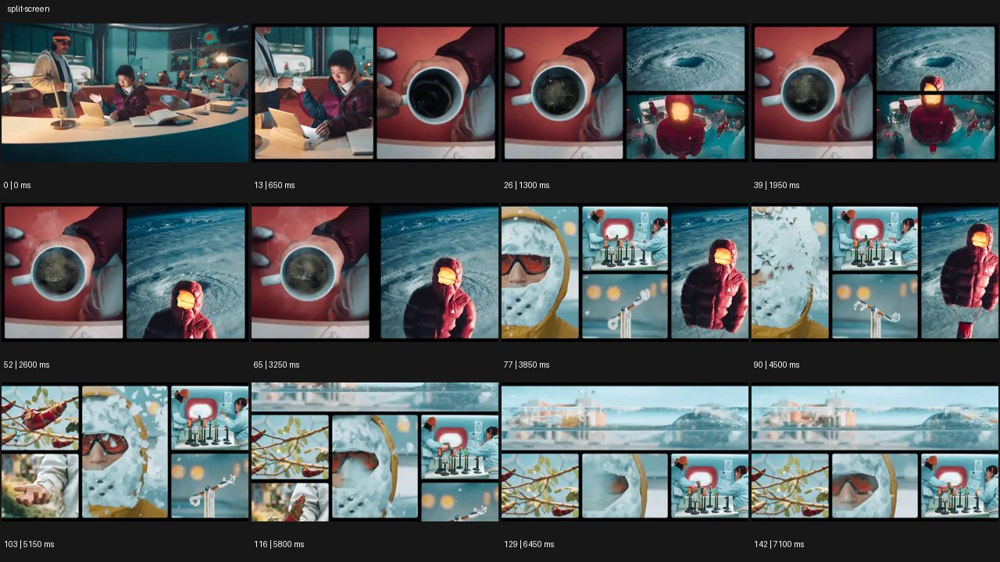

# Split Screen


- 원본 등록명: **Split Screen**
- 분류: D · 편집 & 전환 / Editing & Transition
- 공식 기법 페이지: [Split Screen](https://eyecannndy.com/technique/split-screen)
- 지정 원본 미디어: [애니메이션 WebP](https://asset.eyecannndy.com/media/clip/2024/01/10/261704857319.webp)
- 확인 방식: 143프레임 중 12시점의 시간순 이미지 배열을 직접 시각 확인. 메타데이터 길이 7.15초. 전체 프레임 재생·청음 확인 또는 생성 재현 테스트로 보고하지 않는다.



## 실제 관찰

실험실 장면에서 시작해 0.65초 인물과 컵이 좌우 패널로 나뉜다. 1.3–3.25초 컵·소용돌이·방한복 인물이 서로 다른 크기의 칸에 보인다. 3.85–5.8초 패널 수와 폭이 계속 바뀌고 마지막에는 넓은 위쪽 풍경과 아래쪽의 여러 작은 장면이 함께 남는다.

## 작동 원리와 역할

편집·합성이 칸의 경계와 크기를 조정하고 각 칸 안에서 독립된 주체·카메라 행동이 지속된다. 화면 분할은 하나의 카메라가 넓어지는 것과 다르다.

## 해석의 한계

여러 패널의 사건이 실제 동시 시간인지 확인할 수 없다. 정확한 레이아웃 변화의 프레임 수는 표본에 한정된다. 샘플 사이의 모든 움직임과 반복 경계의 무봉합 여부는 별도 검증하지 않았다. 아래 프롬프트는 새로운 장면 각색이며 생성 테스트는 하지 않았다.

## 뮤직비디오 적용 · 완성형 프롬프트

아래 설정과 길이는 독립 창작 예시다. 실제 요청의 길이·참조·음향 조건을 우선한다.

```text
8초 뮤직비디오. 화면을 같은 폭의 두 세로 칸으로 나누어 왼쪽은 낮의 녹음실, 오른쪽은 밤의 무대를 보여준다. 두 칸 모두 같은 성인 보컬의 허리 위 고정 구도이며 왼쪽 보컬이 마이크를 올리면 오른쪽 보컬이 반 박자 늦게 같은 행동을 시작한다. 중간에는 가운데 좁은 세 번째 칸을 열어 두 손의 디테일을 보여주고 양쪽 얼굴 크기는 유지한다. 마지막에는 손 디테일 칸이 닫히고 두 보컬이 동시에 렌즈를 바라본다. 끝 2초 좌우 대비를 안정적으로 유지하며 칸 사이 얼굴이나 팔이 잘못 이어지지 않는다.
```

## 브랜드필름 적용 · 완성형 프롬프트

제품의 재질과 기능이 읽히는 순간에 효과를 배치하고 안정된 제품 상태로 끝낸다. 실제 브랜드 톤과 구조에 맞춰 각색한다.

```text
8초 고급 여행용 오디오 필름. 처음 화면은 세로 두 칸으로 나누고 왼쪽에는 성인 사용자가 헤드폰을 쓰는 옆모습, 오른쪽에는 알루미늄 이어컵 매크로를 둔다. 왼쪽 카메라는 고정하고 오른쪽 카메라만 느리게 이동해 표면의 빛을 읽힌다. 사용자가 착용을 마치면 오른쪽 칸 아래에 작은 칸을 열어 접히는 힌지 구조를 보여준다. 마지막에는 디테일 칸들을 닫고 착용자의 중간 구도 하나로 화면을 채운다. 끝 2초 얼굴과 제품 형태가 선명하고 패널 경계에서 제품이 잘리거나 중복되지 않게 한다.
```

음향은 원본에서 확인하지 않았다. 실제 음원과 무음·NO BGM 등 사용자 조건을 유지한다. 특정 모델의 자동 재현을 보장하는 프리셋이 아니다.
