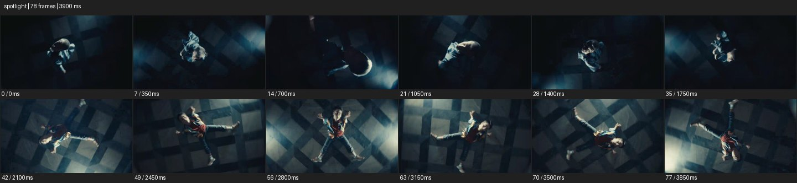

# Spotlight


- 출처: Eyecandy · [Spotlight](https://eyecannndy.com/technique/spotlight)
- 카탈로그 등록 표기: **Spotlight 스포트라이트**
- 카테고리: F · Lens & Optics · 렌즈 & 옵틱
- 원본 미디어: [애니메이션 WebP](https://asset.eyecannndy.com/media/clip/2024/01/04/261704342253.webp)
- 확인 방식: 원본 애니메이션을 디코딩해 시간순 프레임을 추출한 뒤 컨택트 시트를 직접 시각 확인했다. 전체 78프레임 / 3900ms, 기본 12시점. 재생·음향 청취·전 프레임 시각 검수·생성 테스트를 했다고 주장하지 않는다.
- 기본 확인 프레임: 0, 7, 14, 21, 28, 35, 42, 49, 56, 63, 70, 77. 해당 타임스탬프(ms): 0, 350, 700, 1050, 1400, 1750, 2100, 2450, 2800, 3150, 3500, 3850.
- 원본 길이는 관찰 정보다. 아래 새 장면의 길이를 원본에 자동 맞추지 않는다.

## 움직임 증거



## 원본에서 확인한 시작 → 변화 → 끝

처음에는 어둠 속 위에서 본 인물 주변 일부만 밝다. 인물이 움직이고 구도가 회전하면서 체크 무늬 바닥이 점차 더 넓게 드러난다. 후반 전신과 팔·다리의 벌린 동작이 밝은 원 안에 보인다.

- 카메라·시점: 높은 시점과 회전으로 주체를 따라간다.
- 주체: 빛 안에서 인물이 팔다리를 움직인다.
- 조명·합성·편집: 제한된 빛이 주체와 체크 바닥을 차례로 드러낸다.

## 작동 원리와 확인 한계

좁게 제한한 조명 영역으로 주체를 분리하고 빛 범위와 구도의 변화로 공간을 공개한다. 입·치아 확대 예시와 다른 원본이다.

샘플 사이의 빠른 변화는 일부 빠질 수 있다. GIF의 반복 경계가 작품의 의도된 완전 루프라는 보장은 없다. 원본 음악·대사·촬영 장비·제작 소프트웨어는 확인하지 않았다. 아래 프롬프트는 관찰한 원리를 다른 장면에 각색한 창작안이며 원본 장면이나 검증된 생성 결과가 아니다.

## 뮤직비디오 각색 · 완전한 장면 프롬프트

```text
빈 무대 중앙 성인 보컬의 고립을 표현하는 뮤직비디오. 높은 사선 카메라에서 좁은 원형 스포트라이트 안의 보컬만 보이게 시작한다. 보컬이 두 팔을 펼치면 빛의 원이 천천히 넓어져 발끝과 원형 바닥 무늬가 드러난다. 카메라는 부드럽게 낮아지며 정면으로 접근하되 보컬을 빛의 중심에 유지한다. 마지막에는 허리 위 구도에서 멈춰 주변의 어둠과 얼굴 표정을 함께 남긴다. 빛의 확대와 카메라 이동을 구분하고 입이나 눈 속으로 전환하지 않는다.
```

## 브랜드필름 각색 · 완전한 장면 프롬프트

```text
조형적인 핸드백을 미술 작품처럼 보여주는 브랜드필름. 검은 공간 중앙의 낮은 받침 위 가방을 두고 좁은 스포트라이트가 손잡이와 윗면만 드러내게 한다. 카메라는 정면에서 아주 느리게 접근하고 조명의 범위를 아래로 넓혀 가방 본체와 바닥 그림자를 순서대로 공개한다. 전체 형태가 읽히면 조명 변화와 카메라를 멈춘다. 마지막에는 전면 포켓, 잠금장치, 가죽 질감이 보이는 안정된 구도를 유지한다. 주변은 어둡게 두되 제품 하단을 잘라 숨기지 않는다.
```

적용 시 사용자가 지정한 길이·참조·컷·음향·제품 보존 조건을 우선한다. 효과의 시작 계기와 도착 구도를 유지하며 필요한 부분을 해당 장면에 맞춰 다시 연출한다.
