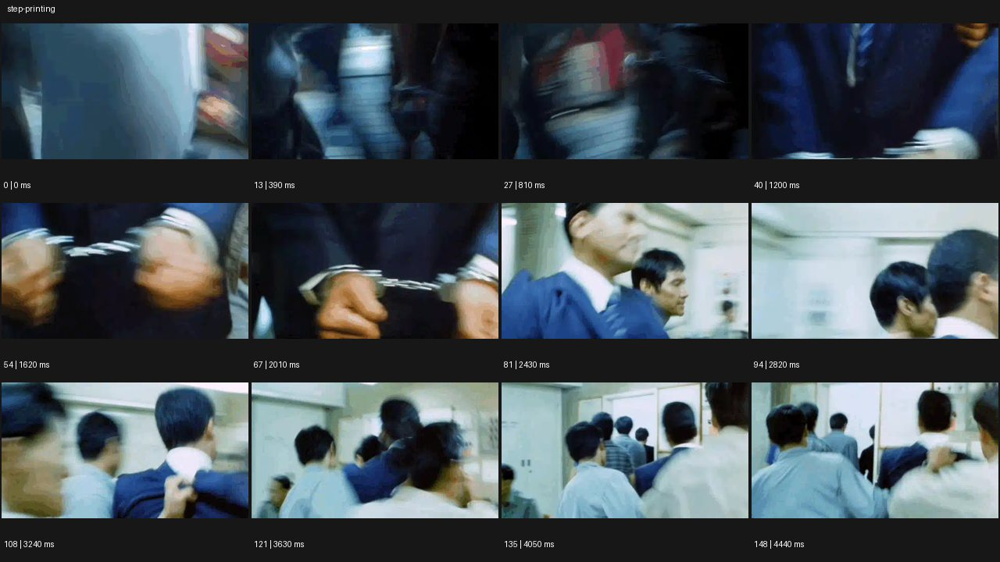
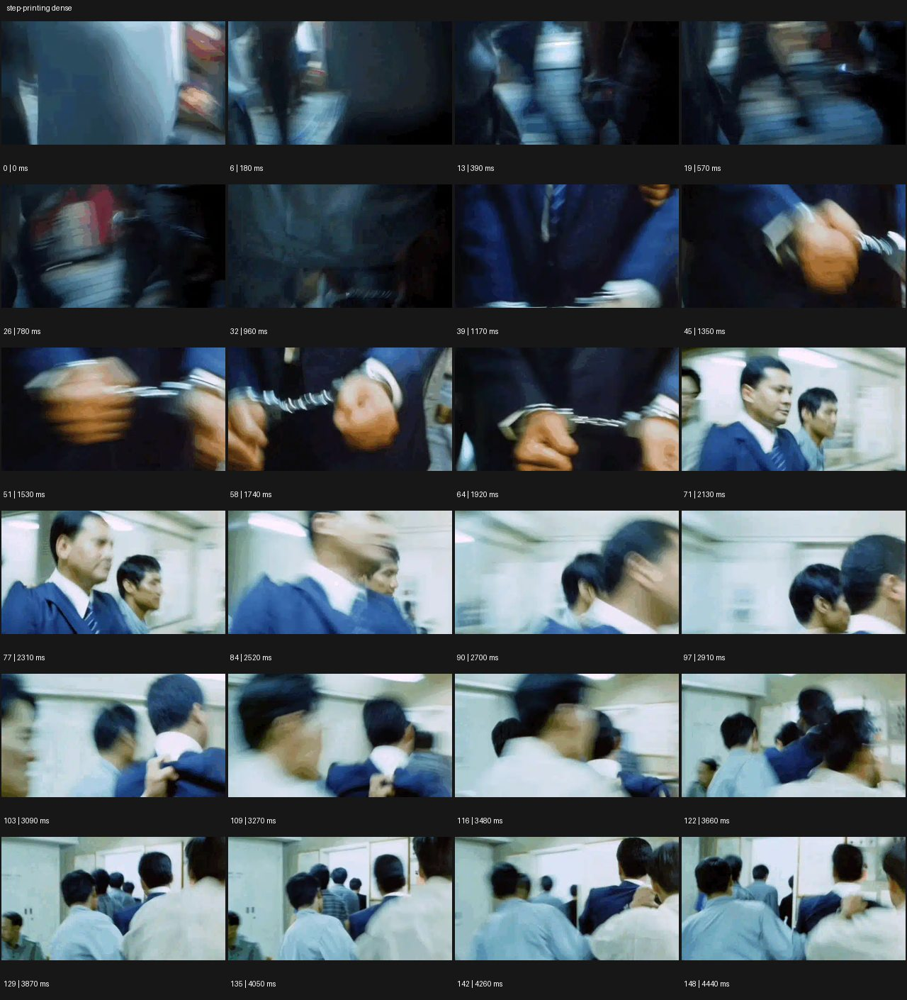

# Step-Print


- 원본 등록명: **Step-Print**
- 분류: D · 편집 & 전환 / Editing & Transition
- 공식 기법 페이지: [Step-Print](https://eyecannndy.com/technique/step-printing)
- 지정 원본 미디어: [애니메이션 WebP](https://asset.eyecannndy.com/media/clip/2024/01/29/261706500582.webp)
- 확인 방식: 149프레임 중 12시점의 시간순 이미지 배열을 직접 시각 확인. 메타데이터 길이 4.47초. 추가 24시점 배열도 직접 확인. 전체 프레임 재생·청음 확인 또는 생성 재현 테스트로 보고하지 않는다.





## 실제 관찰

0–0.96초 좁은 공간의 빠른 움직임이 강하게 번진다. 1.17–1.92초 수갑을 찬 두 손의 근접 구도가 이어지고 손이 위치를 바꾸며 끊긴 듯한 윤곽을 남긴다. 2.13초 이후 여러 사람이 밝은 복도를 이동하는 구도로 바뀌며 흔들림과 흐린 움직임이 끝까지 지속된다.

## 작동 원리와 역할

주체 이동·카메라 흔들림에 시간 샘플을 유지하거나 건너뛰는 표현을 결합하면 부드러운 슬로모션과 다른 끊김을 만든다.

## 해석의 한계

24개 표본으로 실제 반복 프레임의 정확한 수를 검증한 것은 아니다. 필름 인화 공정과 디지털 처리 여부를 단정하지 않는다. 샘플 사이의 모든 움직임과 반복 경계의 무봉합 여부는 별도 검증하지 않았다. 아래 프롬프트는 새로운 장면 각색이며 생성 테스트는 하지 않았다.

## 뮤직비디오 적용 · 완성형 프롬프트

아래 설정과 길이는 독립 창작 예시다. 실제 요청의 길이·참조·음향 조건을 우선한다.

```text
7초 뮤직비디오. 새벽 시장 골목을 성인 보컬이 빠르게 걸어간다. 카메라는 가까운 옆쪽에서 따라가며 형광등과 진열대가 지나가는 생활 공간을 담는다. 중간 3초는 움직임의 몇 프레임을 짧게 유지한 뒤 다음 위치로 건너뛰어 걸음이 뚝뚝 끊기는 시간감을 만든다. 긴 노출처럼 보이는 팔과 배경의 흐림을 남기되 얼굴 정체성은 계속 읽히게 한다. 보컬이 닫힌 가게 앞에 멈추면 반복 프레임 처리를 점차 줄여 정상적인 연속 움직임으로 돌아온다. 마지막 2초 흔들림이 가라앉은 표정에 머문다.
```

## 브랜드필름 적용 · 완성형 프롬프트

제품의 재질과 기능이 읽히는 순간에 효과를 배치하고 안정된 제품 상태로 끝낸다. 실제 브랜드 톤과 구조에 맞춰 각색한다.

```text
7초 고급 여행 카메라 필름. 성인 사진가가 비 오는 역 플랫폼을 걸으며 작은 은색 카메라를 손에 들고 있다. 옆에서 따라가는 숏의 중간 구간에 짧은 프레임 유지와 위치 건너뛰기를 적용해 지나가는 불빛과 코트의 움직임에 거친 시간의 여운을 남긴다. 사진가가 멈춰 카메라를 눈앞으로 올리면 처리 강도를 줄여 정상적인 선명한 연속 움직임으로 전환한다. 마지막에는 셔터를 누르고 카메라를 조금 내린 손의 근접 구도로 한 번 컷한다. 끝 2초 다이얼, 렌즈, 브랜드 각인을 정확히 읽히며 제품 디테일에는 잔상을 남기지 않는다.
```

음향은 원본에서 확인하지 않았다. 실제 음원과 무음·NO BGM 등 사용자 조건을 유지한다. 특정 모델의 자동 재현을 보장하는 프리셋이 아니다.
