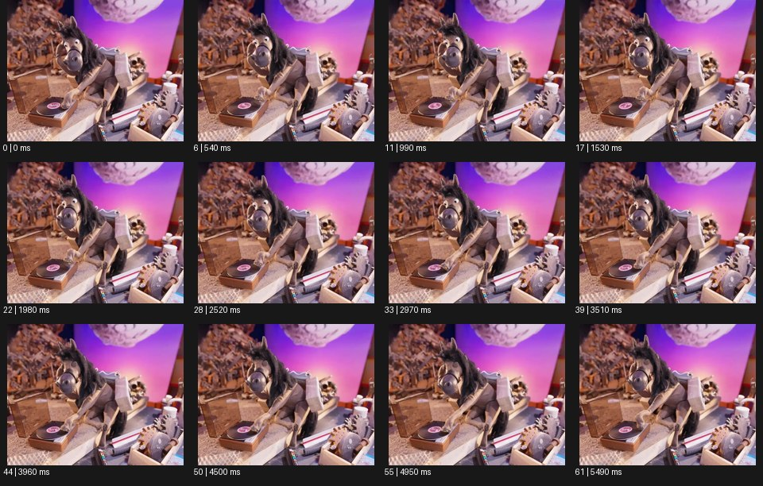

# Stop Motion 스톱모션


출처: Eyecandy · 원본 등록 카드명: **Stop Motion 스톱모션** · slug: stop-motion

분류: I · VFX & Style / VFX & 스타일

[원본 기법 페이지](https://eyecannndy.com/technique/stop-motion) · [원본 미디어](https://asset.eyecannndy.com/media/clip/2024/03/02/261709340472.webp)

## 확인 근거

원본 62프레임, 메타데이터 길이 5580ms. 고유 12개 시점 프레임을 추출하여 이미지로 직접 관찰했다. 재생 감상·음향 청취·생성 재현 테스트를 했다는 뜻이 아니다.

표본 프레임(0부터): 0, 6, 11, 17, 22, 28, 33, 39, 44, 50, 55, 61



## 실제 시간순 관찰

0–1530ms: 미니어처 작업대의 동물 인형이 턴테이블 위에 앞발을 두고 머리·눈을 조금씩 움직인다. 1980–3510ms: 인형이 고개를 옆으로 기울이고 팔 위치가 단계적으로 바뀐다. 3960–5490ms: 머리를 더 숙이며 같은 세트와 소품 배치를 유지한다.

## 주체·카메라·합성·편집 구분

주체 인형의 머리·앞발·표정 변화가 중심이고 카메라는 거의 같은 구도를 유지한다. 움직임은 간헐적인 자세 변화로 보인다. 실제 프레임 촬영인지 모사 애니메이션인지는 미확인이다.

## 장면에 재사용할 원리

물체의 작은 자세 차이를 시간 순서로 연결해 손으로 만든 재질과 움직임의 단계성을 함께 보여준다.

## 확인 한계

샘플 간격 때문에 원본의 실제 촬영 프레임레이트나 모든 중간 자세를 평가하지 않았다. 표본 사이의 모든 프레임과 반복 경계의 연속성을 검사하지 않았다. 음향은 확인하지 않았다.

## 뮤직비디오 각색 · 완성형 프롬프트

아래는 장면 목적에 맞게 새로 설계한 창작 적용안이며 원본 길이를 상속하지 않는다.

```text
7초 스톱모션 뮤직비디오, 골판지 녹음실 안의 성인 가수를 닮은 작은 천 인형을 피아노 앞에 앉힌다. 카메라는 책상 높이의 정면에서 고정한다. 첫 1초는 인형이 고개를 숙인 채 정지하고, 이어 양손을 건반 위로 한 칸씩 옮긴다. 손이 내려갈 때마다 피아노 위 접힌 종이 새 한 마리가 단계적인 날갯짓으로 일어나 인형 주위를 돈다. 천의 바느질과 종이 접힌 자국을 유지하고 중간 동작을 실사처럼 매끈하게 보간하지 않는다. 마지막에는 새가 어깨에 내려앉고 인형이 고개를 들어 정지한다. 종이 마찰과 건반 소리만 두며 자막은 없다.
```

## 브랜드필름 각색 · 완성형 프롬프트

```text
8초 수제 비누 브랜드필름, 따뜻한 베이지 작업대에 종이 포장과 흰 비누 한 개를 놓는다. 정수직 카메라는 고정하고 첫 2초에 포장지 모서리가 한 접기씩 안으로 이동한다. 비누는 점프하거나 녹지 않고 같은 자리에 둔 채 종이가 접혀 정확히 감싸게 한다. 포장 옆의 라벤더 줄기는 두세 단계로 움직여 완성 포장에 기대고, 마지막 접힘에서 표면이 잠깐 눌렸다 펴지는 종이의 힘을 보여준다. 5초에 움직임을 끝내고 카메라가 아주 조금 내려와 포장 두께와 비누의 옆면을 읽힌다. 마지막 2초는 제품 정지 구도, 임의 문구·로고 없이 종이 소리만 둔다.
```

생성 테스트: 미실시. 단일 모델의 정확한 재현을 보장하지 않으며 필요한 촬영·합성·편집 층을 구분해 구현한다.
