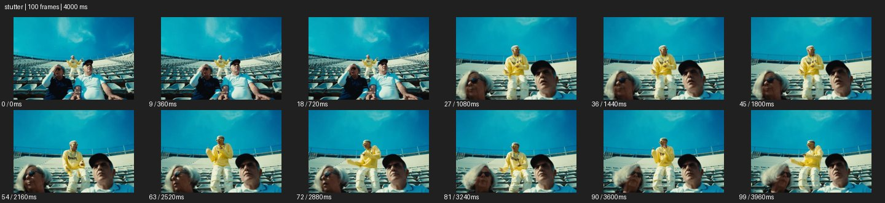
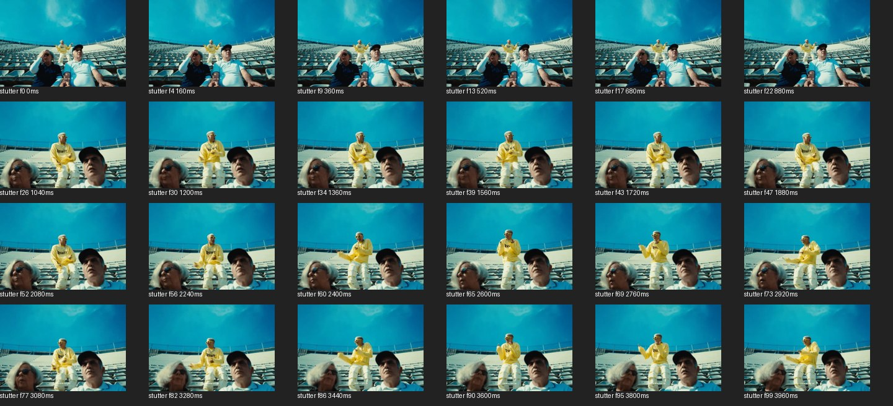

# Stutter


- 출처: Eyecandy · [Stutter](https://eyecannndy.com/technique/stutter)
- 카탈로그 등록 표기: **Stutter 스터터**
- 카테고리: G · Speed & Time · 속도 & 시간
- 원본 미디어: [애니메이션 WebP](https://asset.eyecannndy.com/media/clip/2025/02/10/261739192960.webp)
- 확인 방식: 원본 애니메이션을 디코딩해 시간순 프레임을 추출한 뒤 컨택트 시트를 직접 시각 확인했다. 전체 100프레임 / 4000ms, 기본 12시점, 추가 24시점 고밀도 확인. 재생·음향 청취·전 프레임 시각 검수·생성 테스트를 했다고 주장하지 않는다.
- 기본 확인 프레임: 0, 9, 18, 27, 36, 45, 54, 63, 72, 81, 90, 99. 해당 타임스탬프(ms): 0, 360, 720, 1080, 1440, 1800, 2160, 2520, 2880, 3240, 3600, 3960.
- 원본 길이는 관찰 정보다. 아래 새 장면의 길이를 원본에 자동 맞추지 않는다.

## 움직임 증거





## 원본에서 확인한 시작 → 변화 → 끝

관중석의 앞쪽 두 인물과 뒤 노란 옷 인물이 보인다. 초기 가까워지는 구도가 단계적으로 바뀌고 이후 뒤 인물의 손짓이 진행된다. 비슷한 자세가 여러 샘플에 이어져 끊김 인상을 주지만 정확한 프레임 반복 규칙은 미확인이다.

- 카메라·시점: 초반 가까워지는 구도가 단계적으로 바뀐다.
- 주체: 관중석 인물들이 손과 상체를 움직인다.
- 조명·합성·편집: 유사 프레임의 반복·홀드처럼 보이며 규칙은 미확인.

## 작동 원리와 확인 한계

짧은 프레임 홀드나 생략으로 연속 동작을 계단처럼 분절한다. 정지 이미지와 실제 동작 반복을 샘플에서 완전히 구분하기 어렵다.

샘플 사이의 빠른 변화는 일부 빠질 수 있다. GIF의 반복 경계가 작품의 의도된 완전 루프라는 보장은 없다. 원본 음악·대사·촬영 장비·제작 소프트웨어는 확인하지 않았다. 아래 프롬프트는 관찰한 원리를 다른 장면에 각색한 창작안이며 원본 장면이나 검증된 생성 결과가 아니다.

## 뮤직비디오 각색 · 완전한 장면 프롬프트

```text
단호한 제스처를 강조하는 성인 래퍼의 뮤직비디오. 정면 미디엄 고정 카메라 앞에서 래퍼가 가슴의 손을 앞으로 뻗는다. 뻗는 동작의 중간 세 지점을 짧게 홀드한 뒤 다음 위치로 진행시켜 손의 경로가 계단처럼 보이게 한다. 배경과 얼굴도 같은 프레임 홀드에 묶고 별도의 분신은 만들지 않는다. 손이 완전히 펴지면 정상 연속 재생으로 돌아와 팔을 내리는 동작을 보여준다. 마지막에는 안정된 눈빛과 빈 손을 남겨 제스처 의미를 읽힌다.
```

## 브랜드필름 각색 · 완전한 장면 프롬프트

```text
스니커즈 끈을 조이는 행동을 강조하는 브랜드필름. 카메라는 신발과 성인 모델의 손을 가까이 고정해 담는다. 양쪽 끈을 당기는 한 동작 중 시작, 중간, 끝의 세 순간을 짧게 홀드해 촘촘한 리듬을 만든다. 홀드 사이에는 같은 방향으로 동작이 진행하고 손이 다른 위치로 순간이동하지 않는다. 매듭이 완성되면 정상 재생으로 돌아가 손이 프레임 밖으로 빠진다. 마지막에는 신발과 매듭을 선명하게 유지한다. 손가락 수와 끈 경로, 제품 로고를 보존한다.
```

적용 시 사용자가 지정한 길이·참조·컷·음향·제품 보존 조건을 우선한다. 효과의 시작 계기와 도착 구도를 유지하며 필요한 부분을 해당 장면에 맞춰 다시 연출한다.
